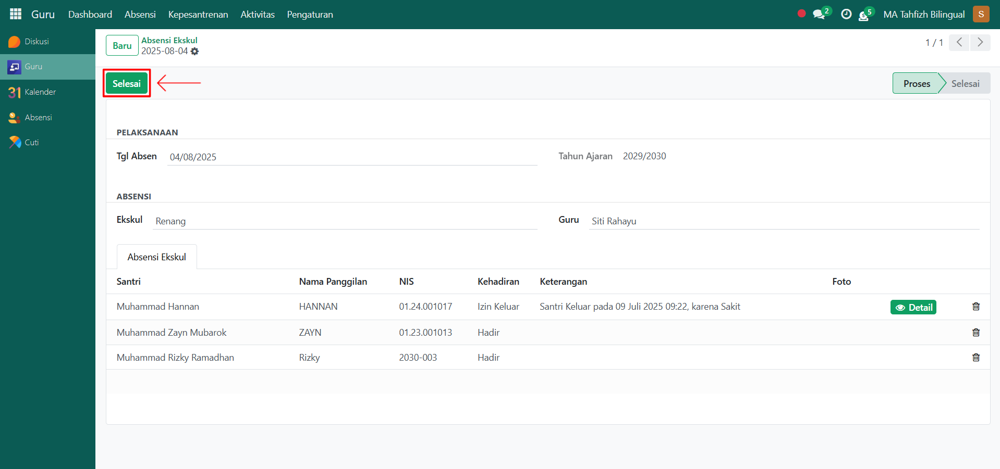

# Absensi Ekskul



## Absensi Ekskul

**Absensi Ekskul** digunakan oleh guru atau pembina ekstrakurikuler untuk mencatat kehadiran santri pada kegiatan ekstrakurikuler. Proses ini membantu pihak pesantren dalam memantau keterlibatan santri di kegiatan non-akademik secara terstruktur.

### Melakukan Absensi Ekskul

Berikut adalah langkah-langkah untuk melakukan absensi ekskul pada Odoo Pesantren sebagai **guru**.

1. Login menggunakan akun guru. Jika Anda belum memahami cara login sebagai guru, silakan lihat panduan [**Login Guru** di sini](../../../setup-and-konfigurasi/panduan-login/login-guru.md).
2.  Buka modul **Guru**, lalu klik menu **Absensi** kemudian pilih submenu **Absensi Ekskul**.

    <figure><figcaption></figcaption></figure>

3.  Klik tombol **"Baru"** untuk menambahkan absensi ekskul.

    <figure><figcaption></figcaption></figure>

4.  Akan tampil halaman form **Absensi Ekskul**. Pada form ini, isi **Tanggal Absen**, lalu pilih **Ekskul** yang dibina oleh guru yang sedang login.

    <figure><figcaption></figcaption></figure>

5. Pada **Tab Absensi Ekskul**, sistem akan menampilkan daftar santri yang mengikuti ekskul tersebut. Lakukan pencatatan kehadiran dengan memberi status Hadir/Izin/Alfa sesuai kondisi santri.&#x20;
6.  Setelah semua inputan diisi dengan benar, klik ikon **Simpan** di sebelah kanan ikon Gear agar data absensi ekskul tersimpan di sistem dan statusnya akan menjadi **Proses**.

    <figure><figcaption></figcaption></figure>

7.  Terakhir, klik tombol **"Selesai"** untuk mengkonfirmasi absensi ekskul yang telah dibuat sehingga statusnya menjadi **Selesai**.

    <figure><figcaption></figcaption></figure>

8. Data Absensi Ekskul berhasil disimpan dan dapat digunakan sebagai laporan kehadiran santri dalam kegiatan ekstrakurikuler.
