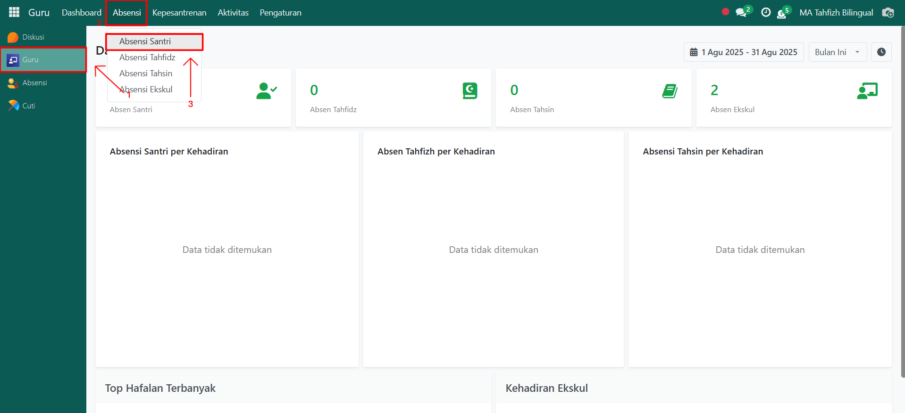
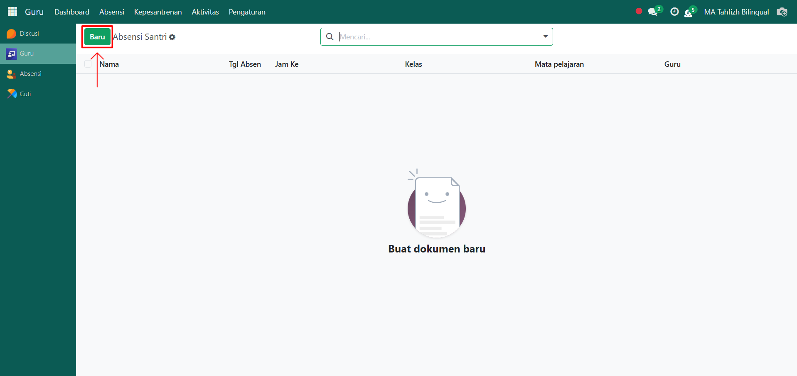
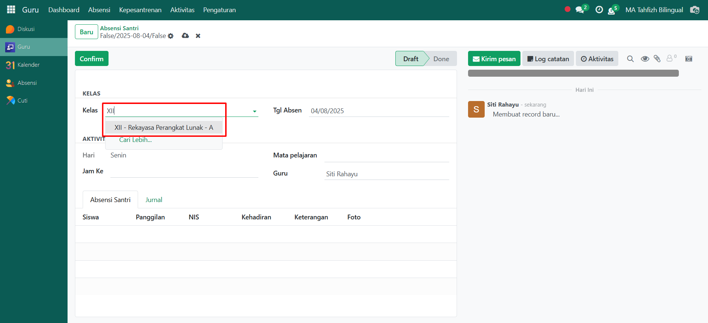
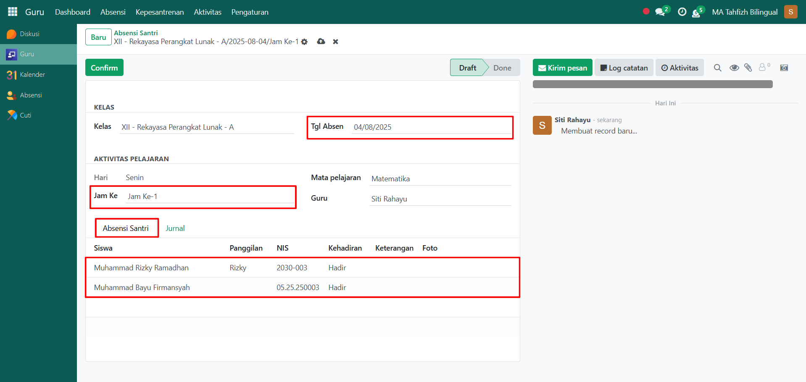
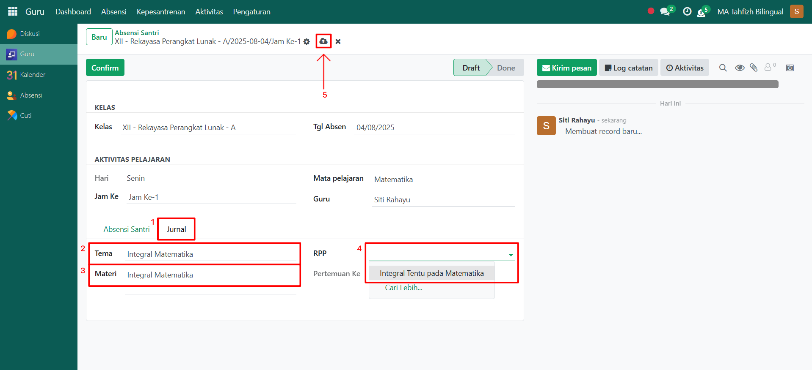
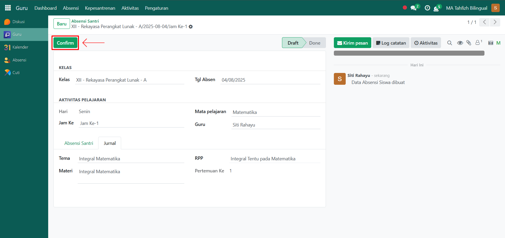

# Absensi Santri

Video \[]

## Absensi Santri

**Absensi Santri** digunakan untuk mencatat kehadiran santri di kelas oleh guru akademik sesuai jadwal pelajaran yang berlangsung. Proses ini juga dilengkapi dengan pencatatan jurnal pembelajaran sebagai catatan kegiatan belajar di kelas.

### Melakukan Absensi Santri

Berikut adalah langkah-langkah untuk melakukan absensi santri pada Odoo Pesantren sebagai **guru akademik**.

1. Login menggunakan akun guru akademik. Jika Anda belum memahami cara login sebagai guru akademik, silakan lihat panduan [**Login Guru Akademik** di sini](../../../setup-and-konfigurasi/panduan-login/login-guru.md).
2.  Buka modul **Guru**, lalu klik menu **Absensi** kemudian pilih submenu **Absensi Santri**.

    <figure><figcaption></figcaption></figure>

3.  Klik tombol **"Baru"** untuk membuat absensi santri.

    <figure><figcaption></figcaption></figure>

4.  Akan tampil halaman form Absensi Santri. Pada form ini, guru yang sedang login memilih **kelas** yang akan diabsensi.

    <figure><figcaption></figcaption></figure>

5.  Isi inputan lainnya, seperti:

    * **Tanggal Absen** (masukkan tanggal absensi santri).
    * **Jam Pelajaran** (masukkan jam pelajaran).
    * **Mata Pelajaran** (otomatis terisi sesuai jam pelajaran yang dikonfigurasi pada jadwal pelajaran).
    * **Guru** (otomatis terisi sesuai guru yang sedang login).
    * **Tab Absensi Santri** → menampilkan daftar santri pada kelas tersebut untuk dilakukan pencatatan hadir, izin, atau alfa.

    <figure><figcaption></figcaption></figure>

6.  Pindah ke **Tab Jurnal**, lalu isi inputan berikut:

    * **Tema** (masukkan tema pembelajaran).
    * **Materi** (masukkan materi yang diajarkan pada pertemuan tersebut).
    * **RPP (Rencana Pelaksanaan Pembelajaran)** (pilih sesuai dengan RPP yang telah dibuat untuk mata pelajaran tersebut).

    Setelah semua inputan diisi dengan benar, klik icon **Simpan** di sebelah kanan icon **Gear** agar data absensi santri tersimpan di sistem dan statusnya akan menjadi **Draft**.

    <figure><figcaption></figcaption></figure>

7.  Klik tombol **"Confirm"** untuk mengkonfirmasi absensi santri yang telah dibuat sehingga statusnya menjadi **Done**.

    <figure><figcaption></figcaption></figure>

8. Absensi Santri berhasil disimpan dan dapat digunakan sebagai dasar laporan kehadiran maupun evaluasi kegiatan pembelajaran.
