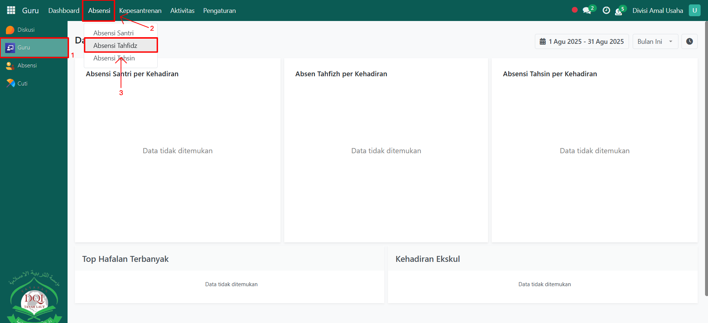
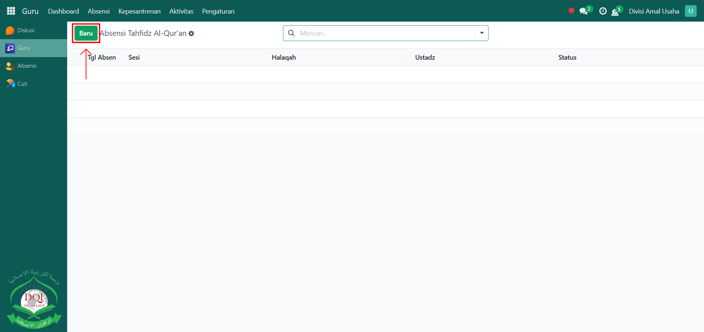
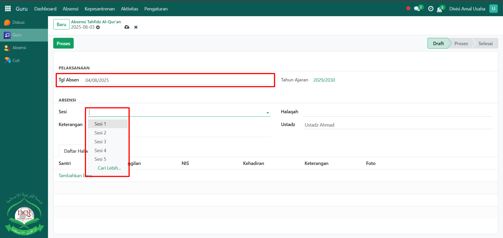
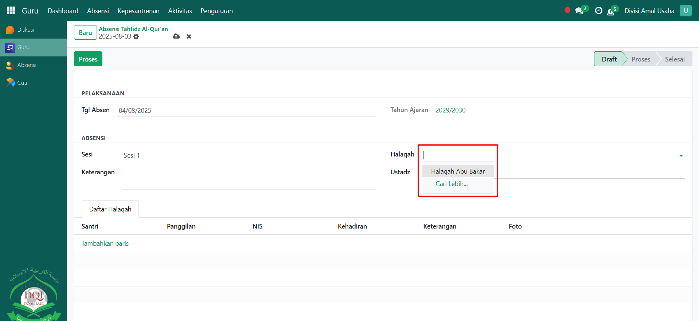
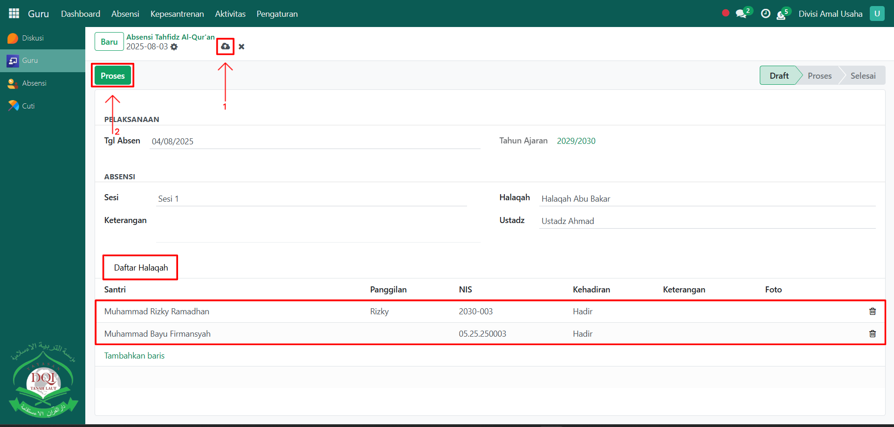
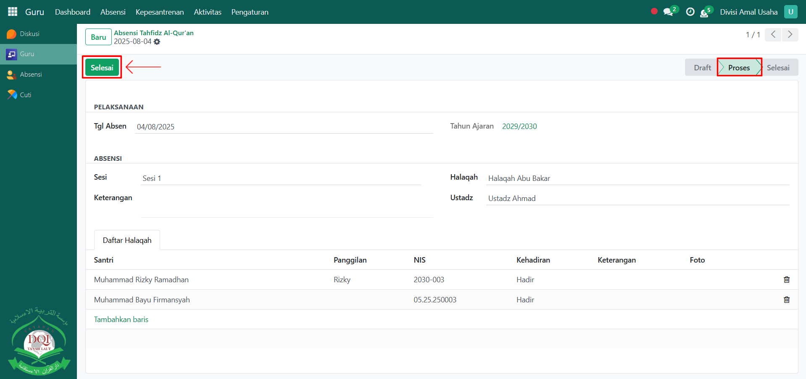

# Absensi Tahfidz

Video \[]

## Absensi Tahfidz

**Absensi Tahfidz** digunakan oleh **guru Qur’an** untuk mencatat kehadiran santri dalam kegiatan tahfidz (hafalan Al-Qur’an). Proses absensi ini penting untuk memastikan keteraturan dan kedisiplinan santri dalam mengikuti halaqah tahfidz.

### Melakukan Absensi Tahfidz

Berikut adalah langkah-langkah untuk melakukan absensi tahfidz pada Odoo pesantren oleh **guru qur'an**.

1. Login menggunakan akun guru qur'an. Jika Anda belum memahami cara login sebagai guru qur'an, silakan lihat panduan [**Login Guru Qur'an** di sini](../../../setup-and-konfigurasi/panduan-login/login-guru.md).
2.  Buka modul **Guru**, lalu klik menu **Absensi** kemudian pilih submenu **Absensi Tahfidz**.

    <figure><figcaption></figcaption></figure>

3.  Klik tombol **"Baru"** untuk membuat absensi tahfidz baru.

    <figure><figcaption></figcaption></figure>

4.  Akan tampil halaman form Absensi Tahfidz. Pada form ini, isi **Tanggal Absen**, lalu pilih **Sesi Tahfidz** sesuai jadwal.

    <figure><figcaption></figcaption></figure>

5.  Pilih **Halaqah** yang dibina oleh guru Qur’an yang sedang login.

    <figure><figcaption></figcaption></figure>

6.  Pindah ke **Tab Daftar Halaqah**, sistem akan menampilkan seluruh santri yang tergabung dalam halaqah tersebut. Lakukan pencatatan absensi dengan memilih status kehadiran santri (Hadir/Izin/Alfa). Setelah semua inputan diisi dengan benar, klik ikon **Simpan** di sebelah kanan ikon Gear agar data absensi tahfidz tersimpan di sistem, lalu klik tombol **Proses** untuk memproses absensi.

    <figure><figcaption></figcaption></figure>

7.  Terakhir, setelah proses absensi selesai, klik tombol **Selesai** untuk mengonfirmasi bahwa absensi tahfidz sudah final.

    <figure><figcaption></figcaption></figure>

8. Data absensi tahfidz yang telah selesai akan tersimpan dan dapat digunakan sebagai laporan kehadiran santri dalam kegiatan tahfidz.
9. Selanjutnya, guru qur'an bisa melakukan penilaian tahfidz kepada santri yang sudah diabsensi melalui absensi tahfidz, [Penilaian Tahfidz Al-Qur'an di sini](../penilaian-kepesantrenan/penilaian-tahfidz.md).
