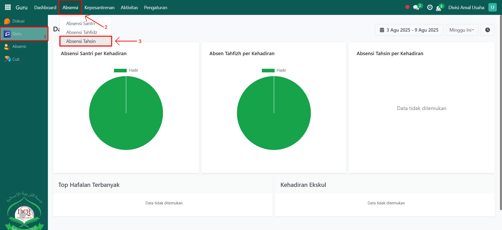
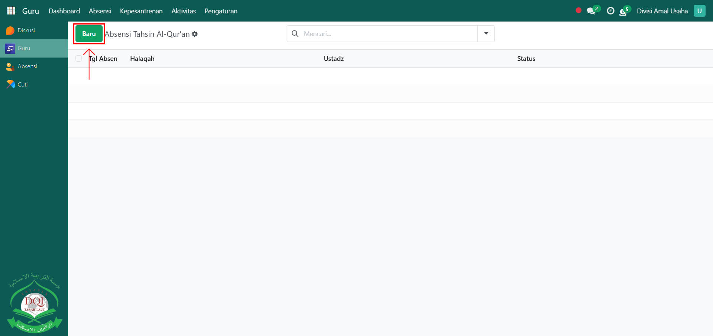
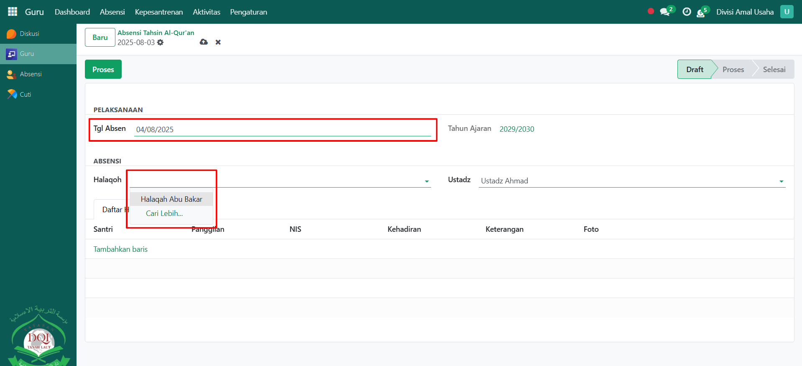
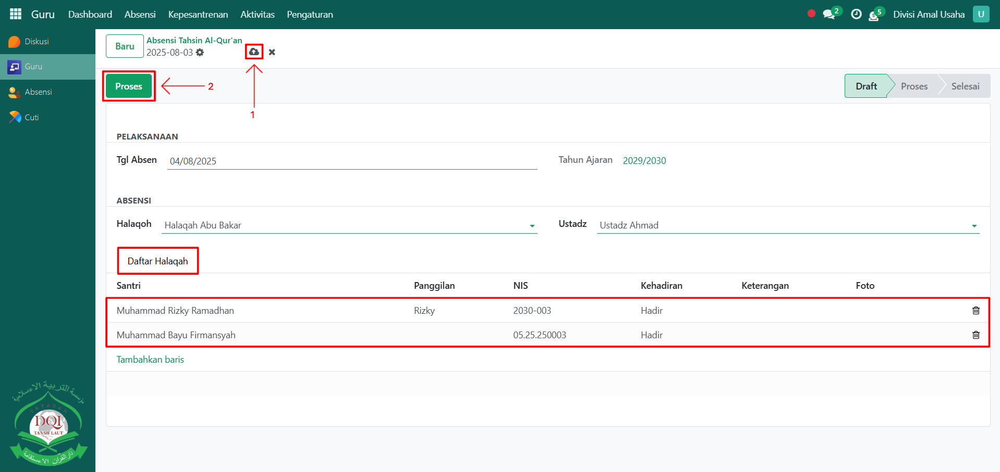
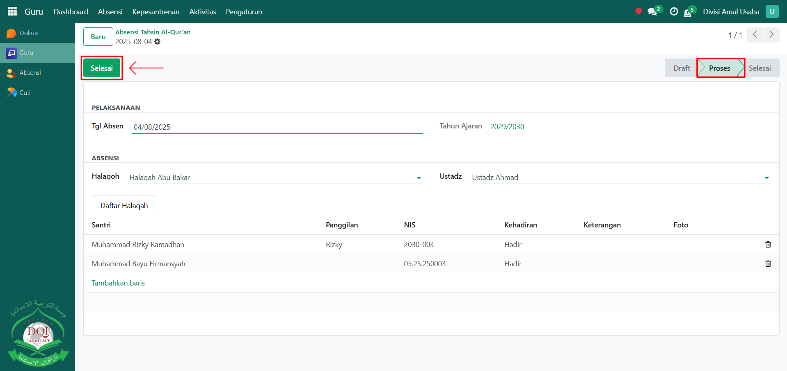

# Absensi Tahsin

Video \[]

## Absensi Tahsin

**Absensi Tahsin** digunakan oleh **guru Qur’an** untuk mencatat kehadiran santri dalam kegiatan tahsin (perbaikan bacaan Al-Qur’an). Proses absensi ini membantu guru dalam memantau keteraturan dan perkembangan santri pada sesi tahsin.

### Melakukan Absensi Tahsin

Berikut adalah langkah-langkah untuk melakukan absensi tahfidz pada Odoo Pesantren sebagai **guru qur'an**.

1. Login menggunakan akun guru qur'an. Jika Anda belum memahami cara login sebagai guru qur'an, silakan lihat panduan [**Login Guru Qur'an** di sini](../../../setup-and-konfigurasi/panduan-login/login-guru.md).
2.  Buka modul **Guru**, lalu klik menu **Absensi** kemudian pilih submenu **Absensi Tahsin**.

    <figure><figcaption></figcaption></figure>

3.  Klik tombol **"Baru"** untuk membuat absensi tahsin baru.

    <figure><figcaption></figcaption></figure>

4.  Akan tampil halaman form **Absensi Tahsin**. Pada form ini, isi **Tanggal Absen**, lalu pilih **Halaqah** yang dibina oleh guru Qur’an yang sedang login.

    <figure><figcaption></figcaption></figure>

5.  Pada **Tab Daftar Halaqah**, sistem akan menampilkan semua daftar santri yang berada dalam halaqah tersebut. Lakukan pencatatan kehadiran dengan memilih status kehadiran (Hadir/Izin/Alfa). Setelah semua inputan diisi dengan benar, klik ikon **Simpan** di sebelah kanan ikon Gear agar data absensi tahsin tersimpan di sistem, lalu klik tombol **Proses** untuk memproses absensi.

    <figure><figcaption></figcaption></figure>

6.  Terakhir, setelah proses absensi selesai, klik tombol **Selesai** untuk mengonfirmasi bahwa absensi tahsin sudah final.

    <figure><figcaption></figcaption></figure>

7. Data absensi tahsin yang telah dikonfirmasi akan tersimpan secara permanen dan dapat digunakan untuk laporan kehadiran santri pada kegiatan tahsin.
8. Selanjutnya, guru qur'an bisa melakukan penilaian tahsin kepada santri yang sudah diabsensi melalui absensi tahsin, [Penilaian Tahsin Al-Qur'an di sini](../penilaian-kepesantrenan/penilaian-tahsin.md).
