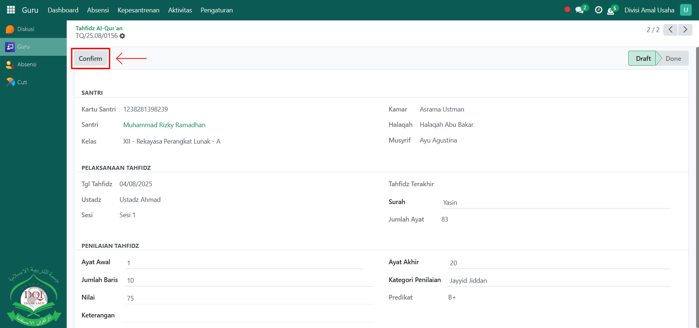

# Penilaian Tahfidz

Video \[]

## Penilaian Tahfidz Al-Qur'an

**Penilaian Tahfidz Al-Qur'an** digunakan oleh guru Qur’an untuk mencatat hasil hafalan santri, termasuk ayat yang dibaca, ketepatan hafalan, serta kualitas bacaannya. Fitur ini membantu pesantren dalam memantau perkembangan hafalan santri secara terstruktur.

### Melakukan Penilaian Tahfidz Al-Qur'an

Berikut adalah langkah-langkah untuk melakukan penialian tahfidz al-qur'an pada Odoo Pesantren sebagai **guru qur'an**.

1. Login menggunakan akun guru qur'an. Jika Anda belum memahami cara login sebagai guru qur'an, silakan lihat panduan [**Login Guru Qur'an** di sini](../../../setup-and-konfigurasi/panduan-login/login-guru.md).
2.  Buka **modul Guru**, lalu klik menu **Kepesantrenan** kemudian pilih submenu **Tahfidz Al-Qur’an**.

    <figure><figcaption></figcaption></figure>

3.  Pilih **santri yang sudah dilakukan absensi tahfidz** oleh Guru Qur’an pada hari tersebut untuk melanjutkan proses penilaian.

    <figure><figcaption></figcaption></figure>

4.  Akan tampil halaman form **Penilaian Tahfidz Al-Qur’an**. Pada form ini, Anda bisa melihat beberapa informasi santri, kemudian pilih **surat Al-Qur’an**.

    <figure><figcaption></figcaption></figure>

5.  Lakukan penilaian dengan mengisi inputan penilaian seperti:

    * **Ayat Awal** (masukkan ayat awal dari hafalan surat Al-Qur'an tersebut).
    * **Ayat Akhir** (masukkan ayat akhir dari hafalan surat Al-Qur'an tersebut).
    * **Jumlah Baris** (masukkan jumlah baris yang dihafal).
    * **Kategori Penilaian** (masukkan kategori penilaian yang sesuai dengan data nilai tahfidz).
    * **Nilai** (masukkan nilai dari tahfidz santri).
    * **Keterangan** (opsional, bisa diisi catatan tambahan dari tahfidz tersebut).

    Setelah semua inputan diisi dengan benar, klik icon **Simpan** di sebelah kanan icon **Gear** agar data penilaian tersimpan di sistem dengan status **Draft**.

    <figure><figcaption></figcaption></figure>

6.  Klik tombol **"Confirm"** untuk mengonfirmasi bahwa proses penilaian sudah selesai, sehingga statusnya berubah menjadi **Done**.

    <figure><figcaption></figcaption></figure>

7. Penilaian Tahfidz Al-Qur’an yang sudah dikonfirmasi akan tersimpan sebagai arsip dan bisa dilihat kembali oleh guru maupun administrator untuk evaluasi perkembangan santri.
