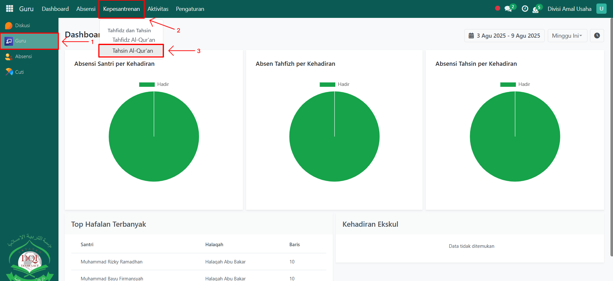
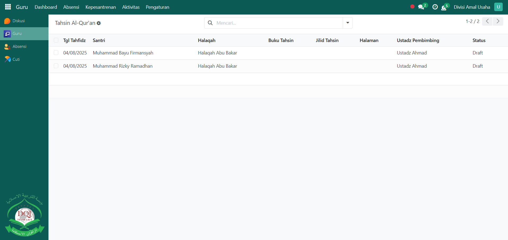
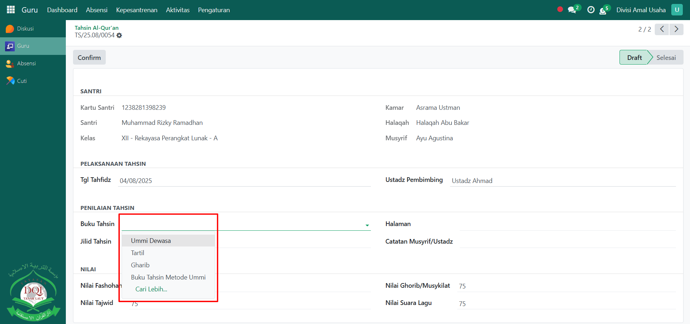
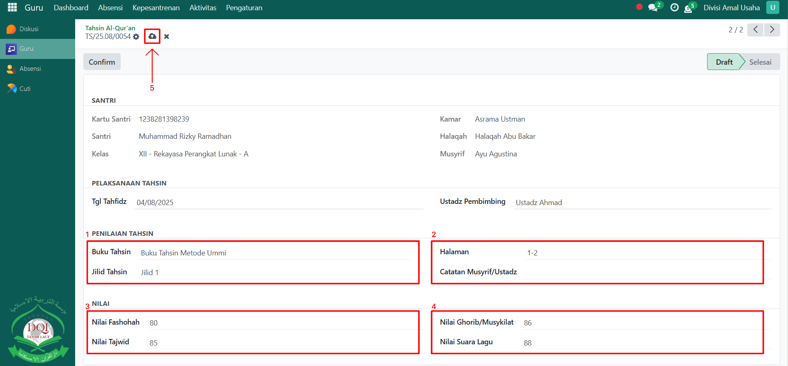
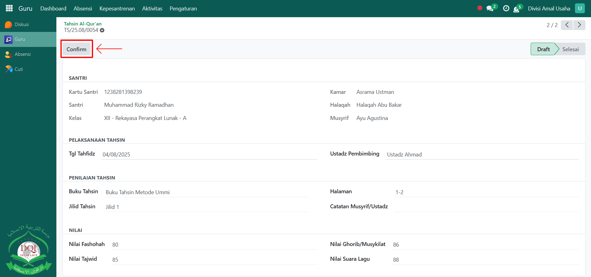

# Penilaian Tahsin

Video \[]

## Penilaian Tahsin Al-Qur'an

**Penilaian Tahsin Al-Qur’an** digunakan oleh Guru Qur’an untuk mengevaluasi bacaan santri berdasarkan kaidah tajwid, fashohah, pemahaman ghorib/musykilat, serta kualitas suara. Dengan fitur ini, perkembangan bacaan santri dapat dipantau dan dinilai secara sistematis.

### Melakukan Penilaian Tahsin Al-Qur'an

Berikut adalah langkah-langkah untuk melakukan penilaian tahsin al-qur'an pada Odoo Pesantren sebagai **guru qur'an**.

1. Login menggunakan akun guru qur'an. Jika Anda belum memahami cara login sebagai guru qur'an, silakan lihat panduan [**Login Guru Qur'an** di sini](../../../setup-and-konfigurasi/role-and-hak-akses-pengguna/panduan-login/login-guru.md).
2.  Buka **modul Guru**, lalu klik menu **Kepesantrenan** kemudian pilih submenu **Tahsin Al-Qur’an**.

    <figure><figcaption></figcaption></figure>

3.  Pilih **santri yang sudah dilakukan absensi Tahsin** pada hari tersebut untuk melanjutkan proses penilaian.

    <figure><figcaption></figcaption></figure>

4.  Akan tampil halaman form **Penilaian Tahsin Al-Qur’an**. Pada form ini, Anda bisa melihat beberapa informasi santri, lalu pilih **Buku Tahsin** yang dipelajari.

    <figure><figcaption></figcaption></figure>

5.  Lakukan penilaian bacaan santri dengan mengisi inputan berikut:

    * **Jilid Tahsin** (misalnya: Jilid 2)
    * **Halaman** yang sedang dibaca santri
    * **Catatan Musyrif/Ustadz** (opsional, untuk menambahkan keterangan khusus).
    * **Nilai Fashohah** (kelancaran bacaan)
    * **Nilai Tajwid** (ketepatan kaidah tajwid)
    * **Nilai Ghorib/Musykilat** (kemampuan membaca lafadz-lafadz yang asing atau sulit)
    * **Nilai Suara & Lagu** (kualitas suara dan lagu bacaan Al-Qur’an).

    Setelah semua inputan diisi dengan benar, klik ikon **Simpan** di sebelah kanan ikon **Gear** agar data penilaian tahsin tersimpan di sistem dengan status **Draft**.

    <figure><figcaption></figcaption></figure>

6.  Klik tombol **"Confirm"** untuk mengonfirmasi bahwa proses penilaian tahsin sudah selesai.

    <figure><figcaption></figcaption></figure>

7. Data penilaian yang sudah dikonfirmasi akan tersimpan dan dapat digunakan sebagai arsip evaluasi perkembangan bacaan santri.
