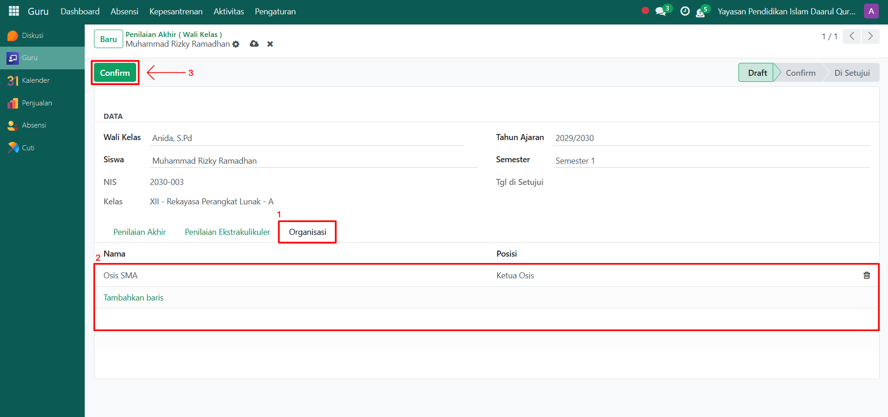

# Penilaian Akhir (Wali Kelas)



## Penilaian Akhir (Wali Kelas)

**Penilaian Akhir (Wali Kelas)** pada Odoo Pesantren digunakan oleh Guru Wali Kelas untuk menginput dan mengkonfirmasi hasil penilaian akhir siswa, termasuk nilai akademik, ekstrakurikuler, dan keikutsertaan organisasi. Proses ini memastikan semua nilai yang diberikan oleh guru mata pelajaran dan pembina kegiatan telah terakumulasi dan siap dicetak sebagai rapor.

### Melakukan Penilaian Akhir oleh Wali Kelas

Berikut adalah langkah-langkah untuk melakukan penilaian akhir (wali kelas) pada Odoo Pesantren oleh **wali kelas**.

1. Login menggunakan akun guru wali kelas. Jika Anda belum memahami cara login sebagai guru wali kelas, silakan lihat panduan [**Login Guru Wali Kelas** di sini](../../../setup-and-konfigurasi/panduan-login/login-guru.md).
2.  Buka modul **Guru**, lalu klik menu **Aktivitas** kemudian pilih submenu **Penilaian Akhir (Wali Kelas)**.

    <figure><figcaption></figcaption></figure>

3.  Klik tombol **"Baru"** untuk membuat penilaian akhir atau rapor siswa.

    <figure><figcaption></figcaption></figure>

4.  Pada halaman formulir Penilaian Akhir, pilih **siswa** yang akan dinilai.

    <figure><figcaption></figcaption></figure>

5.  Masukkan **semester** yang sedang berlangsung di sekolah.

    <figure><figcaption></figcaption></figure>

6.  Pada **Tab Penilaian Akhir**. Sistem akan menampilkan daftar nilai siswa yang telah diinput oleh Guru Mata Pelajaran. Data ini terisi secara otomatis setelah Anda memilih siswa, tahun ajaran, dan semester.

    <figure><figcaption></figcaption></figure>

7.  Kemudian di **Tab Penilaian Ekstrakurikuler**. Sistem akan menampilkan daftar kegiatan ekstrakurikuler yang diikuti siswa. Wali Kelas dapat mengisi nilai untuk setiap kegiatan yang telah diikuti. Data ini juga terisi otomatis, dan Wali Kelas hanya perlu memberikan penilaian.

    <figure><figcaption></figcaption></figure>

8.  Lalu di **Tab Organisasi**. Sistem akan menampilkan daftar organisasi yang diikuti siswa. Setelah semua penilaian terisi, klik tombol **"Confirm"** untuk mengunci data. Status penilaian akan berubah menjadi **Confirm**.

    <figure><figcaption></figcaption></figure>

9.  Untuk menyetujui penilaian, klik tombol **"Disetujui"**. Setelah disetujui, data siap digunakan untuk proses pencetakan rapor dan status penilaian akan menjadi **Di Setujui**.

    <figure><figcaption></figcaption></figure>
