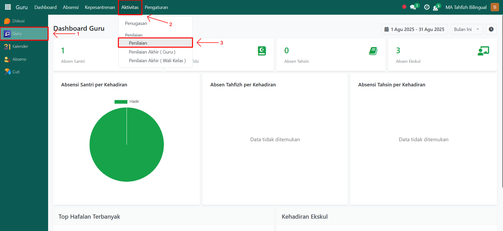

# Penilaian

Video \[]

## Penilaian

**Penilaian** digunakan oleh **guru akademik** untuk mencatat hasil evaluasi belajar santri dalam satu kelas, baik untuk Ulangan Harian, UTS, UAS, maupun jenis penilaian lainnya. Sistem akan secara otomatis menyesuaikan **predikat** sesuai dengan konfigurasi predikat nilai yang telah ditentukan sebelumnya.

### Melakukan Penilaian kepada Santri/Siswa

Berikut adalah langkah-langkah untuk melakukan **Penilaian** pada Odoo Pesantren sebagai **guru akademik**.

1. Login menggunakan akun guru akademik. Jika Anda belum memahami cara login sebagai guru akademik, silakan lihat panduan [**Login Guru Akademik** di sini](../../../setup-and-konfigurasi/panduan-login/login-guru.md).
2.  Buka modul **Guru**, lalu klik menu **Aktivitas** kemudian pilih submenu **Penilaian**.

    <figure><figcaption></figcaption></figure>
3.  Klik tombol **"Baru"** untuk membuat penilaian baru.

    <figure><figcaption></figcaption></figure>

4.  Akan tampil halaman form **Penilaian**. Pada form ini, isi **Guru** yang sedang melakukan penilaian, lalu pilih **Kelas** yang akan dinilai.

    <figure><figcaption></figcaption></figure>

5.  Selanjutnya, isi inputan lainnya seperti:

    * **Mata Pelajaran** (misalnya: Matematika)
    * **Semester** (misalnya: Ganjil/Genap)
    * **Tipe Penilaian** (misalnya: Ulangan Harian, UTS, UAS, atau lainnya)

    Pada bagian bawah form terdapat **list table santri**, yang menampilkan seluruh santri/siswa dalam kelas tersebut.

    <figure><figcaption></figcaption></figure>

6.  Masukkan nilai pada setiap santri. **Predikat** akan otomatis terisi berdasarkan konfigurasi predikat nilai yang sudah dibuat di setup. Setelah semua inputan diisi dengan benar, klik ikon **Simpan** di sebelah kanan ikon Gear agar data penilaian tersimpan di sistem dengan status **Draft**. Klik tombol **Done** untuk mengonfirmasi bahwa proses penilaian sudah selesai.

    <figure><figcaption></figcaption></figure>

7. Data penilaian akan tersimpan secara permanen dan dapat diakses untuk laporan akademik santri.
