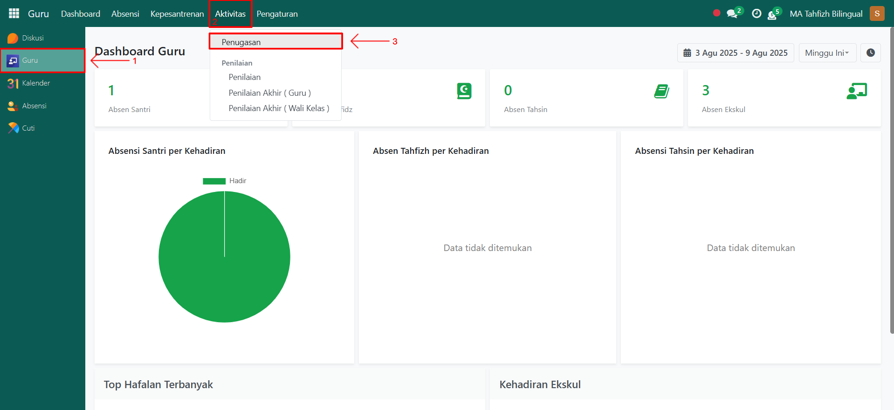
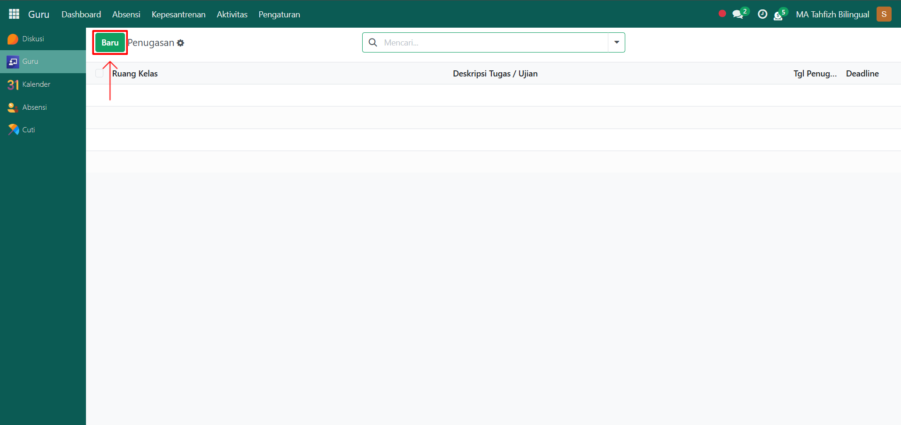
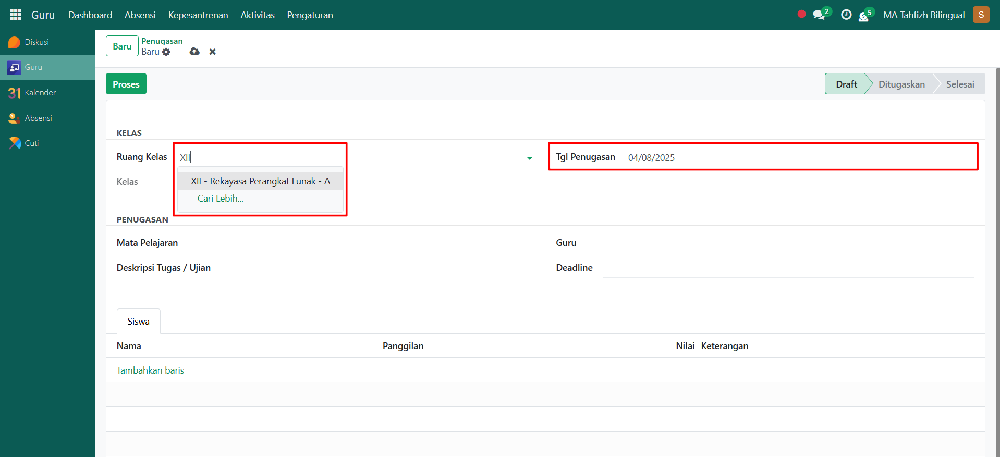
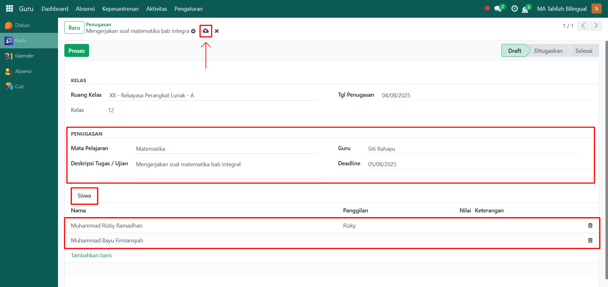
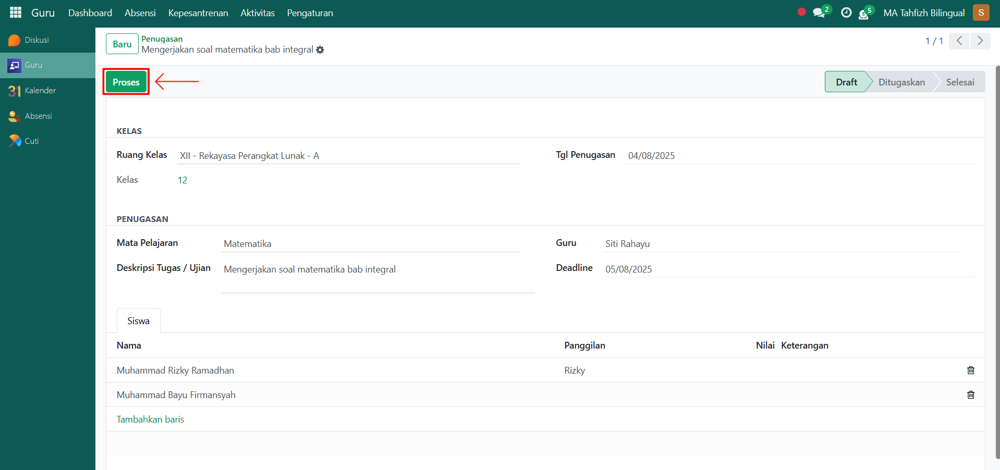
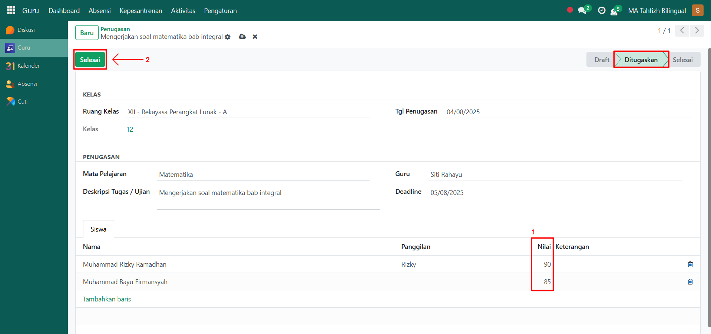

# Penugasan

Video \[]

## Penugasan

Penugasan digunakan oleh **guru akademik** untuk memberikan tugas atau ujian kepada santri sesuai dengan kelas dan mata pelajaran yang diampu. Fitur ini membantu dalam pencatatan dan pemantauan perkembangan akademik santri.

### Melakukan Penugasan kepada Santri/Siswa

Berikut adalah langkah-langkah untuk melakukan **Penugasan** pada Odoo Pesantren sebagai **guru akademik**.

1. Login menggunakan akun guru akademik. Jika Anda belum memahami cara login sebagai guru akademik, silakan lihat panduan [**Login Guru Akademik** di sini](../../../setup-and-konfigurasi/role-and-hak-akses-pengguna/panduan-login/login-guru.md).
2.  Buka modul **Guru**, lalu klik menu **Aktivitas** dan pilih submenu **Penugasan**.

    <figure><figcaption></figcaption></figure>

3.  Klik tombol **"Baru"** untuk membuat penugasan baru.

    <figure><figcaption></figcaption></figure>

4.  Akan tampil halaman form **Penugasan**. Pada form ini, pilih **Kelas**, lalu isi **Tanggal Penugasan**.

    <figure><figcaption></figcaption></figure>

5.  Selanjutnya, isi inputan lainnya seperti:

    * **Mata Pelajaran** (otomatis sesuai dengan jadwal atau bisa dipilih manual)
    * **Guru** (terisi otomatis sesuai akun guru yang login)
    * **Deskripsi Tugas/Ujian** (misalnya: “Mengerjakan soal matematika bab trigonometri”)
    * **Deadline** (tanggal terakhir pengumpulan tugas)
    * **Tab Siswa**, sistem akan menampilkan daftar santri dalam kelas tersebut, pilih siswa yang akan diberi penugasan.

    Setelah semua inputan diisi dengan benar, klik ikon **Simpan** di sebelah kanan ikon **Gear** agar data penugasan tersimpan di sistem dan statusnya menjadi **Draft**.

    <figure><figcaption></figcaption></figure>

6.  Kemudian klik tombol **"Proses"** untuk memproses penugasan.

    <figure><figcaption></figcaption></figure>

7.

    <figure><figcaption></figcaption></figure>

8. Data penugasan akan tersimpan secara permanen dan dapat digunakan untuk proses penilaian santri.
