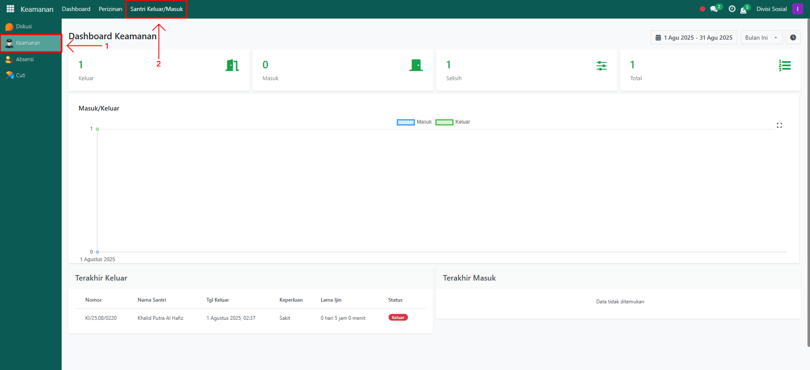
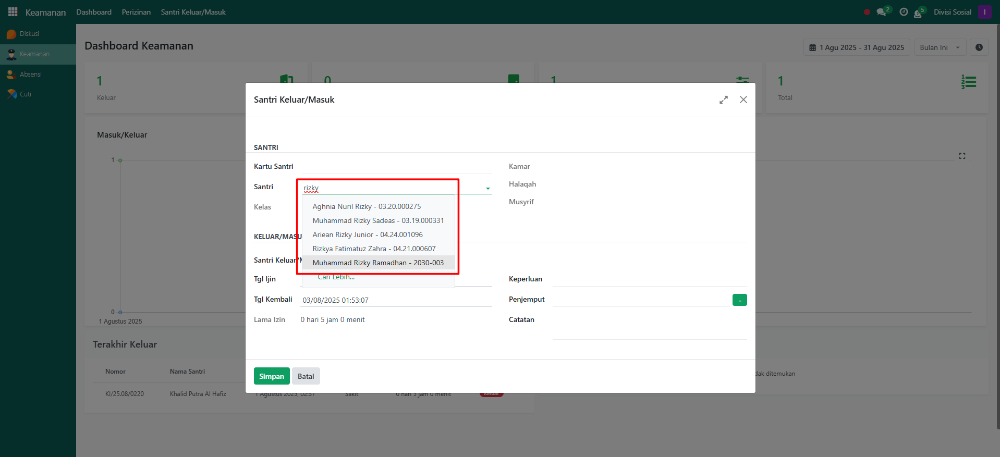
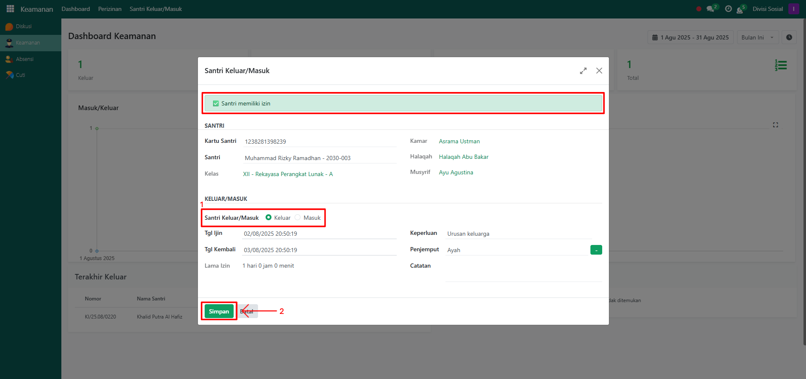
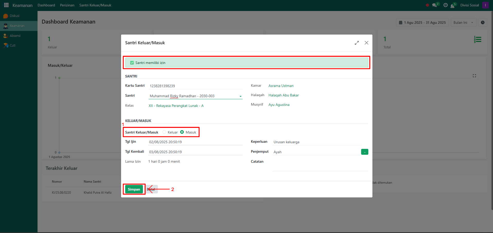
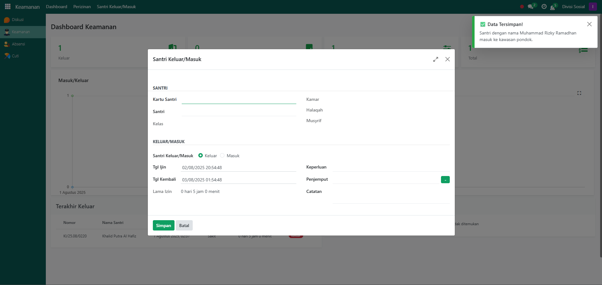

# Santri Keluar/Masuk Pesantren

Video \[]

## Santri Keluar/Masuk Pesantren

**Santri Keluar/Masuk Pesantren** digunakan oleh petugas keamanan untuk mencatat pergerakan santri saat keluar atau masuk pesantren. Proses ini hanya bisa dilakukan apabila santri telah memiliki izin yang disetujui oleh musyrif.

### Mencatat Keluar/Masuk Santri

Berikut adalah langkah-langkah untuk melakukan pencatatan keluar/masuk santri dari pesantren pada Odoo Pesantren sebagai **petugas keamanan**.

1. Login menggunakan akun petugas keamanan. Jika Anda belum memahami cara login sebagai petugas keamanan, silakan lihat panduan [**Login Petugas Keamanan** di sini](../../setup-and-konfigurasi/role-and-hak-akses-pengguna/panduan-login/login-petugas-keamanan.md).
2.  Buka **modul Keamanan**, lalu klik menu **Santri Keluar/Masuk**.

    <figure><figcaption></figcaption></figure>

3.  Akan tampil halaman pop up form **Santri Keluar/Masuk**. Pada form ini, petugas keamanan yang sedang login memilih santri yang akan dicatat keluar atau masuk pesantren.

    <figure><figcaption></figcaption></figure>

4. Pada bagian atas form, akan ditampilkan informasi berupa **peringatan (warning)**. Santri yang **tidak memiliki persetujuan izin dari musyrif** tidak dapat diproses keluar/masuk dan santri yang **sudah memiliki izin dari musyrif** dapat diproses keluar/masuk.
   *   **Santri Keluar** dari Pesantren, Pilih opsi **Keluar** melalui tombol radio yang tersedia. Data santri serta detail perizinan akan otomatis terisi sesuai informasi santri tersebut.&#x20;

       <figure><figcaption></figcaption></figure>

   *   Santri yang **tidak memiliki persetujuan izin dari musyrif** tidak dapat diproses keluar/masuk.

       <figure><figcaption></figcaption></figure>

   *   **Santri Masuk** ke Pesantren, Pilih opsi **Masuk** melalui tombol radio yang tersedia. Data santri serta detail perizinan akan otomatis terisi sesuai informasi santri tersebut.

       <figure><figcaption></figcaption></figure>

   * Setelah konfigurasi form selesai, klik tombol **“Simpan”** untuk menjalankan proses pencatatan santri keluar/masuk.
5. Setelah berhasil, sistem akan menampilkan notifikasi:
   *   **Santri Keluar, n**otifikasi bahwa santri berhasil dicatat keluar dari pesantren.

       <figure><figcaption></figcaption></figure>

   *   **Santri Masuk, n**otifikasi bahwa santri berhasil dicatat masuk ke pesantren.

       <figure><figcaption></figcaption></figure>

6. Riwayat keluar/masuk santri dapat dilihat kembali pada daftar aktivitas keluar/masuk.
