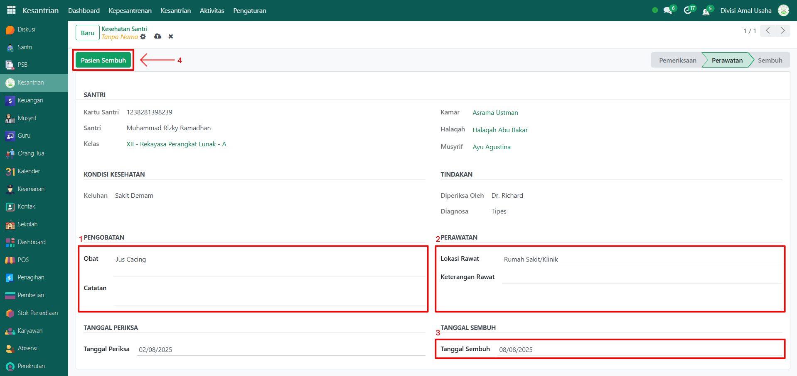

# Kesehatan Santri

Video \[]

## Pengelolaan Kesehatan Santri

**Pengelolaan Kesehatan Santri** dilakukan oleh **administrator** setelah musyrif mencatat data pemeriksaan kesehatan santri. Tahap ini meliputi tindak lanjut berupa pengobatan, perawatan, hingga santri dinyatakan sembuh. Dengan adanya alur ini, data kesehatan santri dapat tercatat dengan baik dari awal pemeriksaan sampai akhir proses penyembuhan.

### Melakukan Pengelolaan Kesehatan Santri

Berikut adalah langkah-langkah untuk melakukan pengelolaan kesehatan santri pada Odoo Pesantren sebagai **administrator**.

1. Login menggunakan akun administrator. Jika Anda belum memahami cara login sebagai admin, silakan lihat panduan [**Login Admin** di sini](../../../panduan-login/login-admin.md).
2.  Buka modul **Kesantrian**, lalu klik menu **Aktivitas** kemudian pilih submenu **Kesehatan Santri**.

    <figure><figcaption></figcaption></figure>

3.  Pada daftar data kesehatan, pilih salah satu data santri dengan status **Pemeriksaan**, yang sebelumnya telah dicatat oleh musyrif dan memerlukan pengelolaan lebih lanjut oleh administrator.

    <figure><figcaption></figcaption></figure>

4. Akan tampil halaman form **Kesehatan Santri**. Periksa kembali data pemeriksaan (keluhan, diagnosa, tanggal, pemeriksa) untuk memastikan kebenaran data.&#x20;
5.  Jika data sudah sesuai, klik tombol **"Pengobatan"** untuk melanjutkan ke tahap pengelolaan kesehatan.

    <figure><figcaption></figcaption></figure>

6.  Pada tahap pengobatan/perawatan, lengkapi data seperti:

    * **Obat** (masukkan obat yang diberikan).&#x20;
    * **Catatan** (opsional, isi dengan catatan tambahan jika diperlukan).
    * **Lokasi Perawatan** (masukkan lokasi yang digunakan untuk merawat santri).
    * **Keterangan Perawatan** (opsional, isi dengan keterangan tambahan untuk pengobatan).
    * **Tanggal Sembuh** (masukkan tanggal sembuh jika santri sudah sembuh).

    Jika santri sudah dinyatakan pulih, klik tombol **"Pasien Sembuh"** untuk menutup kasus kesehatan santri tersebut.

    <figure><figcaption></figcaption></figure>

7.  Setelah status berubah menjadi **Sembuh**, data riwayat kesehatan santri akan tersimpan permanen dalam sistem dan dapat dilihat sewaktu-waktu.

    <figure><figcaption></figcaption></figure>
