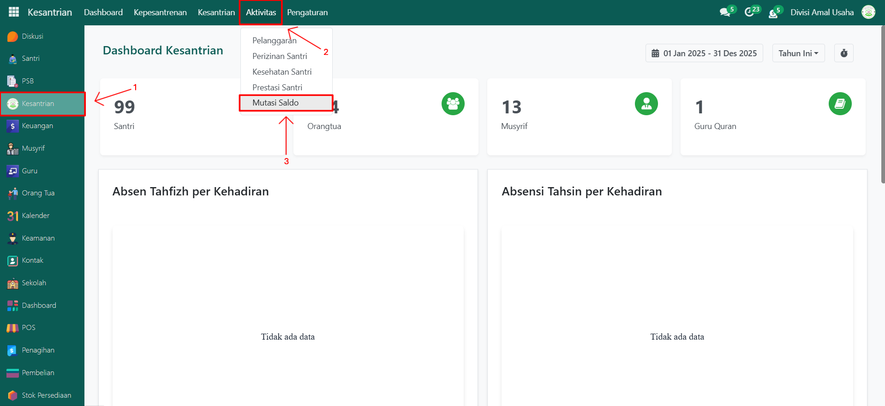
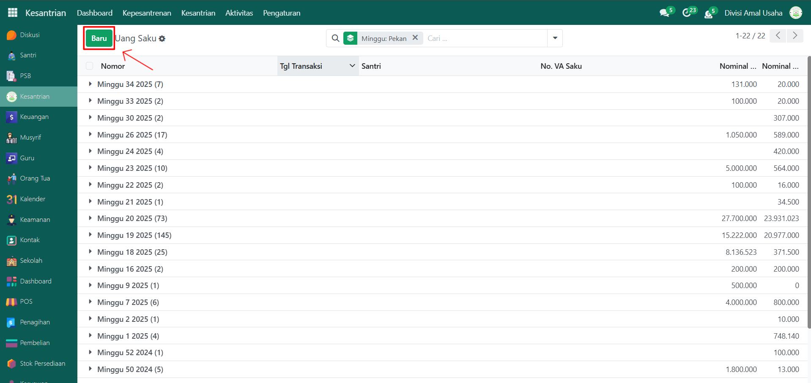
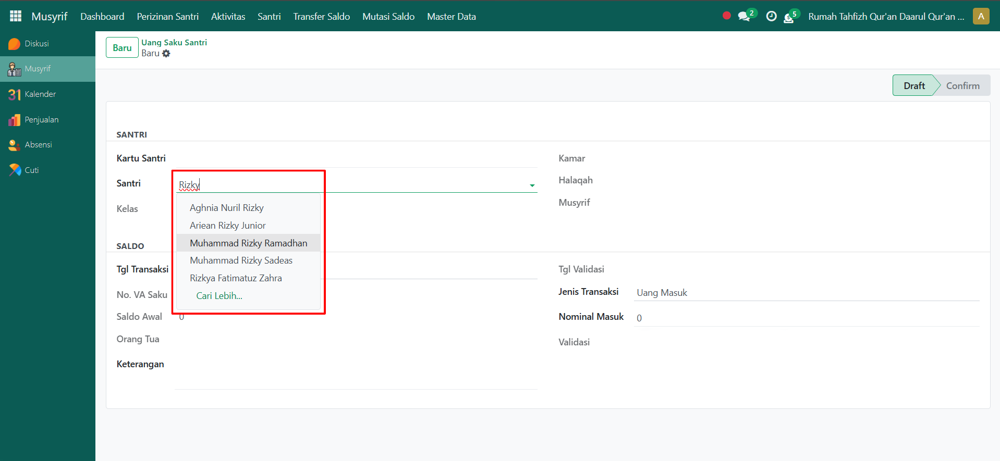
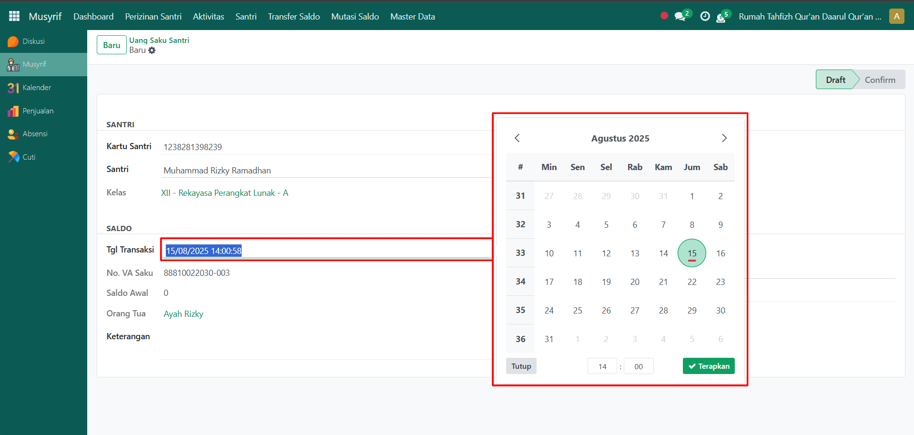
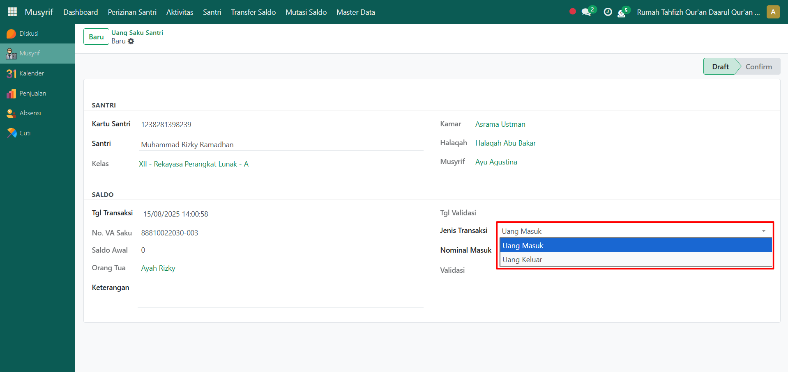
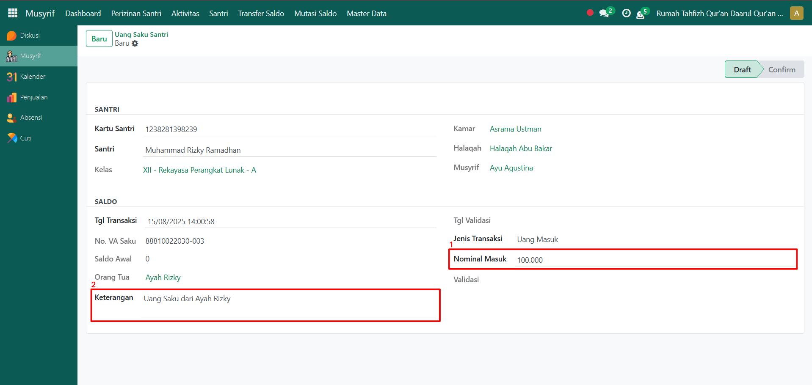
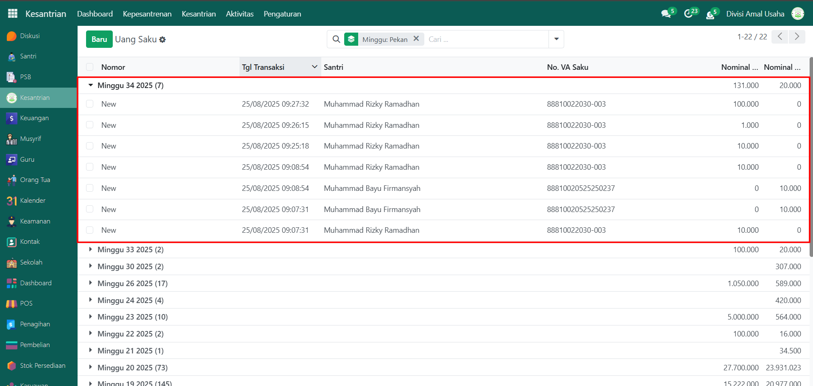
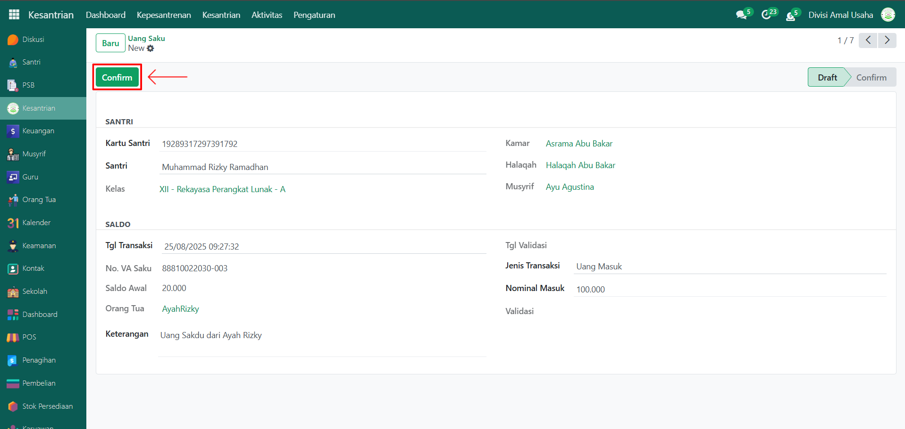

# Mutasi Saldo Santri

Video \[]

## Mutasi Saldo Santri

**Mutasi Saldo Santri** digunakan untuk mencatat pengisian maupun pengeluaran saldo dompet santri. Dengan adanya pencatatan ini, transaksi uang saku dapat dikelola secara transparan dan terdokumentasi dengan baik sehingga memudahkan dalam pengawasan serta pelaporan keuangan santri.

### Melakukan Mutasi Saldo Santri

Berikut adalah langkah-langkah untuk melakukan mutasi saldo pada Odoo Pesantren sebagai **administrator**.

1. Login menggunakan akun administrator. Jika Anda belum memahami cara login sebagai admin, silakan lihat panduan [**Login Admin** di sini](../../../panduan-login/login-admin.md).
2.  Buka modul **Kesantrian**, lalu klik menu **Aktivitas** kemudian pilih submenu **Mutasi Saldo**.

    <figure><figcaption></figcaption></figure>

3.  Klik tombol **"Baru"** untuk melakukan mutasi saldo.

    <figure><figcaption></figcaption></figure>

4.  Halaman form mutasi saldo akan ditampilkan. Pilih **santri** yang akan dilakukan pengisian atau pengeluaran saldo dompet.

    <figure><figcaption></figcaption></figure>

5.  Masukkan **tanggal transaksi**. Secara default, sistem akan otomatis menyesuaikan dengan tanggal saat transaksi dibuat.

    <figure><figcaption></figcaption></figure>

6.  Pada kolom **Jenis Transaksi**, pilih tipe transaksi yang dilakukan, misalnya _Uang Masuk_ (pengisian saldo) atau _Uang Keluar_ (pengeluaran saldo).

    <figure><figcaption></figcaption></figure>

7.  Masukkan **nominal saldo** sesuai transaksi yang dilakukan. Jika diperlukan, tambahkan **keterangan** untuk memperjelas transaksi.

    <figure><figcaption></figcaption></figure>

8. Setelah semua inputan diisi dengan benar, klik icon **Simpan** di sebelah kanan icon **Gear** agar data mutasi saldo tersimpan di sistem dengan status **Draft**.
9. Selanjutnya, transaksi uang saku tersebut akan dikonfirmasi pada pengelolaan mutasi saldo oleh **Administrator**.

### Mengelola Mutasi Saldo Santri

Berikut adalah langkah-langkah untuk mengelola mutasi saldo pada Odoo Pesantren sebagai **administrator**.

1.  Pada tampilan daftar **mutasi saldo**, pilih salah satu entri yang diperlukan untuk dikonfirmasi.

    <figure><figcaption></figcaption></figure>

2.  Klik tombol **"Konfirmasi"** untuk mengkonfirmasi mutasi saldo.

    <figure><figcaption></figcaption></figure>

3. Setelah status mutasi saldo menjadi **Confirm**, sistem akan langsung memproses uang masuk/keluar dari mutasi saldo tersebut ke Dompet Santri.

