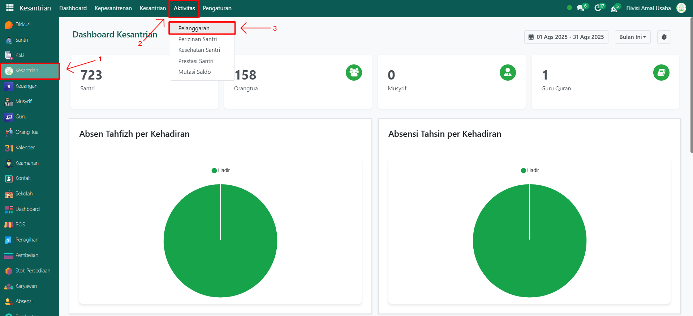

# Pelanggaran Santri



## Pengelolaan Pelanggaran Santri

**Pengelolaan Pelanggaran Santri** dilakukan oleh **administrator** setelah data pelanggaran dicatat dan dikonfirmasi oleh musyrif. Tahap ini berfungsi untuk memastikan kebenaran data pelanggaran dan memberikan persetujuan akhir agar status pelanggaran santri resmi tercatat di sistem.

### Melakukan Pengelolaan Pelanggaran Santri

Berikut adalah langkah-langkah untuk melakukan pengelolaan pelanggaran santri pada Odoo Pesantren sebagai **administrator**.

1. Login menggunakan akun administrator. Jika Anda belum memahami cara login sebagai admin, silakan lihat panduan [**Login Admin** di sini](../../../panduan-login/login-admin.md).
2.  Buka modul **Kesantrian**, lalu klik menu **Aktivitas** kemudian pilih submenu **Pelanggaran**.

    <figure><figcaption></figcaption></figure>

3.  Pada daftar pelanggaran, pilih salah satu data pelanggaran santri yang telah dikonfirmasi oleh musyrif dengan status **Konfirmasi** dan masih menunggu persetujuan administrator.

    <figure><figcaption></figcaption></figure>

4.  Akan tampil halaman form pelanggaran santri. Periksa kembali seluruh data pelanggaran (nama santri, tanggal, kategori pelanggaran, poin, tindakan, dan catatan) untuk memastikan kesesuaiannya. Jika data sudah sesuai, klik tombol **"Disetujui"** untuk memberikan persetujuan administrator.

    <figure><figcaption></figcaption></figure>

5.  Setelah disetujui, status data pelanggaran akan berubah menjadi **Disetujui**, yang menandakan pelanggaran tersebut resmi tercatat dalam sistem.

    <figure><figcaption></figcaption></figure>

6. Jika ternyata data tidak sesuai, administrator dapat melakukan **edit data** dengan mengubah data menjadi **Draft** melalui tombol **"Ubah ke Draft"** atau menghubungi musyrif terkait untuk perbaikan sebelum disetujui.
