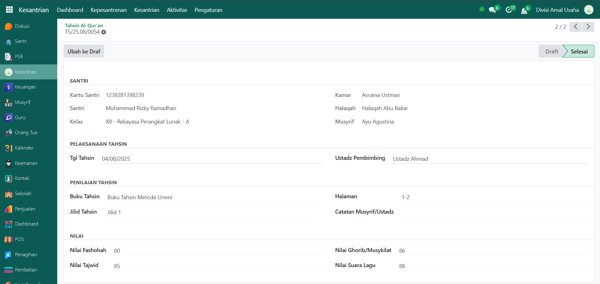

# Absensi & Tahsin Al-Quran

Video \[]

## Absensi & Tahsin Al-Qur'an

**Absensi Tahsin** merupakan kumpulan catatan kehadiran santri dalam kegiatan tahsin Al-Qur’an. **Tahsin Al-Qur'an** adalah kumpulan data pelaksanaan kegiatan tahsin yang dilakukan oleh santri di bawah bimbingan guru/ustadz halaqah.

## Melihat Daftar Absensi Tahsin

Berikut adalah langkah-langkah untuk melihat daftar absensi tahsin santri pada Odoo Pesantren.

1. Login menggunakan akun administrator. Jika Anda belum memahami cara login sebagai admin, silakan lihat panduan [**Login Admin** di sini](../../../panduan-login/login-admin.md).
2.  Buka modul **Kesantrian**, lalu klik menu **Kepesantrenan** kemudian pilih submenu **Absensi Tahsin**.

    <figure><figcaption></figcaption></figure>

3.  Pada halaman **Absensi Tahsin**, Anda akan melihat daftar seluruh data absensi dari setiap sesi halaqah. Informasi utama yang ditampilkan meliputi: nama halaqah, sesi tahsin, ustadz pembina, tanggal absen, dan status absensi.

    <figure><figcaption></figcaption></figure>

4. Untuk melihat detail absensi, klik salah satu data absensi dari daftar.
5.  Akan tampil halaman form absensi yang berisi informasi detail dari absensi tersebut. Pada **Tab Daftar Halaqah**, Anda dapat melihat daftar santri yang mengikuti kegiatan tahsin Al-Qur’an beserta status kehadirannya.

    <figure><figcaption></figcaption></figure>

6. Dengan langkah ini, administrator dapat memantau daftar absensi tahsin santri secara lengkap berdasarkan halaqah maupun per santri.

### Melihat Daftar Tahsin Al-Qur'an

Berikut adalah langkah-langkah untuk melihat daftar tahsin al-qur'an santri pada Odoo Pesantren.

1. Login menggunakan akun administrator. Jika Anda belum memahami cara login sebagai admin, silakan lihat panduan [**Login Admin** di sini](../../../panduan-login/login-admin.md).
2.  Buka modul **Kesantrian**, lalu klik menu **Kepesantrenan** kemudian pilih submenu **Tahsin Al-Qur’an**.

    <figure><figcaption></figcaption></figure>

3.  Pada halaman ini, Anda akan melihat daftar seluruh kegiatan tahsin yang telah dicatat. Setiap entri menampilkan informasi seperti nama halaqah, nama santri, sesi tahsin, guru/ustadz pembimbing, tanggal tahsin, jilid dan halaman yang dibaca, dan status pelaksanaan.

    <figure><figcaption></figcaption></figure>

4. Klik salah satu entri dari daftar untuk melihat **detail** kegiatan tahsin tersebut.
5.  Anda akan diarahkan ke tampilan form tahsin yang memuat informasi lengkap, seperti:

    * **Identitas Santri** (berisi informasi detail mengenai santri yang melakukan tahsin al-qur'an).
    * **Rincian Pelaksanaan Tahfidz** (menampilkan informasi pelaksanaan tahsin).
    * **Penilaian Tahsin** (berisi informasi penilaian tahsin seperti nilai-nilai fashohah, tajwid dan lainnya).

    <figure><figcaption></figcaption></figure>

6. Dengan langkah-langkah ini, Anda dapat memantau dan mengevaluasi perkembangan tahsin santri secara menyeluruh dan akurat.
