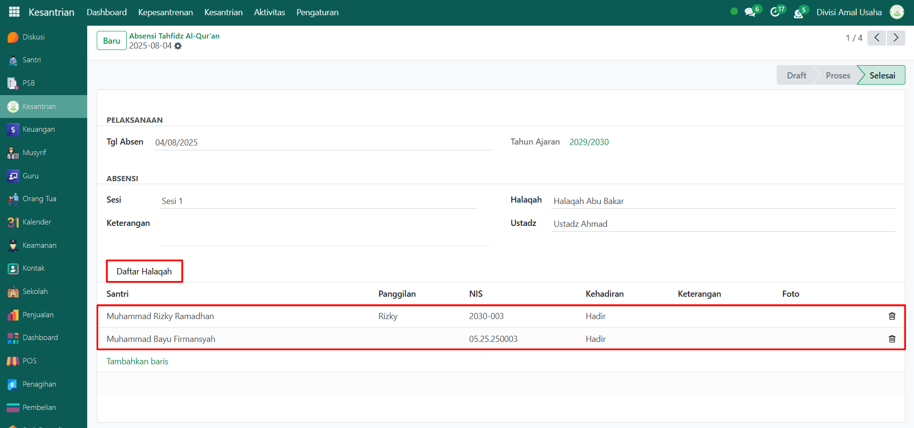

# Cek Absensi Tahfidz & Tahfidz Al-Qur'an



## Absensi & Tahfidz Al-Qur'an

**Absensi Tahfidz** merupakan kumpulan catatan kehadiran santri pada kegiatan halaqah tahfidz Al-Qur’an. Dan **Tahfidz Al-Qur'an** merupakan kumpulan data kegiatan hafalan santri yang dicatat oleh guru/ustadz pembimbing.

### Melihat Daftar Absensi Tahfidz

Berikut adalah langkah-langkah untuk melihat daftar absensi tahfidz santri pada Odoo Pesantren.

1. Login menggunakan akun administrator. Jika Anda belum memahami cara login sebagai admin, silakan lihat panduan [**Login Admin** di sini](../../../panduan-login/login-admin.md).
2.  Buka modul **Kesantrian**, lalu klik menu **Kepesantrenan** kemudian pilih submenu **Absensi Tahfidz**.

    <figure><figcaption></figcaption></figure>

3.  Pada halaman **Absensi Tahfidz**, Anda akan melihat daftar seluruh absensi dari setiap sesi halaqah. Informasi utama yang ditampilkan meliputi: nama halaqah, sesi tahfidz, guru/ustadz pembina, tanggal absen, dan status absensi.

    <figure><figcaption></figcaption></figure>

4. Untuk melihat detail absensi, klik salah satu data absensi yang ada pada daftar.
5.  Akan tampil halaman form absensi yang berisi informasi detail dari absensi tersebut. Pada **Tab Daftar Halaqah**, Anda dapat melihat daftar santri yang mengikuti kegiatan tahfidz Al-Qur’an beserta status kehadirannya.

    <figure><figcaption></figcaption></figure>

6. Dengan langkah ini, administrator dapat memantau daftar absensi tahfidz santri secara lengkap baik perhalaqah maupun per santri.

### Melihat Daftar Penilaian Tahfidz Al-Qur'an

Berikut adalah langkah-langkah untuk melihat daftar penilaian tahfidz Al-Qur'an santri pada Odoo Pesantren.

1. Pada modul **Kesantrian**, lalu klik menu **Kepesantrenan** kemudian pilih submenu **Tahfidz Al-Qur'an**.
2.  Di halaman ini Anda akan melihat daftar semua kegiatan tahfidz santri. Setiap entri menampilkan informasi seperti: nama halaqah, nama santri, sesi tahfidz, guru/ustadz pembimbing, tanggal hafalan, nama surah, ayat awal–akhir, jumlah baris, nilai, dan status hafalan.

    <figure><figcaption></figcaption></figure>

3.  Anda akan diarahkan ke tampilan form tahfidz yang berisi informasi lengkap seperti:

    * **Identitas Santri** (berisi informasi detail mengenai santri yang melakukan tahfidz al-qur'an).
    * **Rincian Pelaksanaan Tahfidz** (menampilkan informasi pelaksanaan tahfidz).
    * **Penilaian Tahfidz** (berisi informasi penilaian tahfidz seperti ayat-ayat yang dihafal dan keterangan nilai tahfidz).

    <figure><figcaption></figcaption></figure>

4. Dengan langkah-langkah ini, Anda dapat memonitor perkembangan hafalan Al-Qur’an santri secara detail dan terstruktur.
