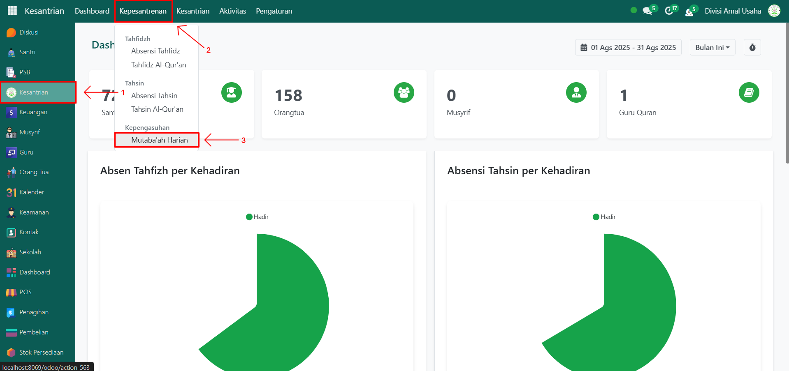
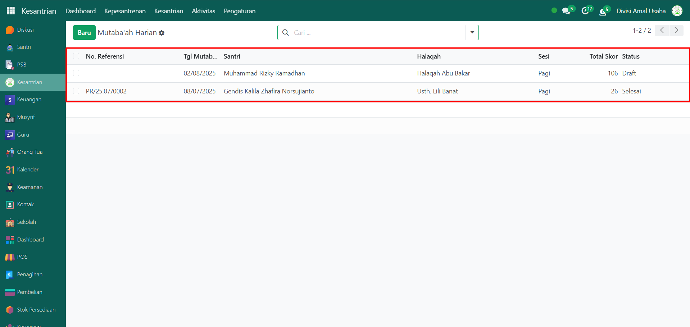
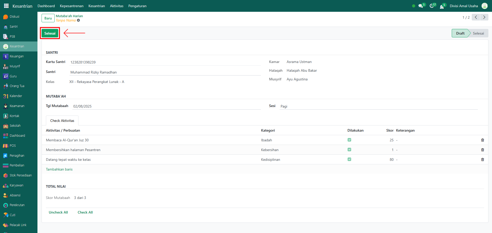
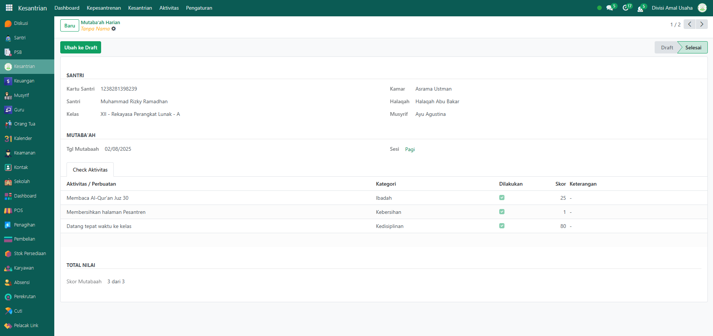

# Kelola Mutaba'ah Harian



## Pengelolaan Mutaba'ah Harian Santri

**Pengelolaan Mutaba’ah Harian Santri** digunakan oleh **Administrator** untuk menindaklanjuti catatan mutaba’ah harian yang sebelumnya dibuat oleh musyrif. Data mutaba’ah yang awalnya berstatus _**Draft**_ akan diverifikasi dan diselesaikan oleh administrator sehingga statusnya menjadi **Selesai**. Dengan fitur ini, pengelolaan aktivitas keseharian santri dapat tercatat dengan baik dan terintegrasi di sistem.

### Melakukan Pengelolaan Mutaba'ah Harian Santri

Berikut adalah langkah-langkah untuk melakukan pengelolaan mutaba'ah harian santri pada Odoo Pesantren sebagai **administrator**.

1. Login menggunakan akun administrator. Jika Anda belum memahami cara login sebagai admin, silakan lihat panduan [**Login Admin** di sini](../../../panduan-login/login-admin.md).
2.  Buka modul **Kesantrian**, lalu klik menu **Kepesantrenan** kemudian pilih submenu **Mutaba'ah Harian**.

    <figure><figcaption></figcaption></figure>

3.  Pilih salah satu data **Mutaba’ah Harian Santri** yang masih berstatus _Draft_ (dicatat oleh musyrif) dan membutuhkan tindak lanjut administrator.

    <figure><figcaption></figcaption></figure>

4.  Akan tampil halaman form mutaba’ah harian santri. Periksa kembali seluruh data yang sudah dicatat oleh musyrif, seperti tanggal, sesi, dan daftar aktivitas. Jika data sudah sesuai, klik tombol **"Selesai"** untuk mengonfirmasi dan menyelesaikan mutaba’ah harian tersebut.

    <figure><figcaption></figcaption></figure>

5.  Setelah berhasil, status mutaba’ah harian santri akan berubah dari **Draft** menjadi **Selesai**, dan data akan tersimpan secara permanen di sistem sebagai arsip resmi.

    <figure><figcaption></figcaption></figure>
