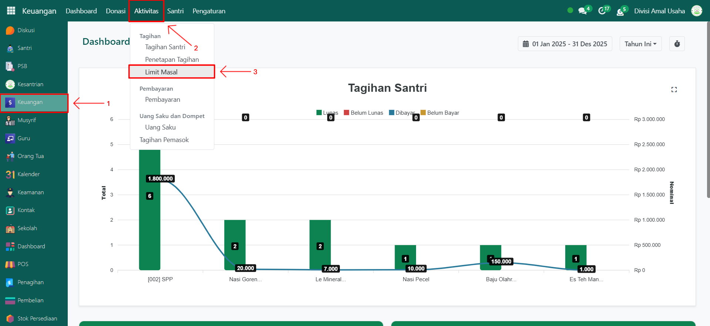
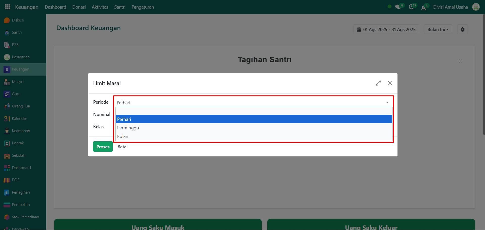
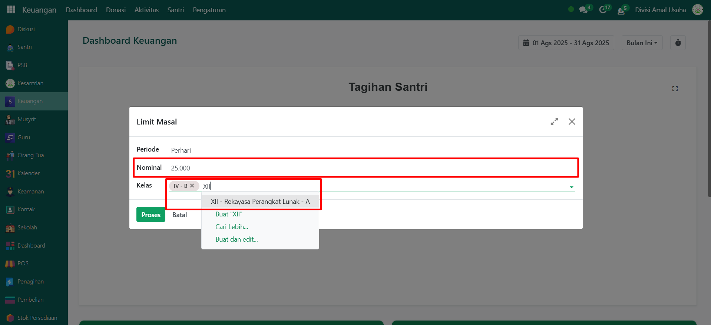
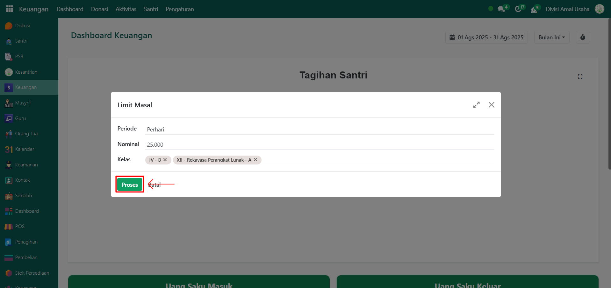
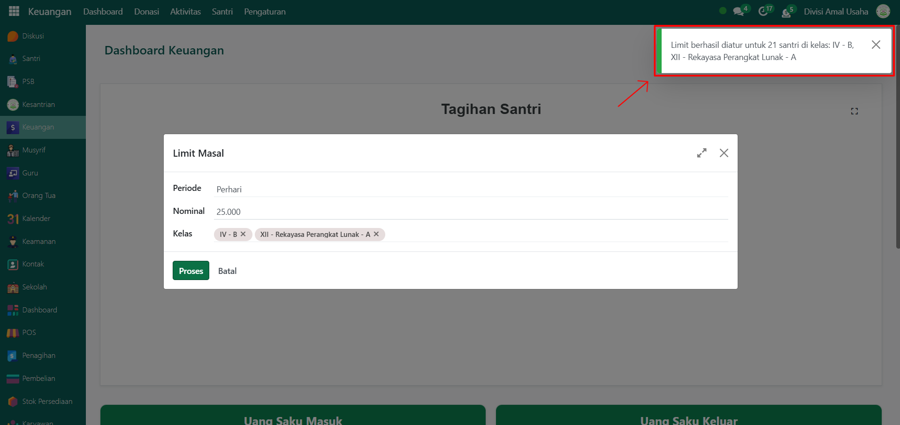

# Limit Saldo Masal

Video \[]

## Limit Saldo Masal Santri

Limit Saldo Masal adalah fitur yang digunakan untuk membatasi penggunaan saldo santri secara serentak berdasarkan periode tertentu (harian, mingguan, atau bulanan). Fitur ini memudahkan administrator dalam mengatur batas maksimal penggunaan saldo agar lebih terkontrol.

### Melimit Saldo Santri Secara Masal

Berikut adalah langkah-langkah untuk melimit pemakaian saldo santri secara masal pada Odoo Pesantren.

1. Login menggunakan akun administrator. Jika Anda belum memahami cara login sebagai admin, silakan lihat panduan [**Login Admin** di sini](../../panduan-login/login-admin.md).
2.  Buka modul **Keuangan**, lalu klik menu **Aktivitas** kemudian pilih submenu **Limit Masal**.

    <figure><figcaption></figcaption></figure>

3.  Akan muncul halaman pop-up form. Pilih **Periode Limit Saldo** (Per Hari, Per Minggu, atau Per Bulan).

    <figure><figcaption></figcaption></figure>

4.  Masukkan **Nominal Limit** yang ingin diterapkan, kemudian pilih **Kelas** yang santrinya akan dikenakan limit saldo masal.

    <figure><figcaption></figcaption></figure>

5.  Setelah semua inputan diisi dengan benar, klik tombol **Proses** untuk menjalankan pembatasan saldo secara masal.

    <figure><figcaption></figcaption></figure>

6.  Setelah berhasil, sistem akan menampilkan notifikasi bahwa **limit saldo santri secara masal** berhasil.

    <figure><figcaption></figcaption></figure>

7. Sistem akan secara otomatis menerapkan batas saldo pada semua santri sesuai kelas dan periode yang dipilih.
