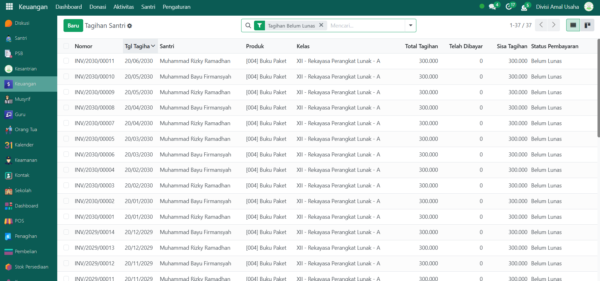
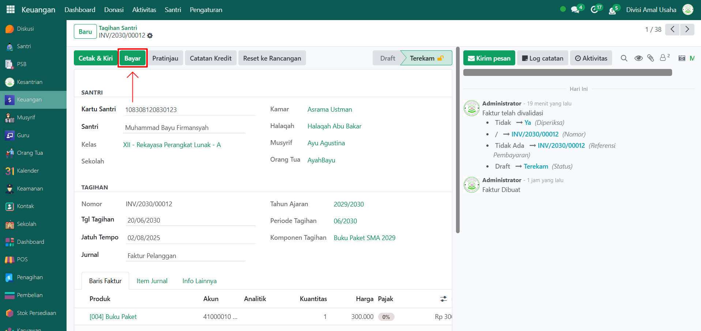
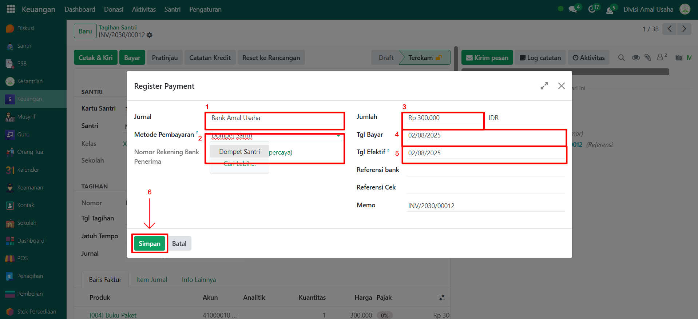
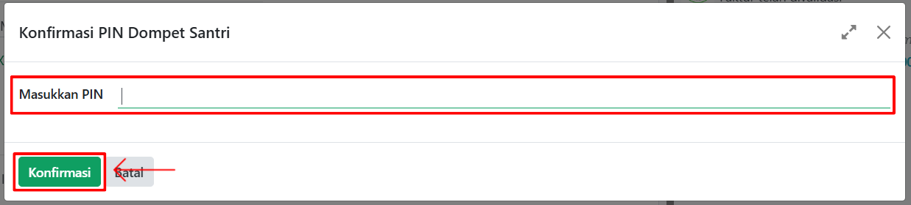
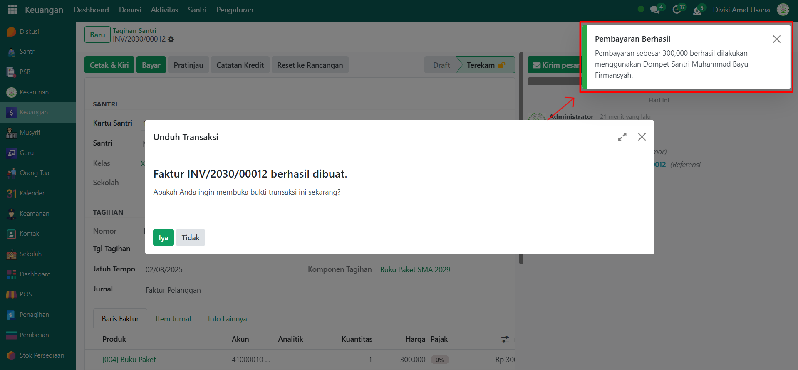

# Pembayaran Tagihan Santri

Video \[]

## Pembayaran Tagihan Santri

**Pembayaran Tagihan Santri** pada Odoo Pesantren adalah proses pencatatan pelunasan atau pembayaran sebagian tagihan yang telah ditetapkan sebelumnya. Proses ini dilakukan oleh administrator atau petugas keuangan dengan menggunakan metode pembayaran yang telah dikonfigurasi di sistem.

### Langkah-Langkah Membayar Tagihan Santri

Berikut adalah langkah-langkah untuk melakukan pembayaran tagihan santri pada Odoo Pesantren.

1. Login menggunakan akun administrator. Jika Anda belum memahami cara login sebagai admin, silakan lihat panduan [**Login Admin** di sini](../../panduan-login/login-admin.md).
2.  Buka modul **Keuangan**, lalu klik menu **Aktivitas** kemudian pilih submenu **Tagihan Santri**.

    <figure><figcaption></figcaption></figure>

3.  Pilih data tagihan santri yang ingin dilakukan pembayaran.

    <figure><figcaption></figcaption></figure>

4.  Pada tampilan halaman form pembayaran tagihan, klik tombol **Bayar** untuk melakukan proses pembayaran.

    <figure><figcaption></figcaption></figure>

5.  Akan muncul pop up form pembayaran, lalu isi inputan yang tersedia seperti:

    * **Jurnal**: pilih jurnal pencatatan pembayaran (misalnya: Kas, Bank, atau Dompet Santri).
    * **Metode Pembayaran**: pilih metode pembayaran yang telah tersedia pada jurnal tersebut.
    * **Jumlah Nominal**: isi dengan jumlah uang yang akan dibayarkan (boleh penuh atau sebagian).
    * **Tanggal Bayar**: isi tanggal pelunasan pembayaran.
    * **Tanggal Efektif**: isi tanggal efektif transaksi dicatat pada sistem.

    Jika semua data sudah diisi dengan benar, klik tombol **Simpan** untuk melanjutkan.

    <figure><figcaption></figcaption></figure>

6.  Setelah itu akan muncul pop up konfirmasi **PIN Dompet Santri**. Masukkan PIN santri yang bersangkutan, lalu klik tombol **Konfirmasi**.

    <figure><figcaption></figcaption></figure>

7.  Jika PIN benar dan proses pembayaran berhasil, sistem akan menampilkan notifikasi bahwa pembayaran tagihan santri telah berhasil dicatat.

    <figure><figcaption></figcaption></figure>

8. Status tagihan akan otomatis diperbarui pada daftar tagihan santri sesuai dengan jumlah yang sudah dibayar (misalnya **Lunas** jika penuh, atau **Sebagian Dibayar** jika pembayaran hanya sebagian).
