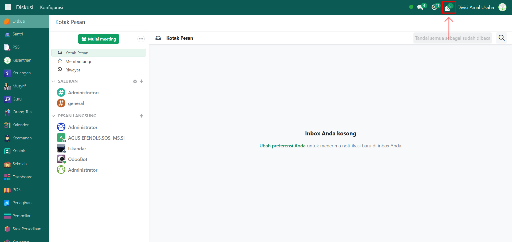
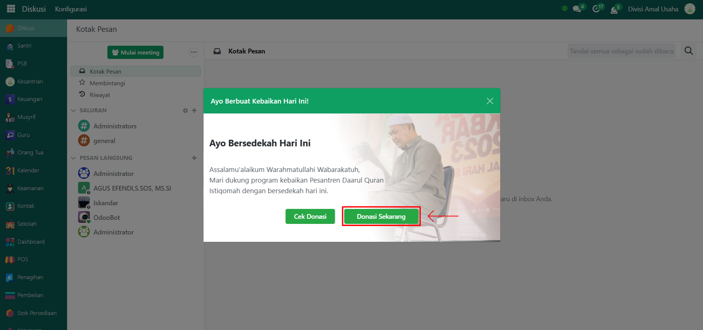
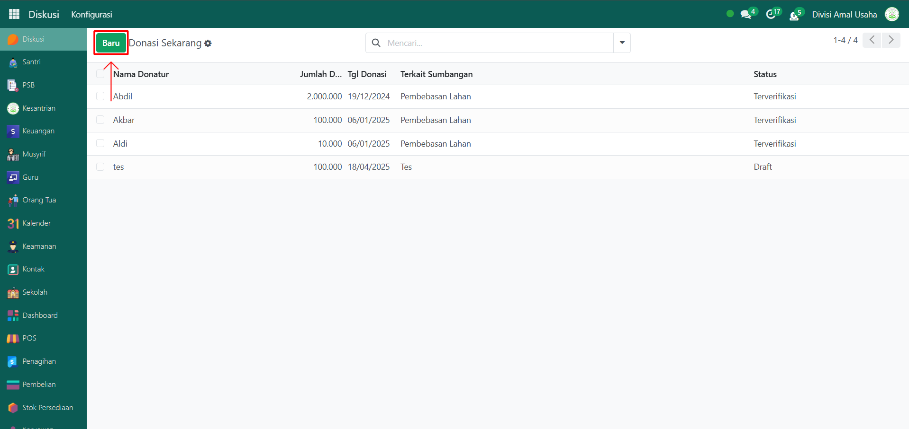
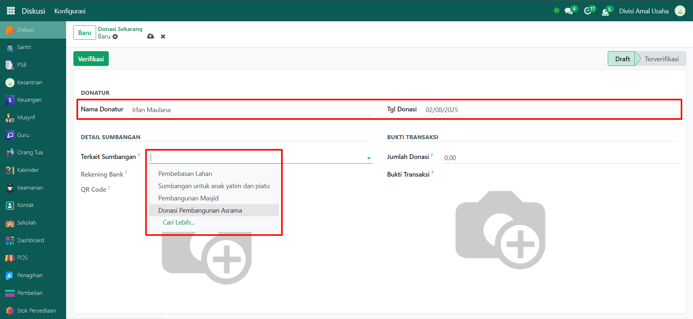
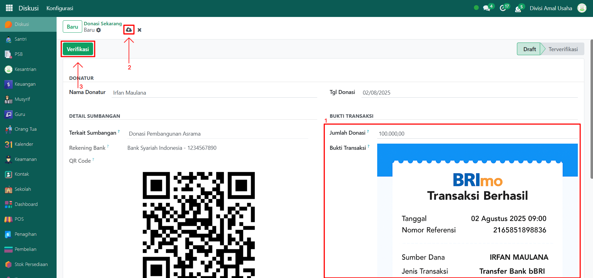

# Pencatatan Donasi



## Pencatatan Donasi

Fitur **Pencatatan Donasi** pada Odoo Pesantren digunakan untuk mencatat setiap transaksi donasi yang masuk dari donatur, baik berupa uang tunai maupun transfer melalui QR Code. Dengan pencatatan ini, seluruh donasi dapat terdokumentasi dengan baik untuk keperluan laporan keuangan pesantren.

### Melakukan Pencatatan Donasi

Berikut adalah langkah-langkah untuk melakukan pencatatan donasi pada Odoo Pesantren.

1. Login menggunakan akun administrator. Jika Anda belum memahami cara login sebagai admin, silakan lihat panduan [**Login Admin** di sini](../../panduan-login/login-admin.md).
2.  Klik ikon notifikasi bergambar **koin** yang berada di sebelah kanan ikon notifikasi **jam** pada tampilan utama.

    <figure><figcaption></figcaption></figure>

3.  Akan muncul pop up tampilan **Donasi**, lalu klik tombol **"Donasi Sekarang"**.

    <figure><figcaption></figcaption></figure>

4.  Klik tombol **"Baru"** untuk melakukan pencatatan donasi baru.

    <figure><figcaption></figcaption></figure>

5.  Pada tampilan halaman form pencatatan donasi, isi inputan seperti ini:

    * **Nama Donatur**.
    * **Tanggal Donasi** (masukkan tanggal saat donasi dilakukan).
    * **Terkait Sumbangan** (pilih jenis sumbangan yang sudah dikonfigurasi sebelumnya).

    <figure><figcaption></figcaption></figure>

6.  Berikutnya, masukkan jumlah donasi yang ingin didonasikan serta bukti dari transaksinya. Setelah semua inputan diisi dengan benar, klik ikon **Simpan** di sebelah kanan ikon **Gear** dan status donasi akan menjadi **Draft**. Klik tombol **"Verifikasi"** untuk menverifikasi data donasi.

    <figure><figcaption></figcaption></figure>
