# Penetapan Tagihan Santri



## Tagihan Santri

**Penetapan Tagihan Santri** adalah proses untuk menentukan tagihan biaya pendidikan santri berdasarkan kelas, angkatan, dan komponen biaya yang berlaku pada tahun ajaran aktif. Proses ini dilakukan oleh administrator melalui modul Keuangan.

### Menetapkan Tagihan Santri

Berikut adalah langkah-langkah untuk menetapkan tagihan kepada santri pada Odoo Pesantren.

1. Login menggunakan akun administrator. Jika Anda belum memahami cara login sebagai admin, silakan lihat panduan [**Login Admin** di sini](../../panduan-login/login-admin.md).
2.  Buka modul **Keuangan**, lalu klik menu **Aktivitas** kemudian pilih submenu **Penetapan Tagihan Santri**.

    <figure>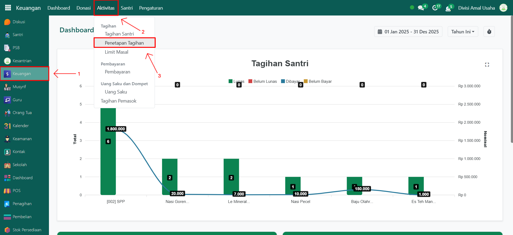<figcaption></figcaption></figure>

3.  Akan muncul halaman pop-up form. Pilih **Santri Angkatan**, **Bulan Awal**, **Bulan Akhir**, dan pilih **Komponen Biaya** yang ingin ditetapkan tagihannya. Field biaya akan terisi otomatis setelah komponen biaya dipilih.

    <figure>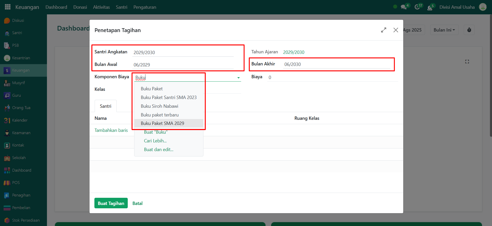<figcaption></figcaption></figure>

4.  Selanjutnya, pilih **Kelas** yang aktif sesuai dengan tahun ajaran yang sedang berjalan.

    <figure>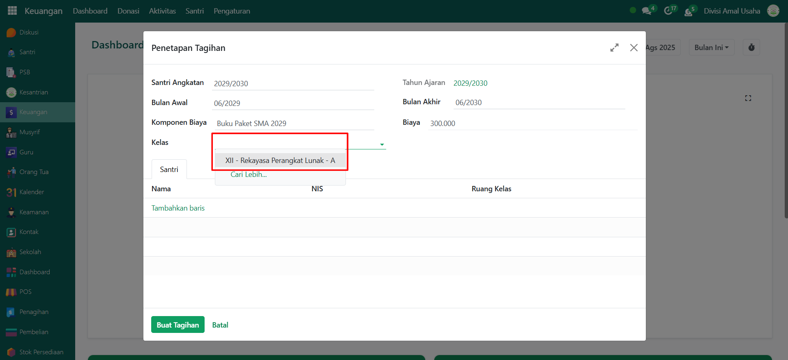<figcaption></figcaption></figure>

5.  Pada **Tab Santri**, daftar santri akan otomatis menyesuaikan dengan kelas yang dipilih. Periksa kembali data yang sudah diisi, lalu klik tombol **Buat Tagihan** untuk menghasilkan tagihan santri sesuai konfigurasi.

    <figure>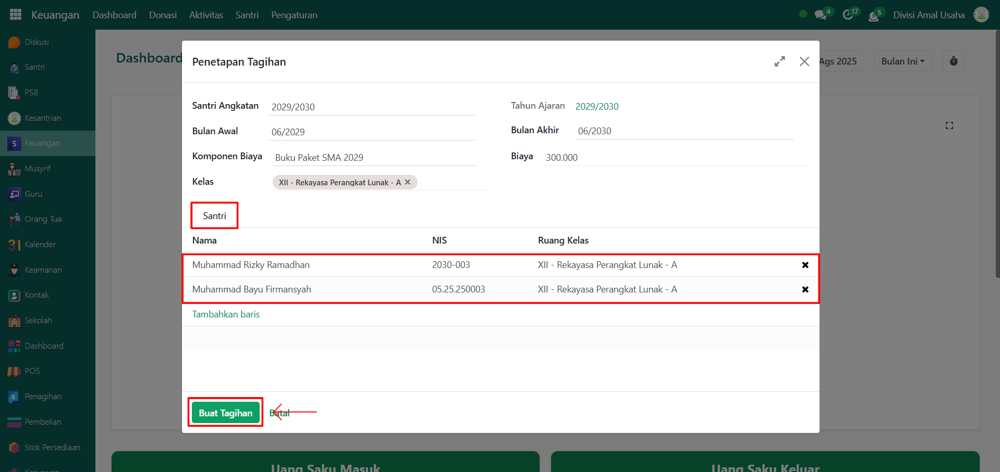<figcaption></figcaption></figure>

6. Sistem akan otomatis membuat tagihan santri berdasarkan komponen biaya, kelas, dan periode yang ditentukan. status tagihan santri yang telah dibuat akan menjadi **Draft** untuk mengkonfirmasinya silakan lanjut ke [Konfirmasi Tagihan Santri](penetapan-tagihan-santri.md#mengkonfirmasi-tagihan-santri).

### Mengkonfirmasi Tagihan Santri

Berikut adalah langkah-langkah untuk mengkonfirmasi tagihan santri yang telah dibuat pada Odoo Pesantren.

1.  Pada modul **Keuangan**, lalu klik menu **Aktivitas** kemudian pilih submenu **Tagihan Santri**.

    <figure>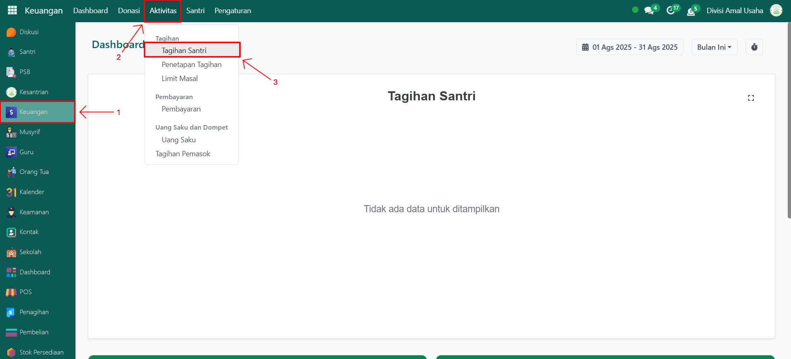<figcaption></figcaption></figure>

2. Terdapat dua cara untuk melakukan konfirmasi tagihan santri, yaitu secara **Masal** atau **Manual**.
   * Konfirmasi Masal
     *   Pada daftar tagihan santri, centang checkbox pada tagihan yang ingin dikonfirmasi.

         <figure>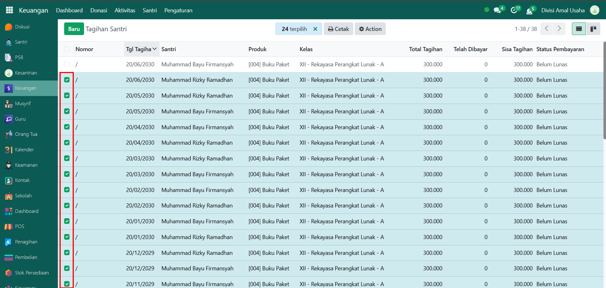<figcaption></figcaption></figure>

     *   Klik tombol **Action**, lalu pilih opsi **Konfirmasi Entri**.

         <figure>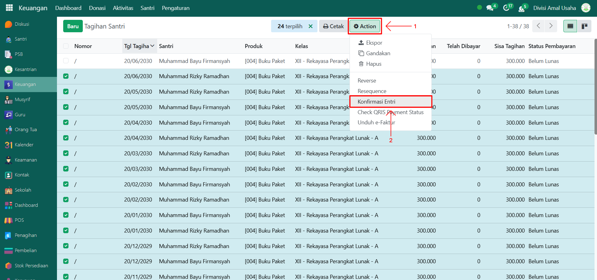<figcaption></figcaption></figure>

     *   Akan muncul tampilan pop up untuk konfirmasi, centang checkbox konfirmasi sekarang dan klik tombol **"Konfirmasi"** untuk mengkonfirmasi tagihan santri.

         <figure>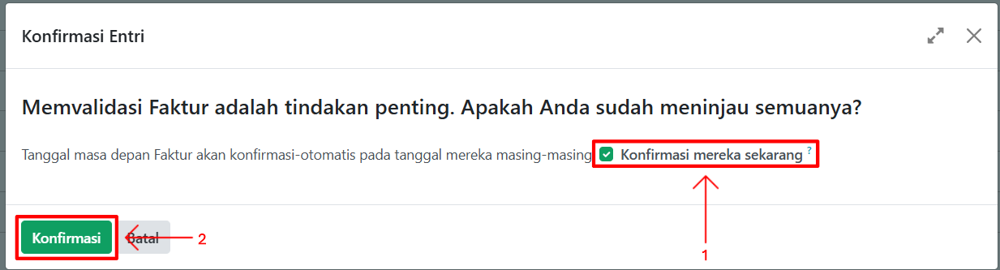<figcaption></figcaption></figure>

     *   Pada daftar tagihan bagian kolom **Nomor** akan otomatis terisi secara berurutan.

         <figure>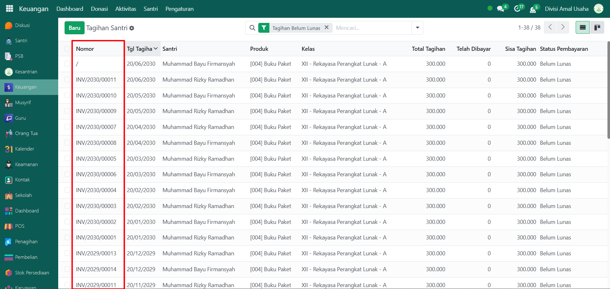<figcaption></figcaption></figure>

   * Konfirmasi Manual
     * Pilih salah satu tagihan santri dari daftar untuk membuka halaman form detail tagihan.
     *   Pada tampilan halaman form tagihan santri, klik tombol **Konfirmasi** untuk mengkonfirmasi tagihan secara manual.

         <figure>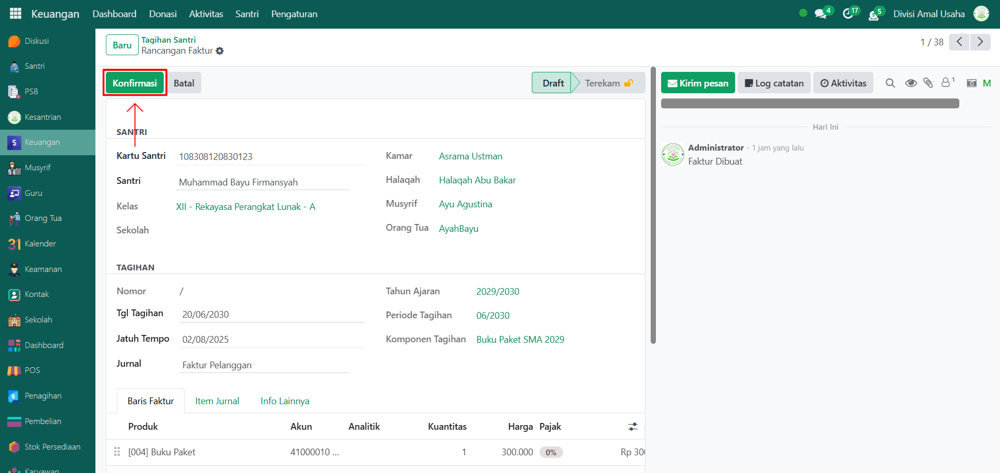<figcaption></figcaption></figure>

3.  Setelah berhasil, status tagihan akan berubah menjadi **Terekam**.

    <figure>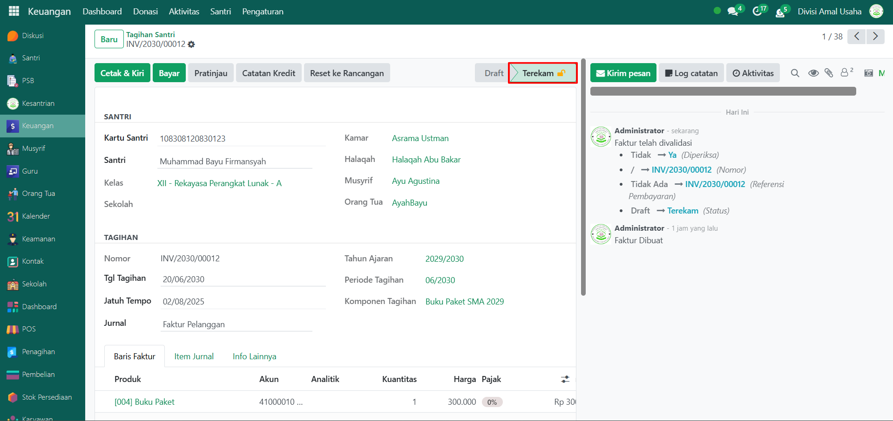<figcaption></figcaption></figure>

4. Setelah tagihan terkonfirmasi, maka tagihan tersebut siap digunakan dalam proses penagihan lebih lanjut (misalnya pembayaran dari orang tua atau lainnya).
