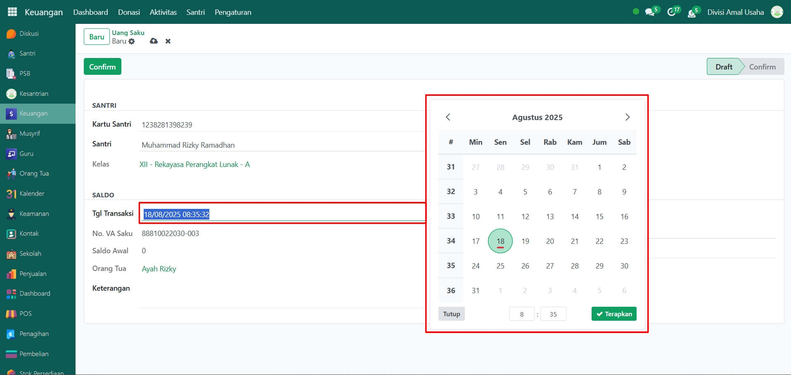
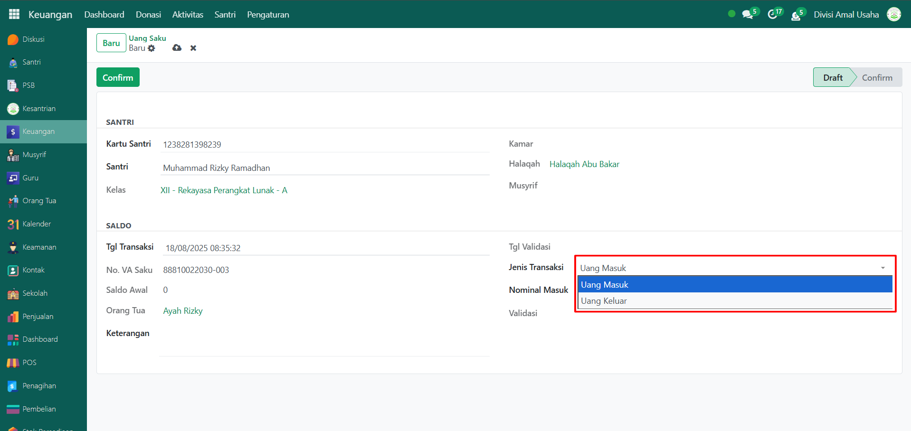
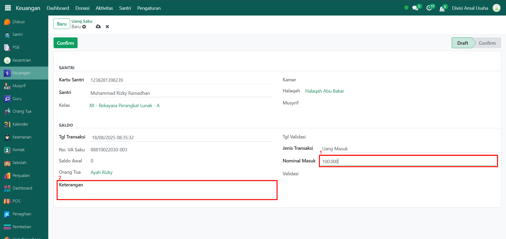

# Uang Saku



## Uang Saku Santri

**Uang Saku Santri** digunakan untuk mencatat transaksi pengisian maupun pengeluaran saldo dompet santri. Dengan adanya pencatatan ini, setiap transaksi keuangan santri dapat terkelola dengan baik, transparan, dan dapat ditelusuri kembali apabila diperlukan.

### Melakukan Transaksi Uang Saku Santri

Berikut adalah langkah-langkah untuk melakukan pengisian saldo dompet santri pada Odoo Pesantren

1. Login menggunakan akun administrator. Jika Anda belum memahami cara login sebagai admin, silakan lihat panduan [**Login Admin** di sini](../../panduan-login/login-admin.md).
2.  Buka modul **Keuangan**, lalu klik menu **Aktivitas** kemudian pilih submenu **Uang Saku**.

    <figure><figcaption></figcaption></figure>

3.  Klik tombol **"Baru"** untuk melakukan transaksi uang saku.

    <figure><figcaption></figcaption></figure>

4.  Halaman form transaksi uang saku akan ditampilkan. Pilih santri yang akan dilakukan pengisian atau pengeluaran saldo dompet.

    <figure><figcaption></figcaption></figure>

5.  Masukkan **tanggal transaksi**. Secara default, sistem akan menyesuaikan dengan tanggal saat transaksi dibuat.

    <figure><figcaption></figcaption></figure>

6.  Pada kolom **Jenis Transaksi**, tentukan jenis transaksi yang dilakukan, misalnya _Uang Masuk_ untuk pengisian saldo atau _Uang Keluar_ untuk pengeluaran saldo.

    <figure><figcaption></figcaption></figure>

7.  Isi **nominal saldo** sesuai dengan transaksi yang dilakukan. Jika diperlukan, tambahkan **keterangan** untuk memperjelas transaksi.

    <figure><figcaption></figcaption></figure>

8.  Setelah semua data transaksi diisi dengan benar, klik tombol **"Confirm"** untuk mengonfirmasi transaksi. Status transaksi akan berubah menjadi _Confirm_.

    <figure><figcaption></figcaption></figure>

9. Transaksi uang saku santri kini tercatat di sistem dan dapat digunakan sebagai dasar pencatatan keuangan maupun laporan terkait saldo dompet santri.
