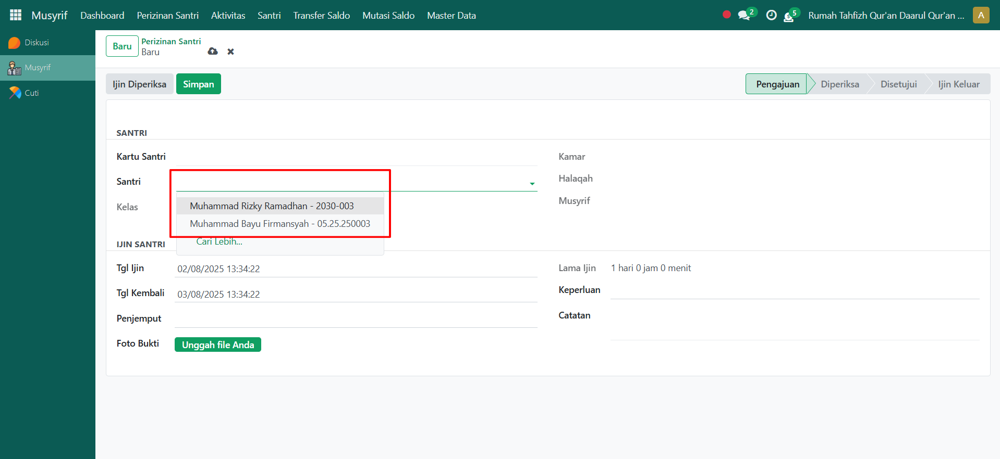

# Menambah Izin Santri

Video \[]

## Perizinan Santri

**Perizinan santri** pada Odoo Pesantren digunakan untuk mencatat izin santri yang dikelola oleh musyrif. Melalui fitur ini, musyrif dapat menginput data perizinan santri mulai dari tanggal izin, tanggal kembali, penjemput, hingga alasan izin.

### Menambahkan Perizinan Santri

Berikut adalah langkah-langkah untuk mengelola perizinan santri pada Odoo Pesantren sebagai **musyrif**.

1. Login menggunakan akun musyrif. Jika Anda belum memahami cara login sebagai musyrif, silakan lihat panduan [**Login Musyrif** di sini](../../setup-and-konfigurasi/role-and-hak-akses-pengguna/panduan-login/login-musyrif.md).
2.  Buka modul **Musyrif**, lalu klik menu **Perizinan Santri**.

    <figure><figcaption></figcaption></figure>

3.  Klik tombol "**Baru"** untuk menambahkan data perizinan santri.

    <figure><figcaption></figcaption></figure>

4.  Akan tampil halaman form perizinan santri. Pada form ini, musyrif yang sedang login memilih **santri yang akan diajukan izinnya**.

    <figure><figcaption></figcaption></figure>

5.  Isi inputan yang tersedia dengan benar, seperti:

    * **Tanggal Izin** (tanggal mulai izin santri).
    * **Tanggal Kembali** (tanggal santri kembali ke pesantren.)
    * **Penjemput**: (nama penjemput santri (jika ada)).
    * **Keperluan**: (alasan izin, misalnya _Sakit, Keluar Kota, Urusan Keluarga,_ atau lainnya).

    Setelah semua data diisi, klik tombol **Simpan** untuk menyimpan perizinan santri. Status perizinan akan otomatis menjadi **Pengajuan**.

    <figure><figcaption></figcaption></figure>

6. Selanjutnya, perizinan santri dapat diproses lebih lanjut, misalnya **disetujui** atau **ditolak** sesuai kebijakan pesantren.
