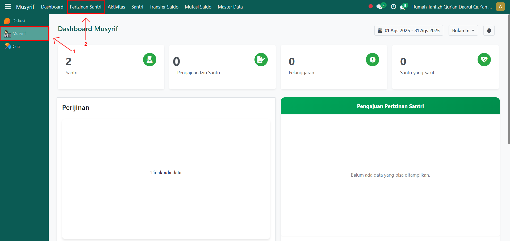
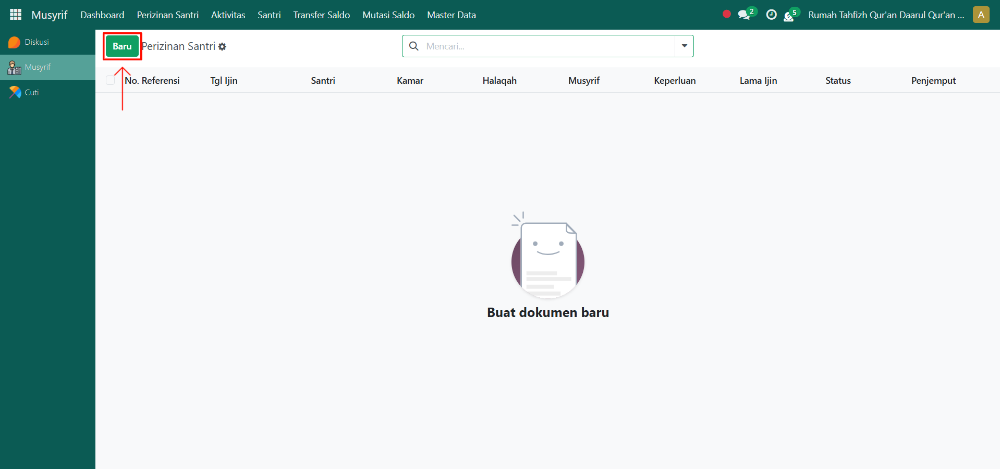
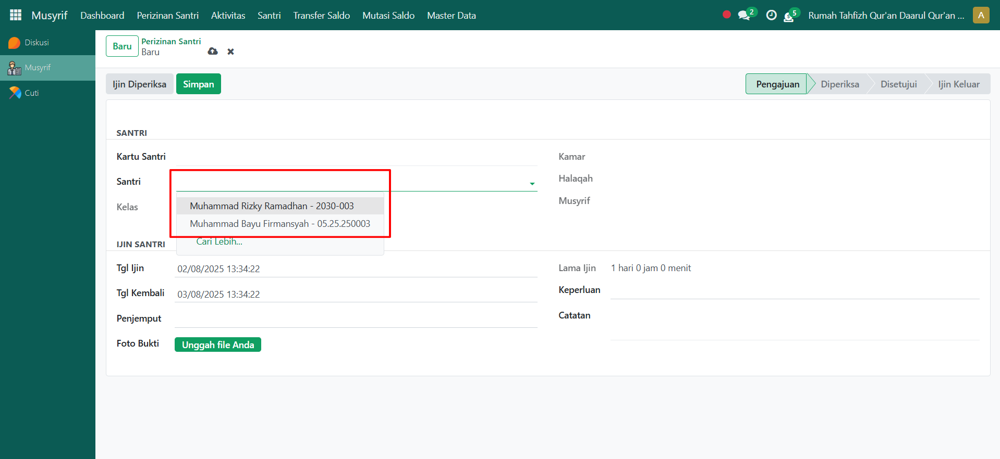
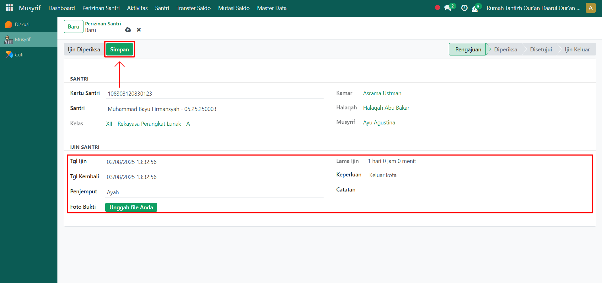

# Mengajukan Izin Santri

Video \[]

## Perizinan Santri

**Perizinan santri** pada Odoo Pesantren digunakan untuk mencatat izin santri yang dikelola oleh musyrif. Melalui fitur ini, musyrif dapat menginput data perizinan santri mulai dari tanggal izin, tanggal kembali, penjemput, hingga alasan izin.

### Mengajukan Perizinan Santri oleh Musyrif

Berikut adalah langkah-langkah untuk membuat/mengajukan perizinan santri pada Odoo Pesantren sebagai **musyrif**.

1. Login menggunakan akun musyrif. Jika Anda belum memahami cara login sebagai musyrif, silakan lihat panduan [**Login Musyrif** di sini](../../setup-and-konfigurasi/panduan-login/login-musyrif.md).
2.  Buka modul **Musyrif**, lalu klik menu **Perizinan Santri**.

    <figure><figcaption></figcaption></figure>

3.  Klik tombol "**Baru"** untuk membuat/mengajukan data perizinan santri.

    <figure><figcaption></figcaption></figure>

4.  Akan tampil halaman form perizinan santri. Pada form ini, musyrif yang sedang login memilih **santri yang akan diajukan izinnya**.

    <figure><figcaption></figcaption></figure>

5.  Isi inputan yang tersedia dengan benar, seperti:

    * **Tanggal Izin** (masukkan tanggal mulai izin santri).
    * **Tanggal Kembali** (masukkan tanggal santri kembali ke pesantren).
    * **Penjemput** (masukkan nama penjemput santri (jika ada)).
    * **Foto Bukti** (upload file foto sebagai bukti perizinan santri tersebut).
    * **Keperluan** (pilih alasan izin sesuai dengan data keterangan izin yang dibuat sebelumnya).
    * **Catatan** (masukkan catatan tambahan dari perizinan yang dibuat).

    Setelah semua data diisi, klik tombol **"Simpan"** untuk menyimpan perizinan santri. Status perizinan akan otomatis menjadi **Pengajuan**.

    <figure><figcaption></figcaption></figure>

6. Selanjutnya, perizinan santri dapat diproses lebih lanjut, misalnya **disetujui** atau **ditolak** sesuai kebijakan pesantren.
