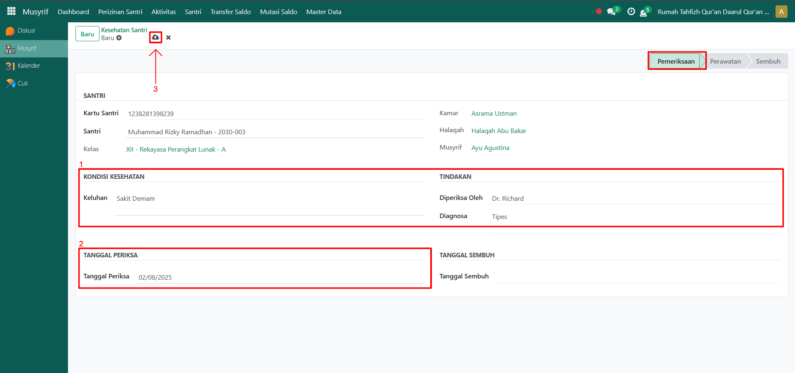

# Kesehatan Santri

Video \[]

## Kesehatan Santri

**Pencatatan Kesehatan Santri** adalah fitur pada modul **Musyrif** yang digunakan untuk mencatat kondisi kesehatan santri secara detail. Dengan fitur ini, musyrif bisa mendata keluhan santri, hasil pemeriksaan, hingga diagnosa dari petugas kesehatan. Data ini menjadi dasar bagi administrator atau pihak pesantren dalam melakukan perawatan atau pengobatan lebih lanjut.

## Mencatat Kondisi Kesehatan Santri

Berikut adalah langkah-langkah untuk mencatat kondisi kesehatan santri pada Odoo Pesantren sebagai **musyrif**.

1. Login menggunakan akun musyrif. Jika Anda belum memahami cara login sebagai musyrif, silakan lihat panduan [**Login Musyrif** di sini](../../../setup-and-konfigurasi/role-and-hak-akses-pengguna/panduan-login/login-musyrif.md).
2.  Buka modul **Musyrif**, lalu klik menu **Aktivitas** dan pilih submenu **Kesehatan Santri**.

    <figure><figcaption></figcaption></figure>

3.  Klik tombol **“Baru”** untuk membuat catatan kesehatan baru.

    <figure><figcaption></figcaption></figure>

4.  Akan tampil halaman form Kesehatan Santri. Pada form ini, musyrif yang sedang login memilih **nama santri** yang kondisinya akan dicatat.

    <figure><figcaption></figcaption></figure>

5.  Isi inputan lain yang tersedia, seperti:

    * **Keluhan** (misalnya: sakit kepala, batuk, atau demam)
    * **Diperiksa oleh** (misalnya: ustadz, musyrif, atau tenaga kesehatan pesantren)
    * **Diagnosa** (misalnya: tipes)
    * **Tanggal Periksa** (tanggal pemeriksaan)

    Setelah semua inputan diisi dengan benar, klik ikon **Simpan** di sebelah kanan ikon **Gear** agar data kesehatan santri tersimpan di sistem.

    <figure><figcaption></figcaption></figure>

6. Catatan kesehatan santri berhasil tersimpan. Proses tindak lanjut seperti perawatan atau pengobatan akan dilakukan oleh administrator atau pihak yang berwenang sampai kondisi santri dinyatakan sembuh.
