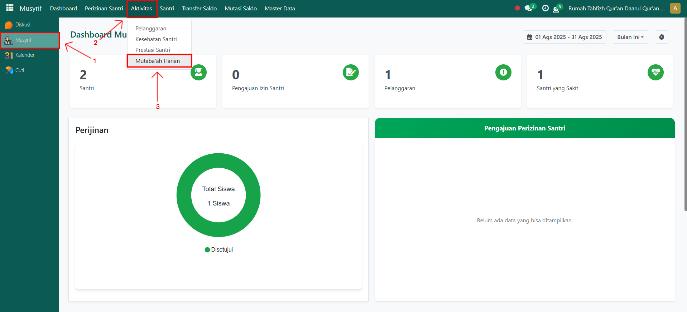
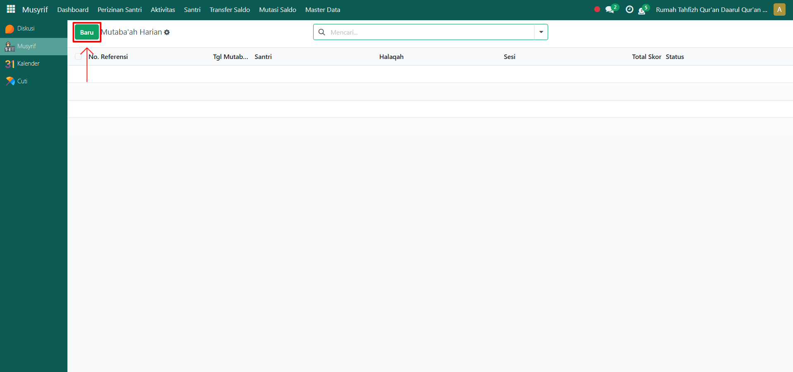
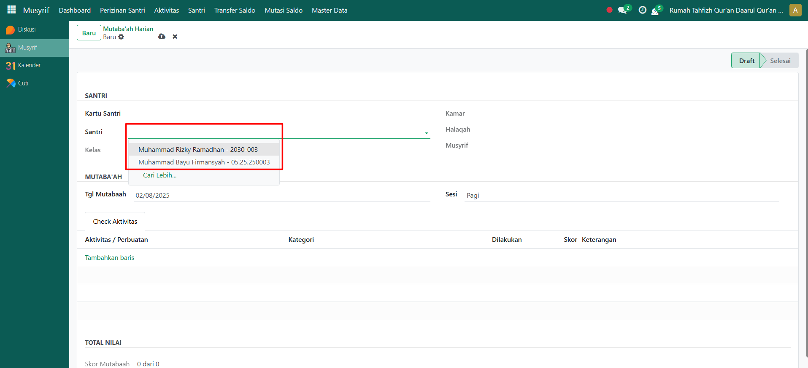
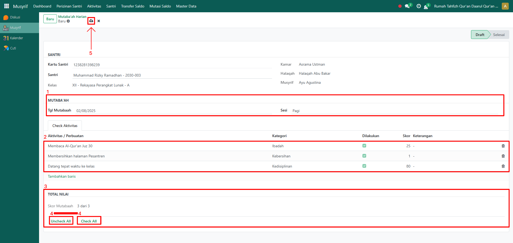

# Mutaba'ah Harian



## Mutaba'ah Harian Santri

**Pencatatan Mutaba’ah Harian** adalah fitur pada modul **Musyrif** yang digunakan untuk mencatat aktivitas harian santri, seperti ibadah, kedisiplinan, dan kegiatan rutin lainnya. Data ini akan menjadi bahan evaluasi bagi pihak pesantren dalam menilai kedisiplinan dan perkembangan santri.

### Mencatat Mutaba'ah Harian Santri

Berikut adalah langkah-langkah untuk mencatat mutaba'ah santri pada Odoo Pesantren sebagai **musyrif**.

1. Login menggunakan akun musyrif. Jika Anda belum memahami cara login sebagai musyrif, silakan lihat panduan [**Login Musyrif** di sini](../../../setup-and-konfigurasi/panduan-login/login-musyrif.md).
2.  Buka modul **Musyrif**, lalu klik menu **Aktivitas** kemudian pilih submenu **Mutaba'ah Harian**.

    <figure><figcaption></figcaption></figure>

3.  Klik tombol **“Baru”** untuk menambahkan catatan mutaba’ah harian baru.

    <figure><figcaption></figcaption></figure>

4.  Akan tampil halaman form Mutaba’ah Harian. Pada form ini, pilih **santri** yang akan dicatat mutaba’ah hariannya.

    <figure><figcaption></figcaption></figure>

5.  Isi inputan lainnya seperti:

    * **Tanggal Mutaba’ah** (masukkan tanggal mutaba'ah).
    * **Sesi** (masukkan sesi mutaba'ah yang dilakukan oleh santri).
    * **Tab Check Aktivitas** (berupa tabel daftar aktivitas mutaba’ah sesuai sesi mutaba'ah yang dimasukkan lalu lakukan penilaian aktivitas mutaba'ah yang telah dilakukan oleh santri beserta skor dan keterangan).

    Pada label **Total Nilai**, gunakan tombol **"Check All"** untuk mencentang semua aktivitas sekaligus, atau **"Uncheck All"** untuk menghapus semua centang. Setelah itu, sesuaikan kembali dengan aktivitas nyata yang dilakukan santri.&#x20;
6.  Setelah semua inputan selesai diisi dengan benar, klik ikon **Simpan** di sebelah kanan ikon **Gear** agar data Mutaba’ah Harian tersimpan di sistem.

    <figure><figcaption></figcaption></figure>

7. Data yang dicatat akan muncul dengan status **Draft**, dan nantinya pihak **Administrator** akan melakukan proses konfirmasi terhadap catatan mutaba’ah harian tersebut.
