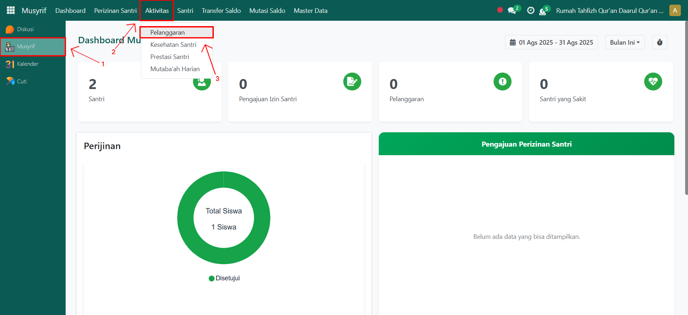
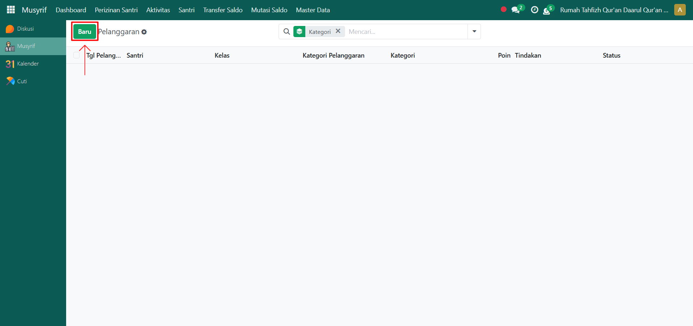
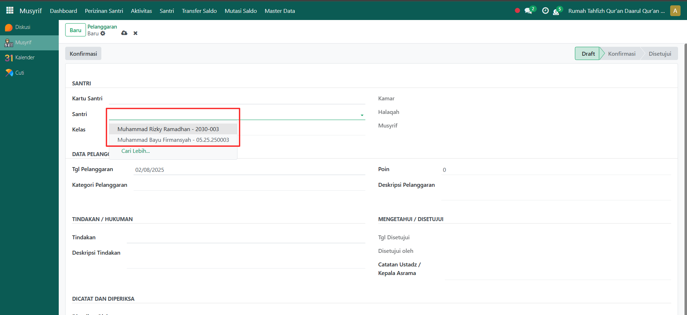
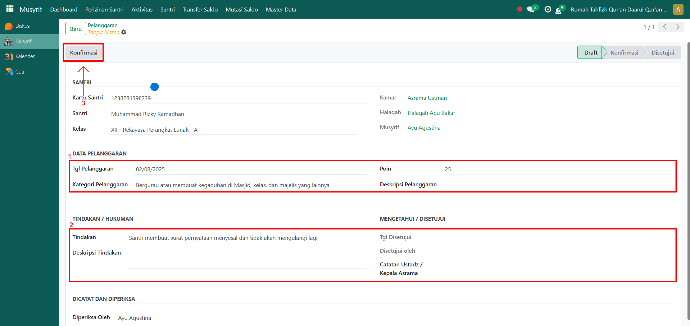

# Pelanggaran Santri



## Pelanggaran Santri

**Pelanggaran Santri** digunakan untuk mencatat setiap pelanggaran yang dilakukan santri di asrama. Dengan fitur ini, musyrif bisa langsung memilih santri yang melanggar, mengisi kategori pelanggaran, poin, serta tindakan disipliner yang diberikan.

### Mencatat Pelanggaran Santri

Berikut adalah langkah-langkah untuk melakukan pencatatan pelanggaran santri pada Odoo Pesantren sebagai **musyrif**.

1. Login menggunakan akun musyrif. Jika Anda belum memahami cara login sebagai musyrif, silakan lihat panduan [**Login Musyrif** di sini](../../../setup-and-konfigurasi/panduan-login/login-musyrif.md).
2.  Buka modul **Musyrif**, lalu klik menu **Aktivitas** kemudian pilih submenu **Pelanggaran**.

    <figure><figcaption></figcaption></figure>

3.  Klik tombol **“Baru”** untuk membuat catatan pelanggaran baru.

    <figure><figcaption></figcaption></figure>

4.  Akan tampil halaman form pelanggaran santri. Pilih **nama santri** yang melakukan pelanggaran.

    <figure><figcaption></figcaption></figure>

5.  Isi inputan lain yang tersedia, seperti:

    * **Tanggal Pelanggaran** (masukkan tanggal saat pencatatan pelanggaran).
    * **Kategori/Nama Pelanggaran** (pilih kategori pelanggaran sesuai data pelanggaran yang dibuat sebelumnya).
    * **Poin Pelanggaran** (Isi poin pelanggaran sesuai pelanggaran yang dilakukan).
    * **Deskripsi Pelanggaran** (masukkan penjelasan lebih lanjut mengenai pelanggaran yang dilakukan).
    * **Tindakan** (pilih tindakan yang harus dilakukan santri).
    * **Deskripsi Tindakan** (masukkan penjelasan lebih lanjut mengenai tindakan disipliner).
    * **Catatan Ustadz / Kepala Asrama** (jika perlu isi dengan catatan tambahan untuk ustadz atau kepala asrama di pesantren).

    Setelah semua data diisi, klik tombol **"Konfirmasi"** untuk menyimpan dan mengonfirmasi catatan pelanggaran.

    <figure><figcaption></figcaption></figure>

6.  Catatan pelanggaran santri berhasil tersimpan dan siap ditindaklanjuti oleh pihak terkait, seperti ustadz atau pihak yang berwenang (administrator).

    <figure><figcaption></figcaption></figure>
