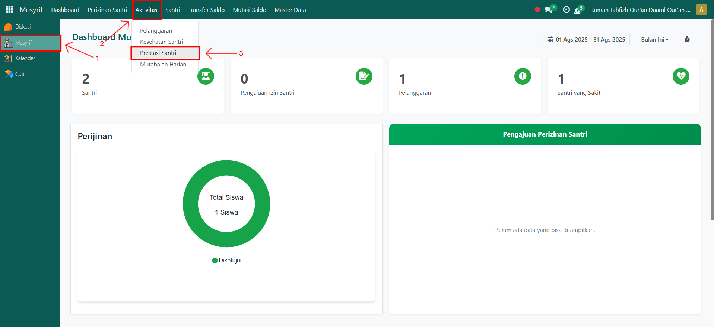
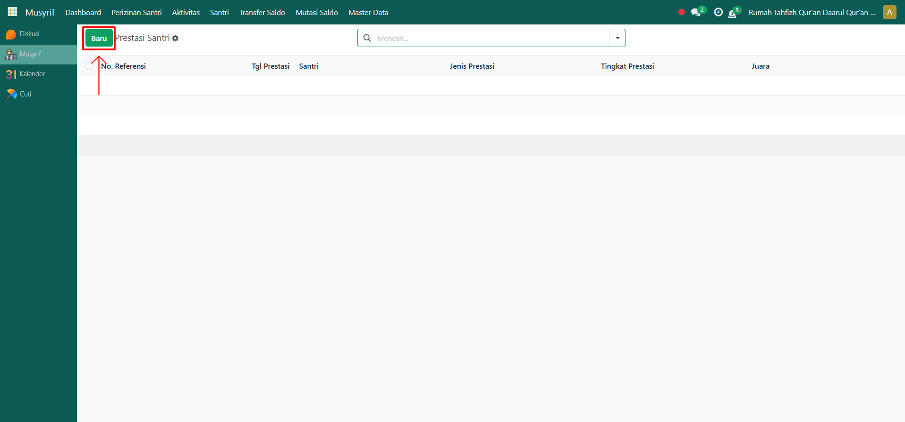
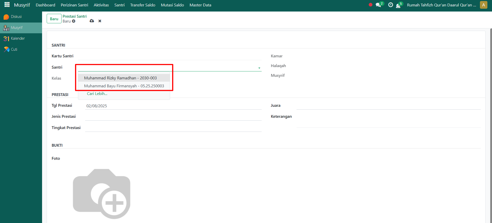
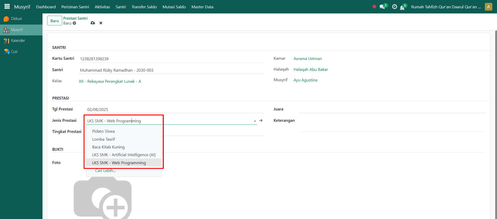
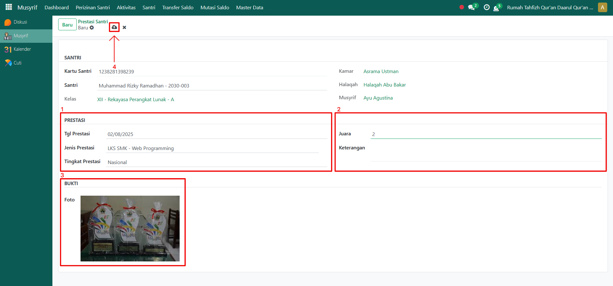

# Prestasi Santri



## Prestasi Santri

**Pencatatan Prestasi Santri** adalah fitur pada modul **Musyrif** yang digunakan untuk mencatat capaian prestasi yang diperoleh santri, baik akademik maupun non-akademik. Data prestasi ini membantu pesantren dalam memantau perkembangan, potensi, serta penghargaan yang diterima santri di berbagai tingkat kompetisi.

### Mencatat Prestasi Santri

Berikut langkah-langkah untuk mencatat prestasi santri pada Odoo Pesantren sebagai **musyrif**.

1. Login menggunakan akun musyrif. Jika Anda belum memahami cara login sebagai musyrif, silakan lihat panduan [**Login Musyrif** di sini](../../../setup-and-konfigurasi/panduan-login/login-musyrif.md).
2.  Buka modul **Musyrif**, lalu klik menu **Aktivitas** kemudian pilih submenu **Prestasi Santri**.

    <figure><figcaption></figcaption></figure>

3.  Klik tombol **“Baru”** untuk membuat catatan prestasi baru.

    <figure><figcaption></figcaption></figure>

4.  Akan tampil halaman form Prestasi Santri. Pada form ini, musyrif yang sedang login memilih **nama santri** yang prestasinya akan dicatat.

    <figure><figcaption></figcaption></figure>

5. Selanjutnya, masukkan **tanggal prestasi santri**.
6.  Pilih **jenis prestasi** yang diperoleh santri sesuai dengan data jenis prestasi yang sudah dikonfigurasi.

    <figure><figcaption></figcaption></figure>

7.  Isi inputan lainnya seperti:

    * **Tingkat Prestasi** (pilih tingkat prestasi yang didapat seperti nasional, internasional dan lainnya).
    * **Juara** (masukkan juara dari prestasi yang didapat oleh santri).
    * **Keterangan** (opsional, untuk menambahkan detail tambahan prestasi).
    * **Bukti Foto Prestasi** (upload dokumentasi prestasi jika ada).

    Setelah semua inputan diisi dengan benar, klik ikon **Simpan** di sebelah kanan ikon **Gear** agar data prestasi santri tersimpan di sistem.

    <figure><figcaption></figcaption></figure>

8. Data prestasi santri berhasil disimpan dan dapat digunakan untuk penilaian perkembangan santri di pesantren.
