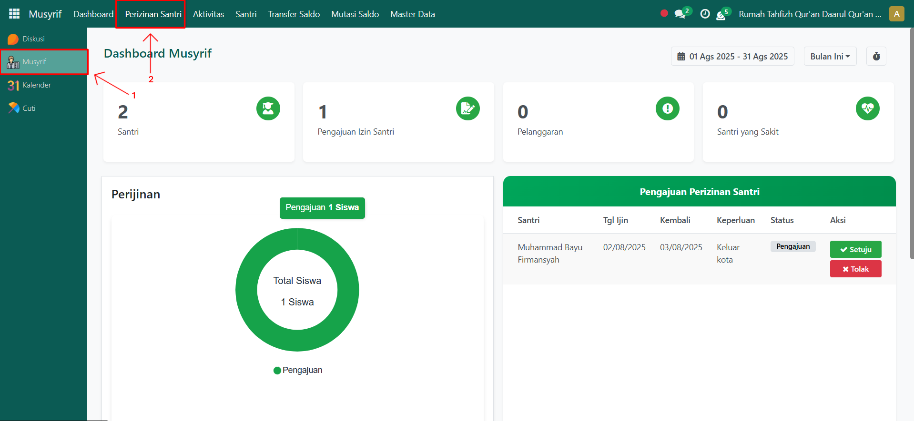
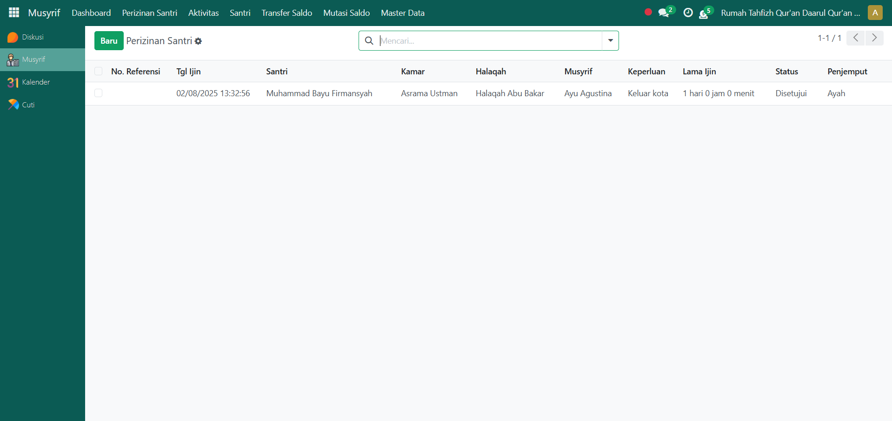
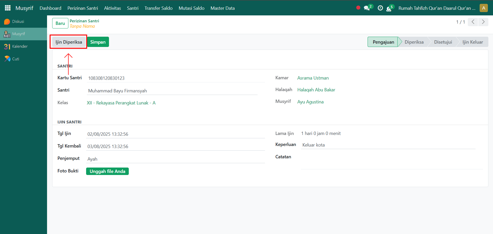
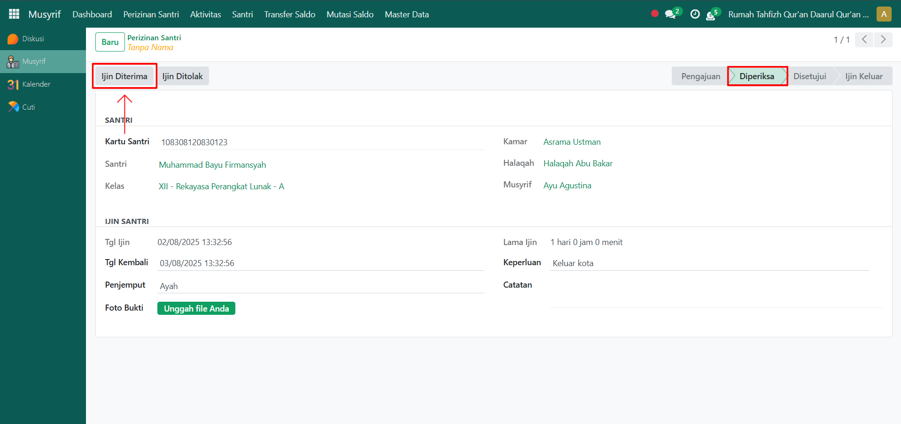
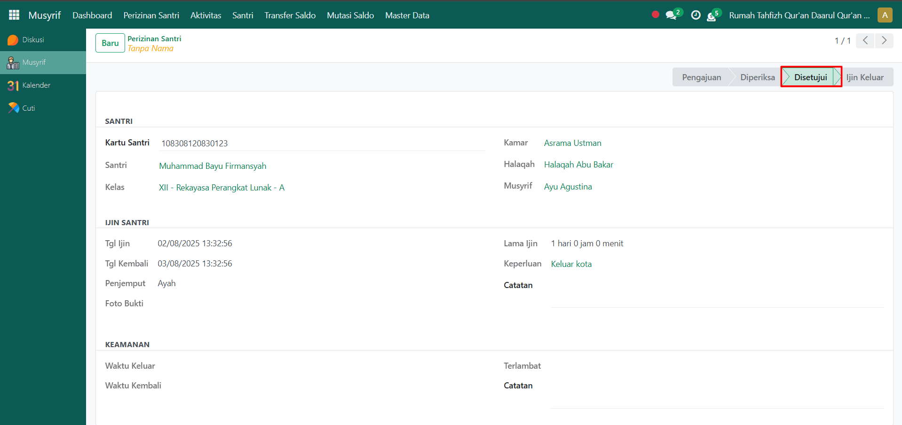

# Pengelolaan Izin Santri

Video \[]

## Pengelolaan Izin Santri

**Pengelolaan Izin Santri** pada Odoo Pesantren dilakukan oleh musyrif untuk memverifikasi, menyetujui, atau menolak pengajuan izin santri. Proses ini memastikan bahwa izin santri tercatat dengan baik dan sesuai prosedur sebelum diteruskan ke petugas keamanan.

### Mengelola Perizinan Santri

Berikut adalah langkah-langkah untuk mengelola perizinan santri pada Odoo Pesantren sebagai **musyrif**.

1. Login menggunakan akun musyrif. Jika Anda belum memahami cara login sebagai musyrif, silakan lihat panduan [**Login Musyrif** di sini](../../setup-and-konfigurasi/role-and-hak-akses-pengguna/panduan-login/login-musyrif.md).
2.  Buka modul **Musyrif**, klik menu **Perizinan Santri**.

    <figure><figcaption></figcaption></figure>

3.  Pilih salah satu data perizinan santri yang ingin dikelola dari daftar perizinan.

    <figure><figcaption></figcaption></figure>

4.  Akan tampil halaman form perizinan santri. Untuk melakukan pemeriksaan awal, klik tombol "**Ijin Diperiksa"**.

    <figure><figcaption></figcaption></figure>

5.  Setelah status berubah menjadi **Diperiksa**, lanjutkan proses:

    * Klik tombol **"Ijin Diterima"** apabila santri memenuhi syarat untuk keluar pesantren.
    * Klik tombol **"Ijin Ditolak"** apabila santri tidak memenuhi kriteria atau izin tidak dapat diberikan.

    <figure><figcaption></figcaption></figure>

6.  Jika izin disetujui, status perizinan akan otomatis berubah menjadi **Disetujui**, yang berarti musyrif telah menyetujui izin santri untuk keluar. Sebaliknya jika izin ditolak, maka status perizinan santri akan berubah menjadi **Ditolak**.

    <figure><figcaption></figcaption></figure>

7. Setelah itu, data perizinan akan diteruskan ke **Petugas Keamanan** untuk dilakukan pencatatan keluar-masuk santri sesuai prosedur keamanan.
8. Perizinan santri selesai dikelola dan status akhirnya dapat dipantau pada daftar perizinan santri di modul Musyrif.
