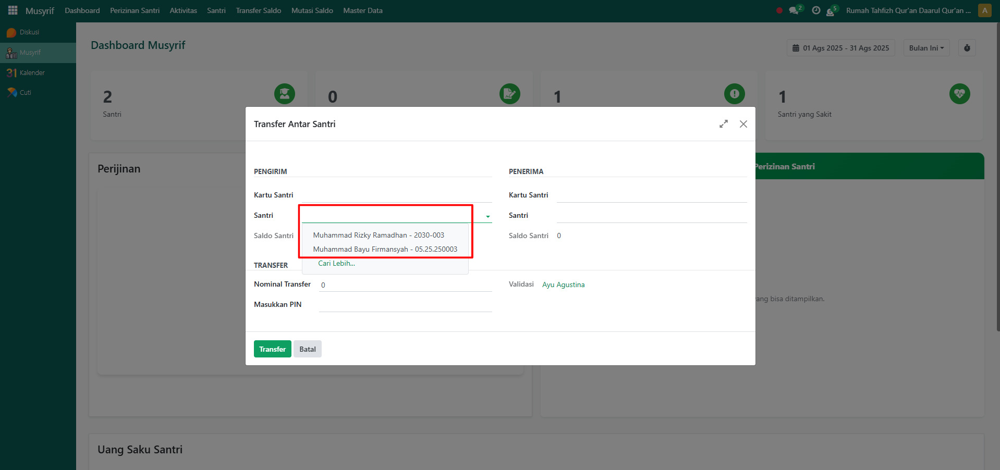

# Transfer Saldo Santri

Video \[]

## Transfer Saldo Antar Santri

Fitur **Transfer Saldo Santri** pada modul _Musyrif_ digunakan untuk memfasilitasi transaksi pemindahan saldo antar santri. Dengan adanya fitur ini, santri dapat saling berbagi saldo melalui persetujuan musyrif yang sedang login.

### Melakukan Transfer Saldo Antar Santri

Berikut langkah-langkah untuk melakukan transfer saldo antar santri pada Odoo Pesantren sebagai **musyrif**.

1. Login menggunakan akun musyrif. Jika Anda belum memahami cara login sebagai musyrif, silakan lihat panduan [**Login Musyrif** di sini](../../setup-and-konfigurasi/panduan-login/login-musyrif.md).
2.  Buka **modul Musyrif**, lalu klik menu **Transfer Saldo**.

    <figure><figcaption></figcaption></figure>

3.  Akan tampil halaman pop up form Transfer Saldo. Pada form ini, pilih santri **sebagai pengirim** yang akan mengirimkan saldonya ke santri lain.

    <figure><figcaption></figcaption></figure>

4.  Selanjutnya, pilih santri **sebagai penerima** yang akan menerima saldo dari santri pengirim.

    <figure><figcaption></figcaption></figure>

5.  Isi inputan lainnya seperti **Nominal Transfer**, lalu masukkan **PIN Dompet Santri Pengirim** untuk otorisasi. Setelah semua inputan selesai diisi dengan benar, klik tombol **"Transfer"** untuk memproses transfer saldo antar santri.

    <figure><figcaption></figcaption></figure>

6.  Setelah berhasil, sistem akan memproses transaksi dan menampilkan notifikasi bahwa **transfer saldo antar santri berhasil dilakukan**.

    <figure><figcaption></figcaption></figure>

7. Transaksi berhasil dapat dilihat pada **riwayat mutasi saldo** santri pengirim maupun penerima.
