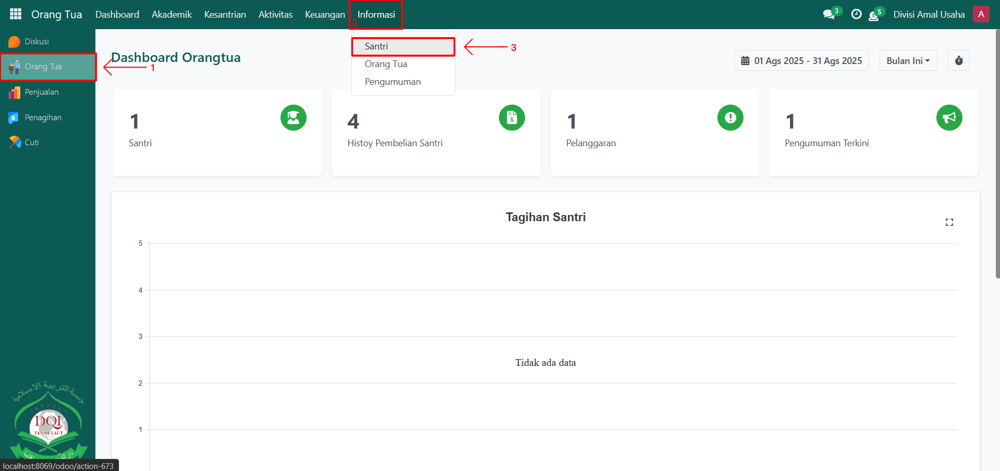
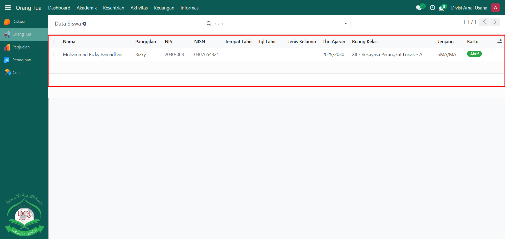
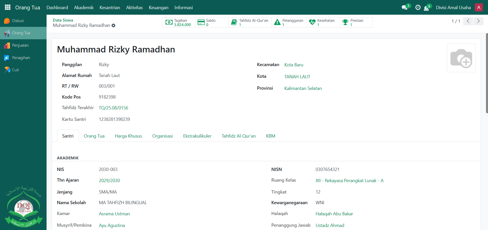

# Cek Informasi Data Santri

Video \[]

## Cek Informasi Data Santri

**Cek Informasi Data Santri** digunakan oleh **Orang Tua** untuk melihat data lengkap anaknya yang sedang menempuh pendidikan di pesantren. Melalui fitur ini, orang tua dapat memastikan bahwa informasi santri sesuai dengan data yang sudah terdaftar di sistem, seperti data pribadi, kelas, orang tua, dan informasi lainnya.

### Mengecek Informasi Data Santri oleh Orang Tua

Berikut adalah langkah-langkah untuk mengecek informasi santri pada Odoo Pesantren sebagai **orang tua**.

1. Login menggunakan akun orang tua. Jika Anda belum memahami cara login sebagai orang tua, silakan lihat panduan [**Login Orang Tua** di sini](../../../setup-and-konfigurasi/role-and-hak-akses-pengguna/panduan-login/login-orang-tua.md).
2.  Buka modul **Orang Tua**, lalu klik menu **Informasi** dan pilih submenu **Santri**.

    <figure><figcaption></figcaption></figure>

3.  Pada halaman **Santri**, sistem akan menampilkan daftar santri yang terhubung dengan akun orang tua yang sedang login. Klik salah satu data santri untuk melihat informasi lebih detail, seperti **nama lengkap, jenjang pendidikan, kelas, wali kelas, data orang tua, serta informasi akademik dan kesantrian lainnya**.

    <figure><figcaption></figcaption></figure>

4.  Data ini hanya dapat dilihat (read-only) oleh orang tua sesuai dengan akun login yang terhubung.

    <figure><figcaption></figcaption></figure>
