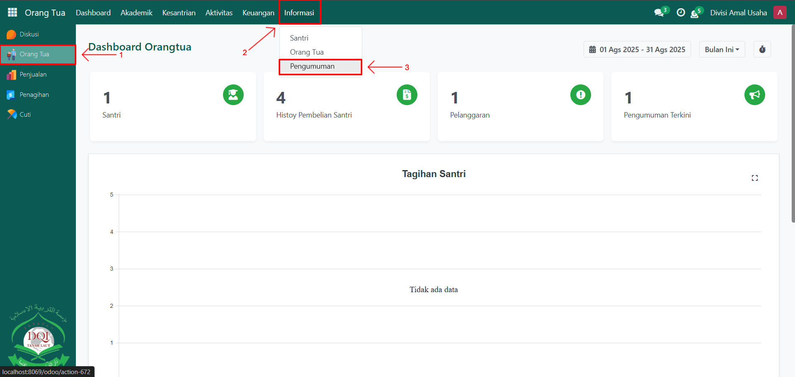
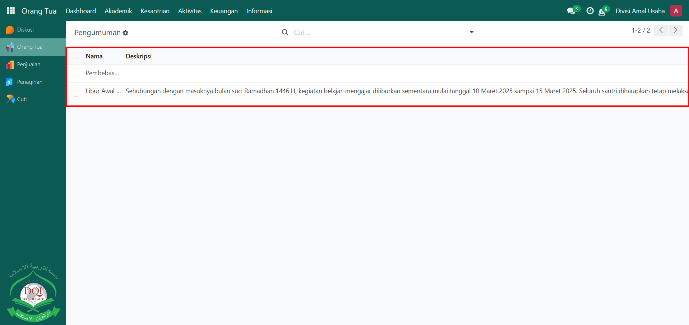
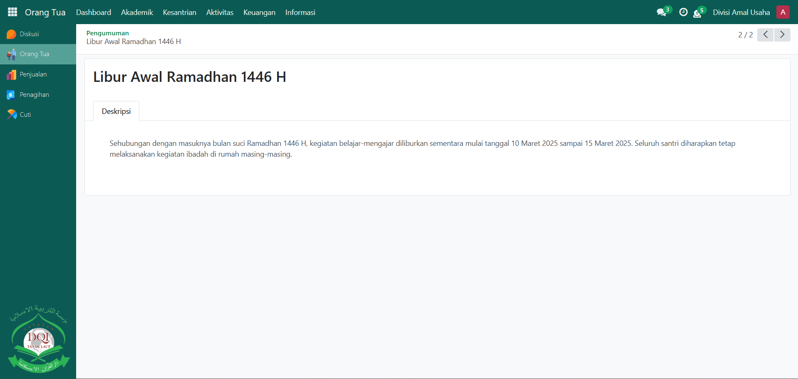

# Cek Pengumuman

Video \[]

## Cek Pengumuman

**Cek Pengumuman** digunakan oleh **Orang Tua** untuk melihat berbagai informasi atau pengumuman resmi yang dikeluarkan oleh pihak pesantren, seperti kegiatan, jadwal, pembayaran, atau informasi penting lainnya. Dengan fitur ini, orang tua dapat selalu mendapatkan informasi terkini secara langsung melalui sistem Odoo Pesantren.

### Mengecek Pengumuman oleh Orang Tua

Berikut adalah langkah-langkah untuk mengecek pengumuman pada Odoo Pesantren sebagai **orang tua**.

1. Login menggunakan akun orang tua. Jika Anda belum memahami cara login sebagai orang tua, silakan lihat panduan [**Login Orang Tua** di sini](../../../setup-and-konfigurasi/panduan-login/login-orang-tua.md).
2.  Buka modul **Orang Tua**, lalu klik menu **Informasi** dan pilih submenu **Pengumuman**.

    <figure><figcaption></figcaption></figure>

3.  Pada halaman **Pengumuman**, sistem akan menampilkan daftar pengumuman yang telah dibuat oleh administrator. Klik salah satu pengumuman pada daftar untuk melihat detail informasi lebih lanjut, seperti **judul pengumuman, dan isi pengumuman**.

    <figure><figcaption></figcaption></figure>

4.  Orang tua hanya dapat melihat informasi pengumuman. Jika pengumuman membutuhkan tindak lanjut, maka detail pengumuman biasanya akan mencantumkan instruksi yang perlu dilakukan.

    <figure><figcaption></figcaption></figure>
