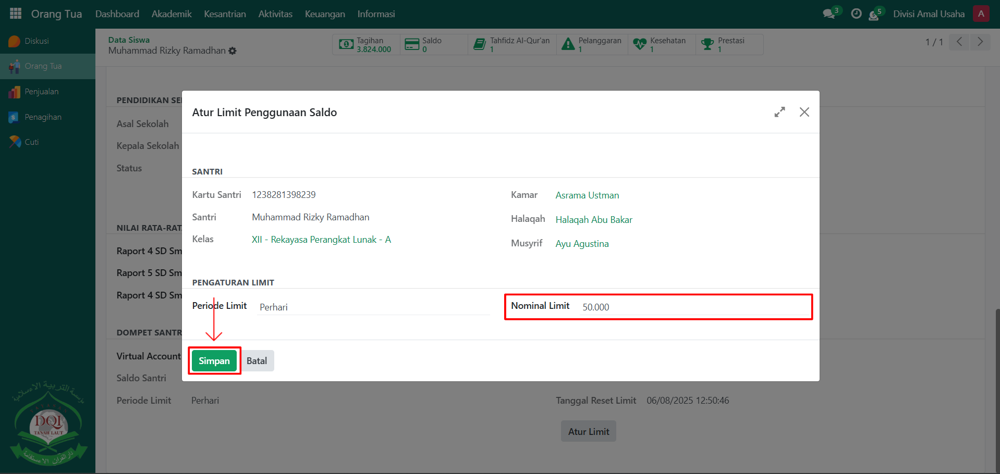

# Limit Saldo Santri

Video \[]

## Limit Saldo Santri

**Limit Saldo Santri** digunakan oleh orang tua untuk mengatur batas penggunaan saldo santri dalam jangka waktu tertentu, misalnya harian, mingguan, atau bulanan. Dengan fitur ini, orang tua dapat mengontrol pengeluaran anaknya agar sesuai dengan kebutuhan yang sudah ditetapkan.

### Melimit Pengguanaan Saldo Santri oleh Orang Tua

Berikut adalah langkah-langkah untuk melimit penggunaan saldo santri pada Orang Tua sebagai **orang tua**.

1. Login menggunakan akun orang tua. Jika Anda belum memahami cara login sebagai orang tua, silakan lihat panduan [**Login Orang Tua** di sini](../../setup-and-konfigurasi/role-and-hak-akses-pengguna/panduan-login/login-orang-tua.md).
2.  Buka modul **Orang Tua**, lalu klik menu **Informasi** dan pilih submenu **Santri**.

    <figure><figcaption></figcaption></figure>

3.  Pada halaman **Santri**, pilih data santri yang ingin Anda atur limit saldo penggunaannya.

    <figure><figcaption></figcaption></figure>

4.  **Pastikan sebelumnya administrator telah memberikan hak akses “Limit Saldo Orang Tua” pada data orang tua yang bersangkutan.** Jika akses ini belum dicentang oleh administrator, maka fitur pengaturan limit tidak akan muncul.

    <figure><figcaption></figcaption></figure>

5.  Setelah masuk ke halaman form santri, scroll ke bawah dan klik tombol **"Atur Limit"**.

    <figure><figcaption></figcaption></figure>

6.  Akan tampil pop up form **Limit Saldo**, pilih periode limit saldo (per hari, per minggu, atau per bulan).

    <figure><figcaption></figcaption></figure>

7.  Masukkan batas nominal saldo sesuai kebutuhan. Setelah semua inputan diisi dengan benar, klik tombol **"Simpan"** untuk menerapkan limit saldo.

    <figure><figcaption></figcaption></figure>

8.  Sistem akan menyimpan pengaturan tersebut dan menampilkan notifikasi bahwa limit saldo santri berhasil ditetapkan.

    <figure><figcaption></figcaption></figure>
