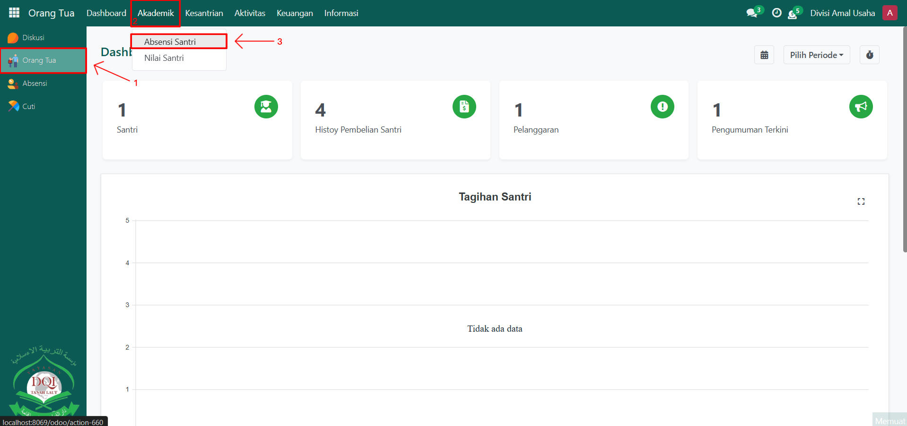
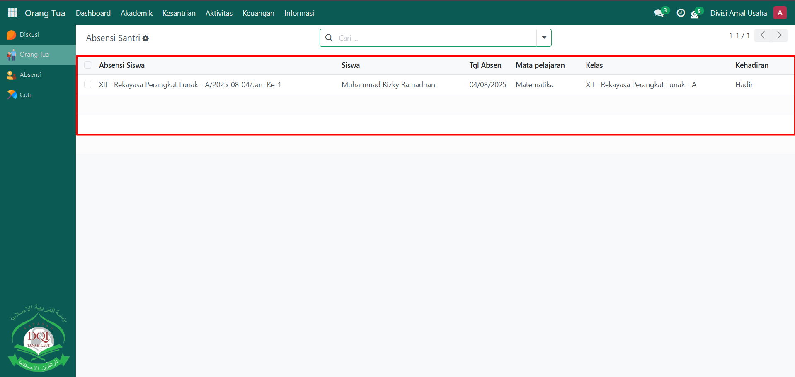
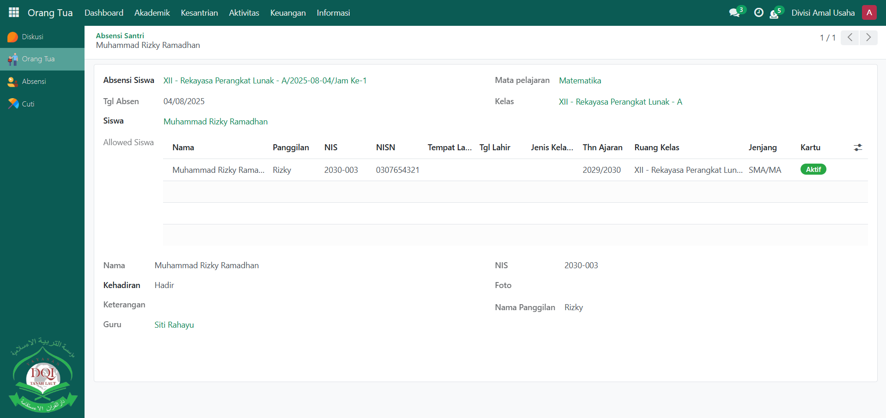

# Absensi Santri



## Monitoring Absensi Santri

**Monitoring Absensi Santri** pada Odoo Pesantren memungkinkan orang tua untuk memantau kehadiran anaknya secara langsung melalui sistem. Dengan fitur ini, orang tua dapat mengetahui apakah santri hadir, izin, sakit, atau tidak hadir pada setiap sesi pembelajaran. Hal ini membantu orang tua tetap terhubung dengan aktivitas anak di pesantren meskipun tidak berada di lokasi.

### Memonitoring Absensi Santri oleh Orang Tua

Berikut adalah langkah-langkah untuk memonitoring absensi santri pada Odoo Pesantren sebagai **orang tua**.

1. Login menggunakan akun orang tua. Jika Anda belum memahami cara login sebagai orang tua, silakan lihat panduan [**Login Orang Tua** di sini](../../../setup-and-konfigurasi/panduan-login/login-orang-tua.md).
2.  Buka modul **Orang Tua**, lalu klik menu **Akademik** kemudian pilih submenu **Absensi Santri**.

    <figure><figcaption></figcaption></figure>

3.  Pada halaman **Absensi Santri**, sistem akan menampilkan daftar data absensi santri dari anak Anda, berisi informasi kehadiran seperti hadir, izin, sakit, atau alpa. Klik salah satu data absensi untuk melihat detail informasi, misalnya **tanggal**, **mata pelajaran/aktivitas**, **keterangan**, dan **guru yang mencatat absensi**.

    <figure><figcaption></figcaption></figure>

4.  Data absensi yang ditampilkan bersifat **real-time**, sehingga orang tua dapat langsung mengetahui kondisi kehadiran anak pada hari tersebut.

    <figure><figcaption></figcaption></figure>
