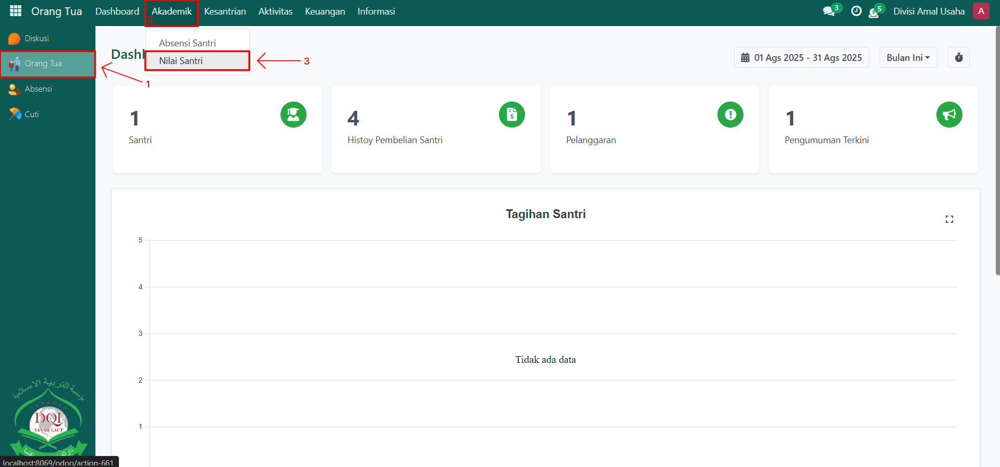
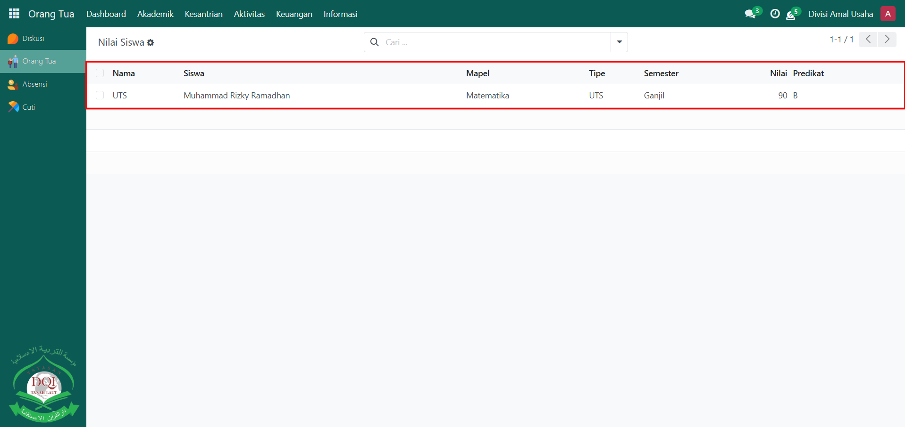
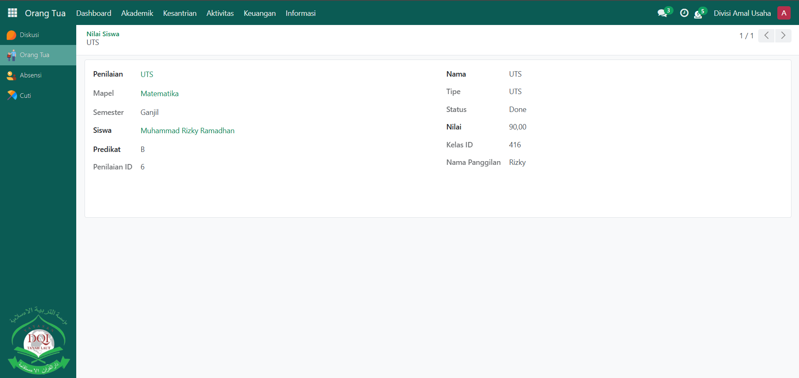

# Nilai Santri

Video \[]

## Monitoring Nilai Santri

**Monitoring Nilai Santri** pada Odoo Pesantren memungkinkan orang tua untuk memantau perkembangan akademik anaknya secara langsung melalui sistem. Dengan fitur ini, orang tua dapat mengetahui nilai tugas, ujian, penilaian harian, hingga penilaian akhir yang diberikan oleh guru. Hal ini membantu orang tua untuk terus mengikuti capaian akademik anaknya di pesantren.

### Memonitoring Nilai Santri oleh Orang Tua

Berikut adalah langkah-langkah untuk memonitoring nilai santri pada Orang Tua sebagai **orang tua**.

1. Login menggunakan akun orang tua. Jika Anda belum memahami cara login sebagai orang tua, silakan lihat panduan [**Login Orang Tua** di sini](../../../setup-and-konfigurasi/role-and-hak-akses-pengguna/panduan-login/login-orang-tua.md).
2.  Buka modul **Orang Tua**, lalu klik menu **Akademik** dan pilih submenu **Nilai Santri**.

    <figure><figcaption></figcaption></figure>

3.  Sistem akan menampilkan daftar nilai santri dari anak Anda, yang berisi informasi seperti mata pelajaran, jenis penilaian (tugas, UTS, UAS, dan lain-lain), serta nilai dan predikat yang diperoleh. Klik salah satu data nilai untuk melihat informasi lebih detail, misalnya **nilai per kompetensi**, **predikat**, **catatan guru**, dan **semester**.

    <figure><figcaption></figcaption></figure>

4.

    <figure><figcaption></figcaption></figure>

5. Data nilai yang ditampilkan bersifat **update sesuai input guru**, sehingga orang tua dapat langsung memantau progres belajar anak secara real-time.
