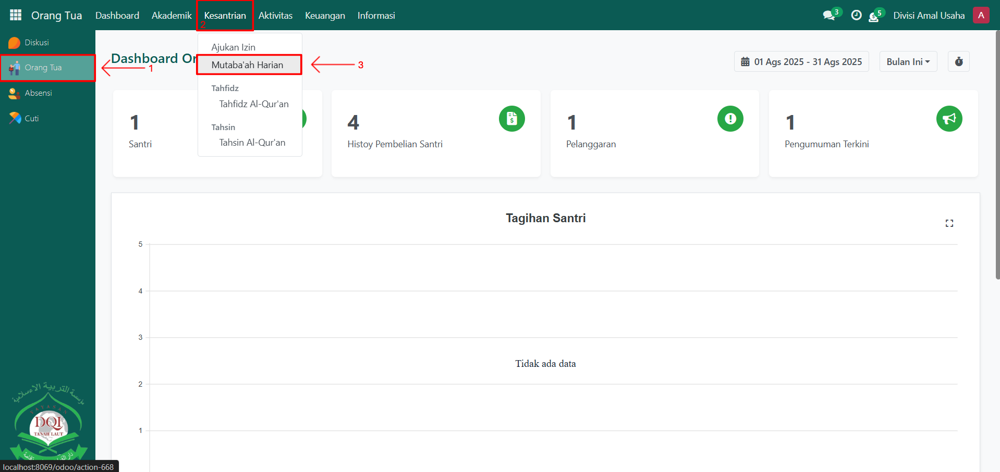

# Mutaba'ah Harian

Video \[]

## Monitoring Mutaba'ah Harian

**Monitoring Mutaba’ah Harian Santri** digunakan oleh **Orang Tua** untuk memantau aktivitas harian anaknya di pesantren. Melalui fitur ini, orang tua dapat melihat daftar kegiatan mutaba’ah harian yang telah dicatat oleh musyrif dan diverifikasi oleh administrator, sehingga perkembangan aktivitas santri dapat dipantau secara transparan dan real-time.

### Memonitoring Mutaba'ah Harian oleh Orang Tua

Berikut adalah langkah-langkah untuk memonitoring mutaba'ah harian santri pada Odoo Pesantren sebagai **orang tua**.

1. Login menggunakan akun orang tua. Jika Anda belum memahami cara login sebagai orang tua, silakan lihat panduan [**Login Orang Tua** di sini](../../../setup-and-konfigurasi/panduan-login/login-orang-tua.md).
2.  Buka modul **Orang Tua**, lalu klik menu **Kesantrian** kemudian pilih submenu **Mutaba’ah Harian**.

    <figure><figcaption></figcaption></figure>

3.  Pada halaman **Mutaba’ah Harian**, sistem akan menampilkan daftar data mutaba’ah harian dari anak Anda sesuai dengan kelas dan jadwalnya. Klik salah satu data mutaba’ah harian untuk melihat informasi lebih detail mengenai aktivitas santri, seperti **tanggal**, **sesi**, dan **daftar kegiatan yang dicatat**.

    <figure><figcaption></figcaption></figure>

4.  Orang tua dapat memantau hasil pencatatan secara rutin untuk mengetahui perkembangan kedisiplinan dan aktivitas harian anak di pesantren.

    <figure><figcaption></figcaption></figure>
