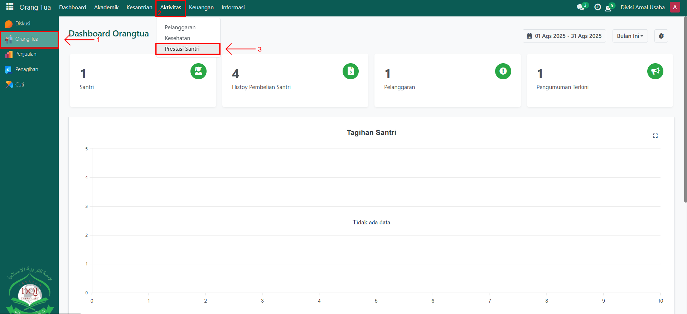

# Prestasi Santri

Video \[]

## Monitoring Prestasi Santri

**Monitoring Prestasi Santri** digunakan oleh **Orang Tua** untuk memantau prestasi anaknya yang dicatat oleh musyrif atau guru di pesantren. Dengan fitur ini, orang tua dapat mengetahui pencapaian santri baik di bidang akademik maupun non-akademik (misalnya lomba, olahraga, tahfidz, atau prestasi lainnya).

### Memonitoring Prestasi Santri oleh Orang Tua

Berikut adalah langkah-langkah untuk memonitoring prestasi santri pada Odoo Pesantren sebagai **orang tua**.

1. Login menggunakan akun orang tua. Jika Anda belum memahami cara login sebagai orang tua, silakan lihat panduan [**Login Orang Tua** di sini](../../../setup-and-konfigurasi/role-and-hak-akses-pengguna/panduan-login/login-orang-tua.md).
2.  Buka modul **Orang Tua**, lalu klik menu **Aktivitas** kemudian pilih submenu **Prestasi Santri**.

    <figure><figcaption></figcaption></figure>

3.  Pada halaman **Prestasi Santri**, sistem akan menampilkan daftar catatan prestasi anak Anda yang telah dimasukkan oleh musyrif atau guru. Klik salah satu data prestasi untuk melihat detail informasi, seperti **nama prestasi, tingkat (lokal/nasional/internasional), juara, tanggal prestasi, deskripsi, serta bukti foto prestasi (jika ada)**.

    <figure><figcaption></figcaption></figure>

4.  Orang tua dapat menggunakan informasi ini untuk memantau perkembangan prestasi anak secara berkala.

    <figure><figcaption></figcaption></figure>
