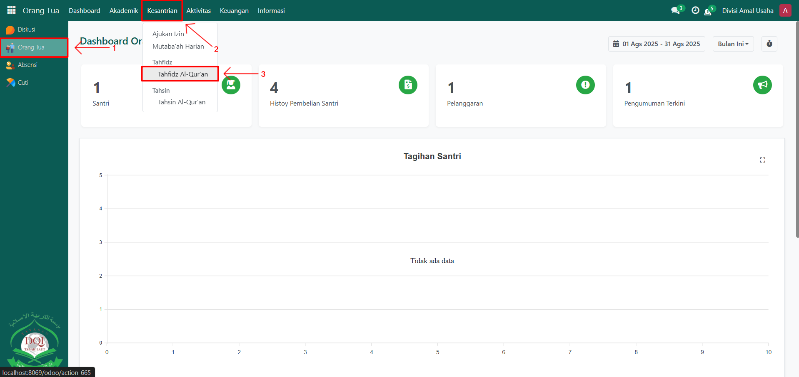
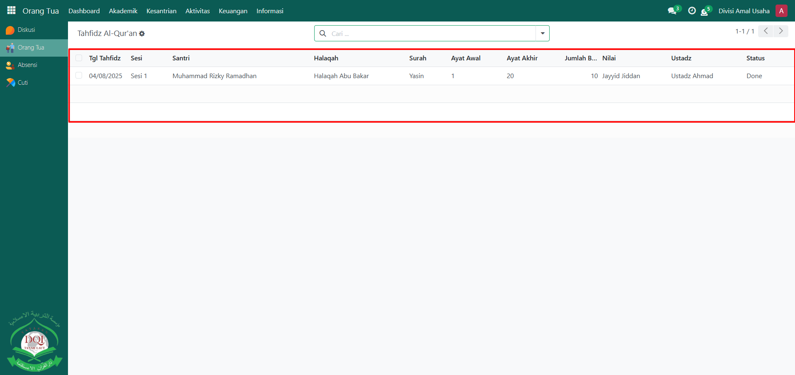
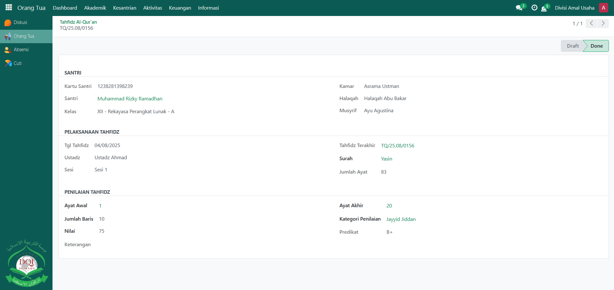

# Tahfidz Al-Qur'an

Video \[]

## Monitoring Tahfidz Al-Qur'an Santri

**Monitoring Tahfidz Al-Qur’an** digunakan oleh **Orang Tua** untuk memantau perkembangan hafalan Al-Qur’an anaknya di pesantren. Data hafalan ini dicatat langsung oleh guru Qur’an dan dapat dilihat oleh orang tua secara real-time melalui sistem Odoo Pesantren.

### Memonitoring Tahfidz Al-Qur'an Santri oleh Orang Tua

Berikut adalah langkah-langkah untuk memonitoring tahfidz al-qur'an santri pada Odoo Pesantren sebagai **orang tua**.

1. Login menggunakan akun orang tua. Jika Anda belum memahami cara login sebagai orang tua, silakan lihat panduan [**Login Orang Tua** di sini](../../../setup-and-konfigurasi/role-and-hak-akses-pengguna/panduan-login/login-orang-tua.md).
2.  Buka modul **Orang Tua**, lalu klik menu **Kesantrian** kemudian pilih submenu **Tahfidz Al-Qur'an**.

    <figure><figcaption></figcaption></figure>

3.  Pada halaman **Tahfidz Al-Qur’an**, sistem akan menampilkan daftar catatan hafalan Al-Qur’an dari anak Anda yang telah dicatat oleh guru Qur’an. Klik salah satu data untuk melihat informasi lebih detail, seperti **surat, ayat awal–akhir, jumlah baris, nilai, kategori penilaian, serta keterangan dari guru Qur’an**.

    <figure><figcaption></figcaption></figure>

4.  Orang tua dapat memantau perkembangan hafalan ini secara rutin untuk memastikan kemajuan anak dalam menghafal Al-Qur’an.

    <figure><figcaption></figcaption></figure>
