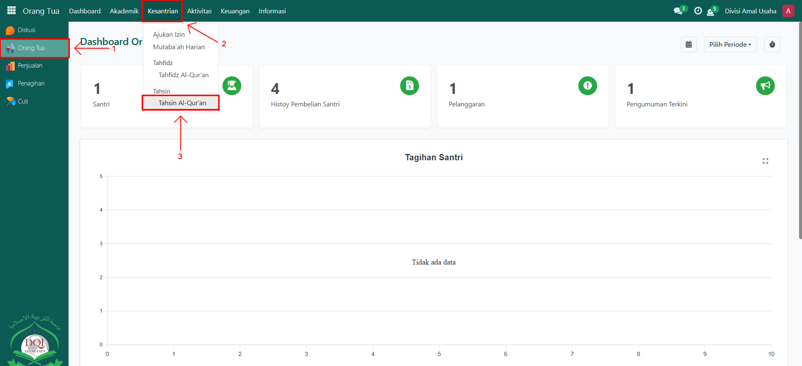
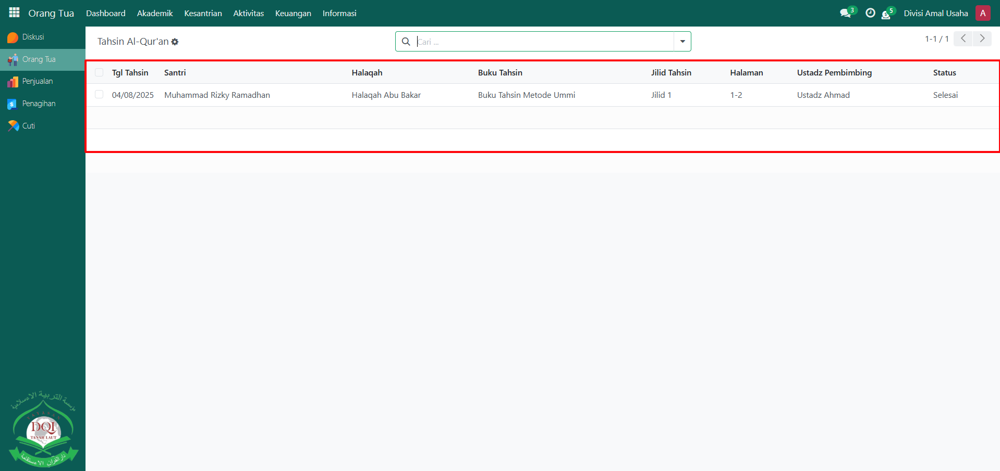
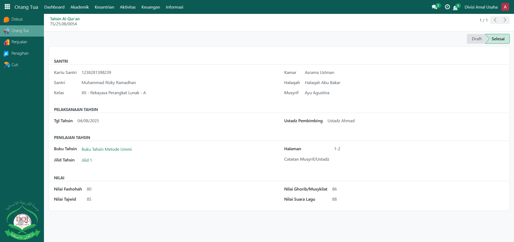

# Tahsin Al-Qur'an

Video \[]

## Monitoring Tahsin Al-Qur'an Santri

**Monitoring Tahsin Al-Qur’an** digunakan oleh **Orang Tua** untuk memantau perkembangan kemampuan membaca Al-Qur’an anaknya sesuai kaidah tajwid, fashohah, suara, serta aspek lainnya. Data ini dicatat oleh guru Qur’an pada setiap sesi tahsin, dan orang tua dapat melihat hasilnya melalui sistem Odoo Pesantren.

### Memonitoring Tahsin Al-Qur'an Santri oleh Orang Tua

Berikut adalah langkah-langkah untuk memonitoring tahsin al-qur'an santri pada Odoo Pesantren sebagai **orang tua**.

1. Login menggunakan akun orang tua. Jika Anda belum memahami cara login sebagai orang tua, silakan lihat panduan [**Login Orang Tua** di sini](../../../setup-and-konfigurasi/role-and-hak-akses-pengguna/panduan-login/login-orang-tua.md).
2.  Buka modul **Orang Tua**, lalu klik menu **Kesantrian** kemudian pilih submenu **Tahsin Al-Qur'an**.

    <figure><figcaption></figcaption></figure>

3.  Pada halaman **Tahsin Al-Qur’an**, sistem akan menampilkan daftar data tahsin anak Anda yang telah dicatat oleh guru Qur’an. Klik salah satu data untuk melihat informasi lebih detail, seperti **jilid tahsin, halaman yang dipelajari, nilai fashohah, tajwid, ghorib/musykilat, suara lagu, serta catatan guru Qur’an**.

    <figure><figcaption></figcaption></figure>

4.  Orang tua dapat memantau perkembangan bacaan anak secara berkala untuk memastikan peningkatan kualitas tahsin.

    <figure><figcaption></figcaption></figure>
