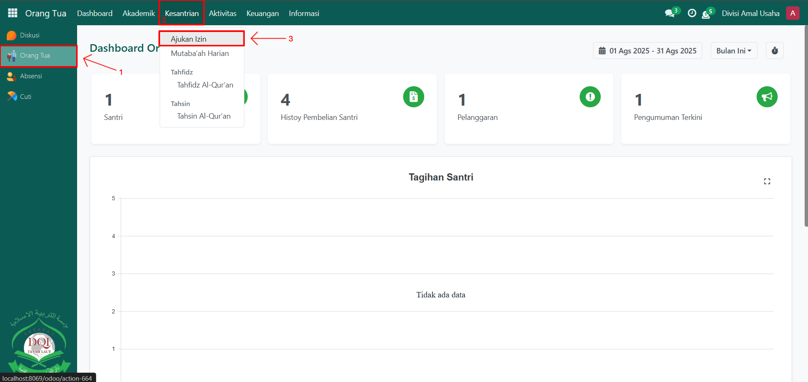
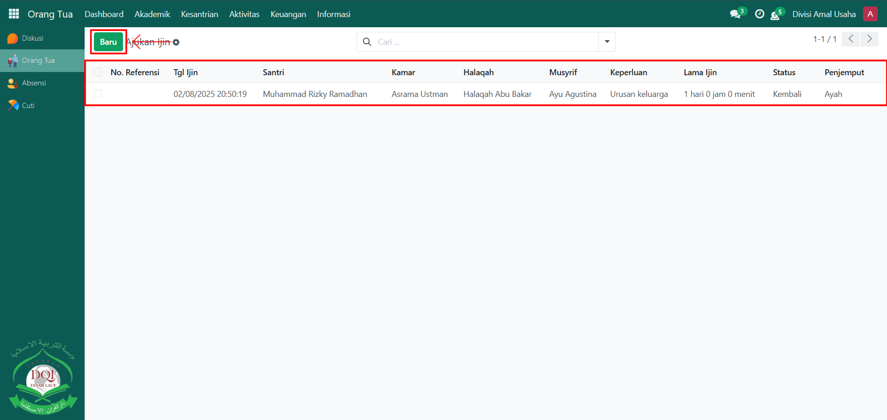
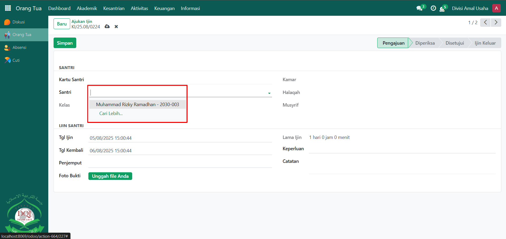
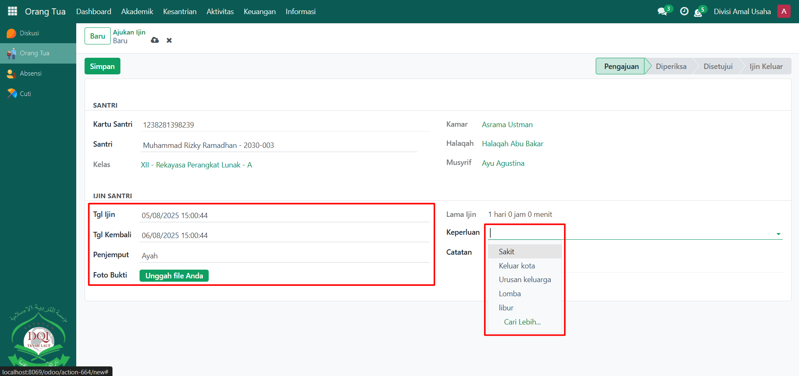
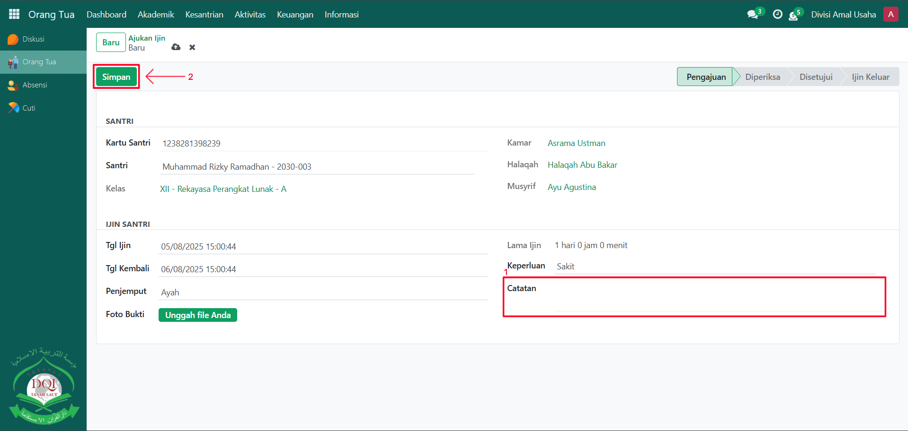

# Pengajuan Izin Santri



## Pengajuan Izin

**Pengajuan Izin** pada Odoo Pesantren digunakan oleh **Orang Tua** untuk mengajukan izin keluar bagi santrinya. Dengan fitur ini, orang tua dapat secara langsung mengajukan permohonan izin kepada pihak pesantren, lengkap dengan informasi tanggal, penjemput, serta alasan izin. Pengajuan ini nantinya akan diteruskan ke **Musyrif** untuk dilakukan pemeriksaan dan persetujuan.

### Melakukan Pengajuan Izin Santri oleh Orang Tua

Berikut adalah langkah-langkah untuk melakukan pengajuan izin santri pada Odoo Pesantren sebagai **orang tua**.

1. Login menggunakan akun orang tua. Jika Anda belum memahami cara login sebagai orang tua, silakan lihat panduan [**Login Orang Tua** di sini](../../setup-and-konfigurasi/panduan-login/login-orang-tua.md).
2.  Buka modul **Orang Tua**, lalu klik menu **Kesantrian** kemudian pilih submenu **Ajukan Izin**.

    <figure><figcaption></figcaption></figure>

3.  Pada tampilan **Ajukan Izin**, Anda juga dapat melihat daftar perizinan santri yang sudah diajukan sebelumnya. Untuk membuat izin baru, klik tombol **"Baru"**.

    <figure><figcaption></figcaption></figure>

4.  Akan tampil halaman form pengajuan izin santri. Pilih santri yang sesuai dengan akun orang tua yang sedang login.

    <figure><figcaption></figcaption></figure>

5.  Masukkan data pengajuan izin, seperti:

    * **Tanggal Izin** (tanggal mulai izin santri)
    * **Tanggal Kembali** (tanggal santri kembali ke pesantren)
    * **Penjemput** (nama orang yang menjemput santri)
    * **Foto Bukti** (masukkan file foto bukti perizinan santri).
    * **Keperluan Izin** (misalnya: sakit, urusan keluarga, keluar kota, atau lainnya)

    <figure><figcaption></figcaption></figure>

6.  Tambahkan **Catatan** apabila diperlukan, misalnya catatan tambahan kepada musyrif. Setelah semua inputan diisi dengan benar, klik tombol **"Simpan"** untuk menyimpan pengajuan izin santri.

    <figure><figcaption></figcaption></figure>

7. Tahapan selanjutnya, pengajuan izin ini akan diproses oleh **Musyrif** untuk dilakukan pemeriksaan dan persetujuan.
