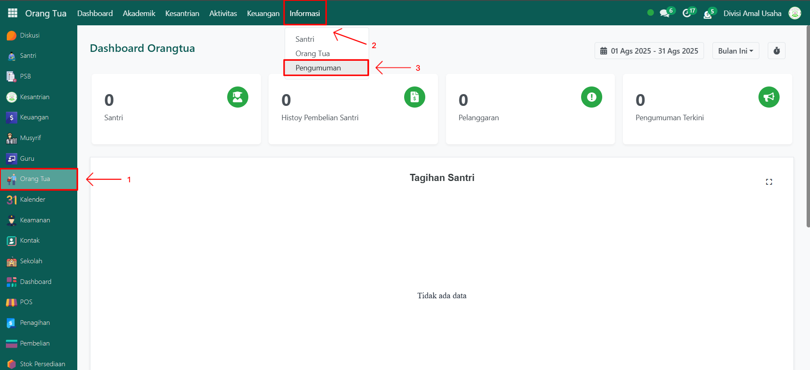
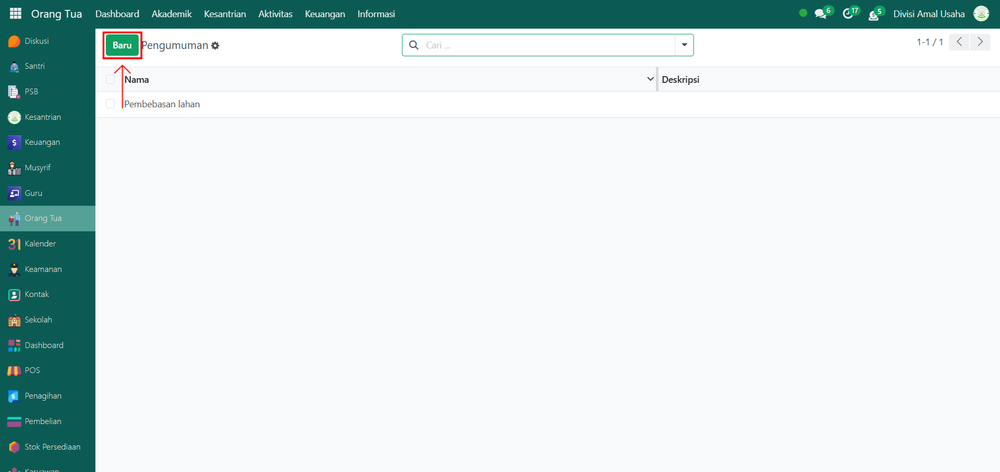
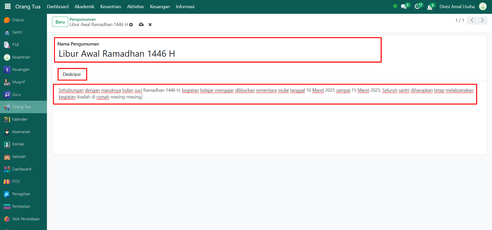

# Pengumuman

Video \[]

## Pengumuman

**Pengumuman** digunakan oleh Administrator untuk menyampaikan informasi penting kepada orang tua atau wali santri melalui sistem. Pengumuman yang ditambahkan akan langsung ditampilkan pada modul **Orang Tua**, sehingga orang tua dapat membaca informasi terbaru saat login ke sistem. Contoh pengumuman misalnya jadwal ujian, libur pesantren, pembayaran SPP, atau agenda kegiatan pesantre

### Menambahkan Pengumuman oleh Administrator

Berikut adalah langkah-langkah untuk menambahkan pengumuman oleh Administrator pada Odoo Pesantren.

1. Login menggunakan akun administrator. Jika Anda belum memahami cara login sebagai admin, silakan lihat panduan [**Login Admin** di sini](../../panduan-login/login-admin.md).
2.  Buka modul **Orang Tua**, lalu klik menu **Informasi** dan pilih submenu **Pengumuman**.

    <figure><figcaption></figcaption></figure>

3.  Klik tombol **"Baru"** untuk membuat pengumuman baru.

    <figure><figcaption></figcaption></figure>

4.  Akan tampil halaman form **Pengumuman**. Isi inputan yang tersedia seperti:

    * **Nama Pengumuman** → tulis judul pengumuman yang ingin ditampilkan.
    * **Tab Deskripsi** → isi deskripsi lengkap mengenai isi pengumuman.

    <figure><figcaption></figcaption></figure>

5.  Setelah semua inputan diisi dengan benar, klik ikon **Simpan** di sebelah kanan ikon **Gear** agar data pengumuman tersimpan di sistem.

    <figure><figcaption></figcaption></figure>

6. Setelah disimpan, pengumuman akan otomatis ditampilkan dan dapat dilihat oleh orang tua saat login menggunakan akun **Orang Tua** pada modul yang sama.

### Edit dan Hapus Data Pengumuman

Untuk mengedit suatu data pengumuman, silahkan pilih terlebih dahulu data mana yang akan diedit. Editlah data pengumuman dan klik icon **Simpan** untuk menyimpan data perubahan tersebut.

Untuk menghapus suatu data pengumuman adalah dengan pilih data mana yang akan dihapus, kemudian klik icon **Gear** atau **Action** lalu pilih opsi **Hapus**, maka akan tampil dialog konfirmasi apakah anda ingin menghapus data tersebut. Jika ya, klik **Hapus** jika tidak maka klik **Tidak, tetap simpan**.
