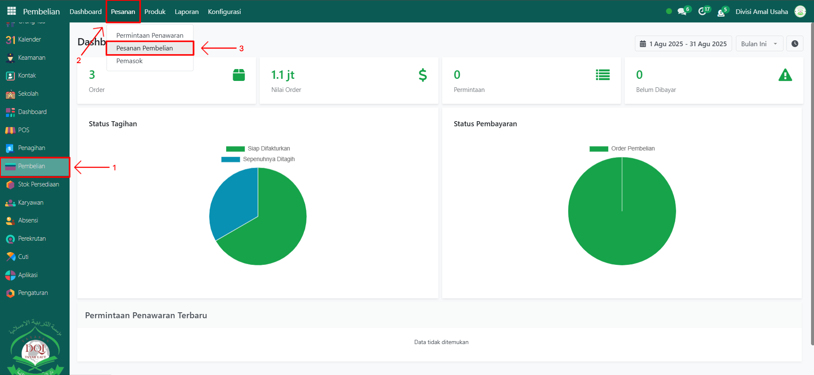
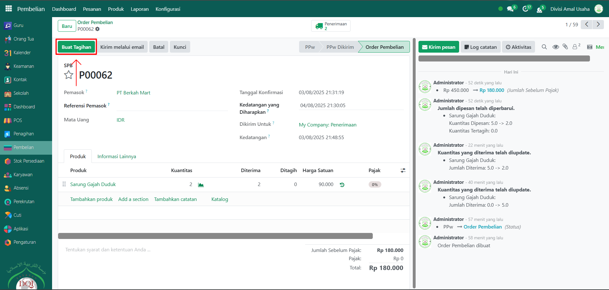
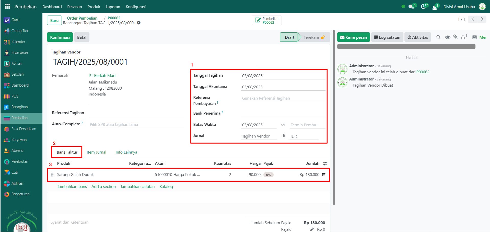
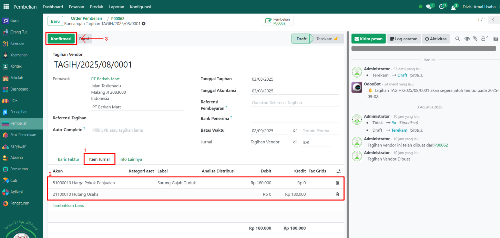

# Catat Tagihan Pemasok

Video \[]

## Catat Tagihan Pemasok

**Catat Tagihan Pemasok** pada Odoo Pesantren digunakan untuk mencatat tagihan yang diterima dari pemasok berdasarkan order pembelian yang sudah dilakukan. Dengan pencatatan ini, sistem dapat mengelola kewajiban pembayaran kepada pemasok secara akurat.

### Melakukan Pencatatan Tagihan Pemasok

Berikut adalah langkah-langkah untuk melakukan pencatatan tagihan pemasok pada Odoo Pesantren.

1. Login menggunakan akun administrator. Jika Anda belum memahami cara login sebagai admin, silakan lihat panduan [**Login Admin** di sini](../../panduan-login/login-admin.md).
2.  Buka modul **Pembelian**, lalu klik menu **Pesanan**  dan pilih submenu **Pesanan Pembelian**.

    <figure><figcaption></figcaption></figure>

3.  Pilih **order pembelian** yang sudah selesai dilakukan dan perlu dibuatkan tagihan.

    <figure><figcaption></figcaption></figure>

4.  Pada tampilan form order pembelian, klik tombol **"Buat Tagihan"** untuk membuat catatan tagihan dari pemasok.

    <figure><figcaption></figcaption></figure>

5.  Sistem akan otomatis membuat dokumen **Tagihan Pemasok** berdasarkan order pembelian. Pada halaman form tagihan pemasok, isi inputan berikut:

    * **Tanggal Tagihan** (tanggal sesuai faktur dari pemasok)
    * **Akunting/Jurnal** (pilih jurnal pencatatan yang sesuai, misalnya _Pembelian_)
    * **Batas Waktu** (tanggal jatuh tempo pembayaran)
    * **Jurnal**, pastikan jurnal pencatatan tagihan harus tepat (misalnya: Tagihan Vendor).
    * Pada **Tab Baris Faktur**, pastikan produk, kuantitas, harga, dan pajak sesuai dengan order pembelian.

    <figure><figcaption></figcaption></figure>

6.  Pindah ke **Tab Item Jurnal**, periksa apakah akun yang tercatat sudah sesuai dengan konfigurasi akuntansi. Jika semua data sudah benar, klik tombol **Konfirmasi**. Status tagihan pemasok akan berubah dari _Draft_ menjadi _Terekam_.

    <figure><figcaption></figcaption></figure>

7. Setelah tagihan dikonfirmasi, sistem akan menambahkan kewajiban pembayaran di modul **Keuangan** di menu **Tagihan Pemasok**, dan siap untuk diproses pembayarannya di sini.
