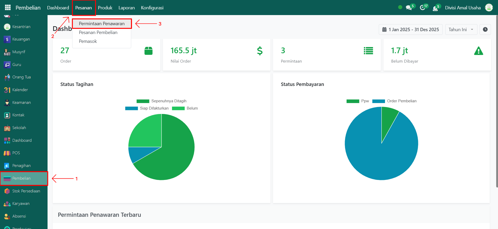
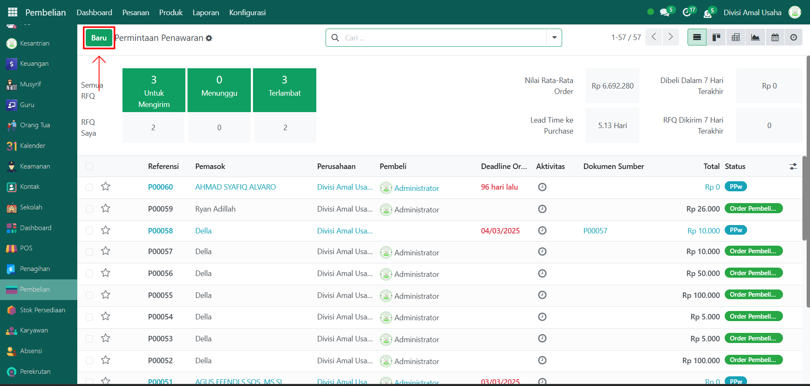
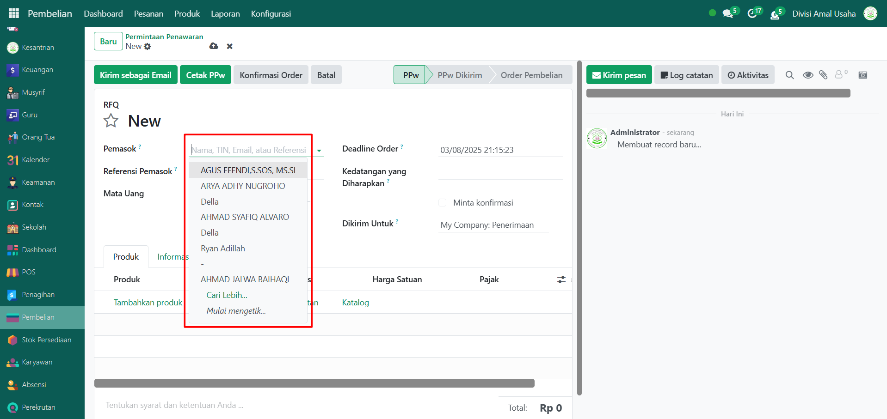
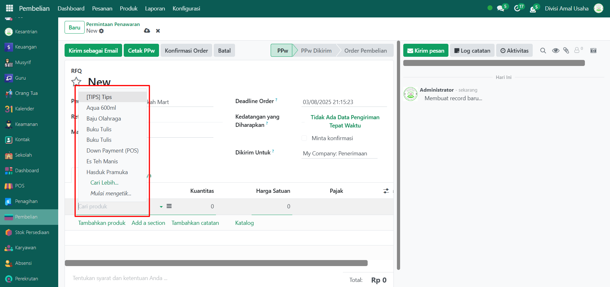
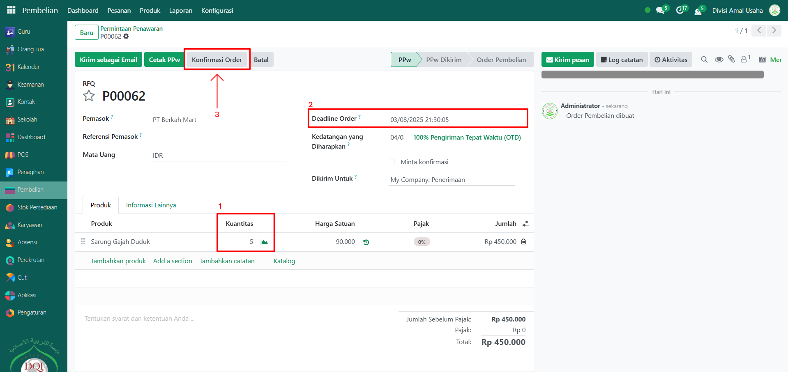

# Order Pembelian Barang

Video \[]

## Order Pembelian Barang

**Order Pembelian Barang** pada Odoo Pesantren digunakan untuk membuat pesanan barang dari pemasok (vendor). Administrator dapat menentukan pemasok, produk, jumlah, serta deadline order sebelum barang diterima ke dalam stok.

### Melakukan Order Pembelian Barang kepada Pemasok

Berikut adalah langkah-langkah untuk melakukan order pembelian barang kepada pemasok pada Odoo Pesantren.

1. Login menggunakan akun administrator. Jika Anda belum memahami cara login sebagai admin, silakan lihat panduan [**Login Admin** di sini](../../panduan-login/login-admin.md).
2.  Buka modul **Pembelian**, lalu klik menu **Pesanan** kemudian pilih submenu **Permintaan Penawaran**.

    <figure><figcaption></figcaption></figure>

3.  Klik tombol **"Baru"** untuk membuat order pembelian.

    <figure><figcaption></figcaption></figure>

4.  Pada form order pembelian, pilih **Pemasok** yang menjadi tujuan pembelian barang.

    <figure><figcaption></figcaption></figure>

5.  Tambahkan **Produk** yang akan dibeli.

    <figure><figcaption></figcaption></figure>

6.  Kemudian isi **Kuantitas**, **Harga Satuan** (akan otomatis terisi jika produk sudah memiliki harga), dan **Deadline Order** (tanggal jatuh tempo). Setelah data terisi lengkap, klik tombol **"Konfirmasi Order"** untuk memproses pesanan pembelian. Status order akan berubah dari _Draft_ menjadi _Purchase Order_.

    <figure><figcaption></figcaption></figure>

7. Tahap berikutnya adalah **Penerimaan Barang** yang dapat dilakukan langsung dari form order pembelian (tombol **"Terima Produk"**) atau melalui **modul Stok Persediaan** di menu [Penerimaan Barang di sini](../modul-stok-persediaan/penerimaan-barang.md).
8. Setelah barang diterima, sistem akan memperbarui stok produk secara otomatis dan order pembelian dianggap selesai.
