# Simulasi Penjualan via Kasir



## Simulasi Penjualan via Kasir

**Simulasi Penjualan** **via Kasir** digunakan untuk melakukan transaksi penjualan produk secara langsung menggunakan aplikasi **POS (Point of Sale)** pada Odoo Pesantren. Fitur ini mensimulasikan kondisi nyata seperti penjualan di kantin atau koperasi santri, dengan metode pembayaran yang sudah terintegrasi dengan **Dompet Santri** atau metode pembayaran lain yang telah dikonfigurasi.

### Melakukan Simulasi Penjualan via Kasir

Berikut adalah langkah-langkah untuk melakukan simulasi penjualan via kasir pada Odoo Pesantren.

1. Login menggunakan akun administrator. Jika Anda belum memahami cara login sebagai admin, silakan lihat panduan [**Login Admin** di sini](../../panduan-login/login-admin.md).
2.  Buka modul **POS**, lalu klik menu **Dashboard**.

    <figure>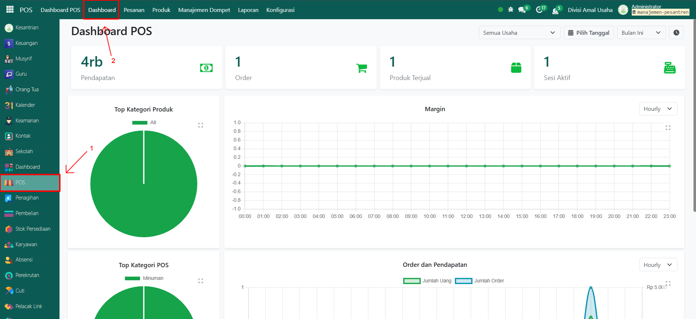<figcaption></figcaption></figure>

3.  Pada tampilan dashboard, pilih salah satu **sesi POS** (misalnya kantin atau toko pesantren) yang ingin dibuka, kemudian klik tombol **"Buka Pendaftaran"**.

    <figure>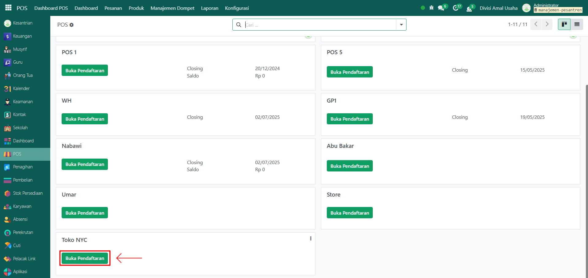<figcaption></figcaption></figure>

4.  Akan muncul halaman baru, klik tombol **"Buka Pendaftaran"** untuk masuk ke sesi POS.

    <figure><figcaption></figcaption></figure>

5.  Setelah itu, klik icon **Pengguna**.

    <figure>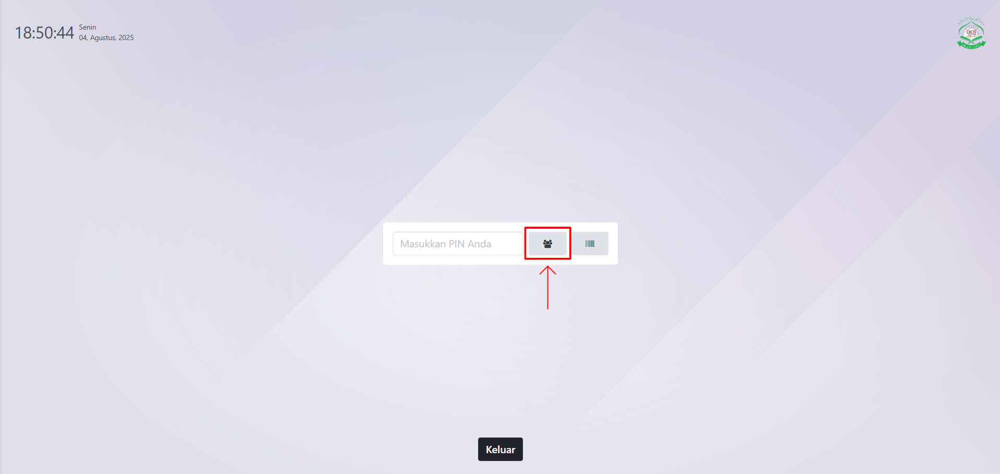<figcaption></figcaption></figure>

6.  Muncul pop up pemilihan pengguna, pilih karyawan yang akan bertugas di sesi POS tersebut (misalnya: **Administrator**).

    <figure>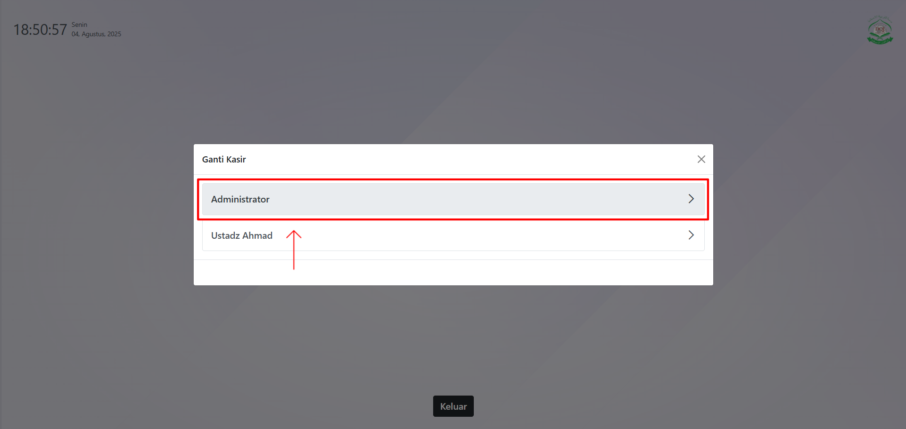<figcaption></figcaption></figure>

7.  Sistem akan membuka tampilan POS. Jika muncul pop up konfirmasi pendaftaran sesi, klik tombol **"Buka Pendaftaran"** untuk memulai membuka simulasi penjualan pada POS.

    <figure>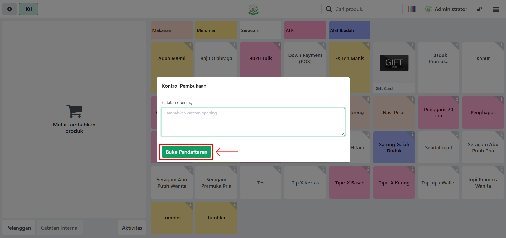<figcaption></figcaption></figure>

8.  Untuk memulai transaksi, pilih pelanggan dengan klik tombol **"Pelanggan"** di pojok kiri bawah.

    <figure>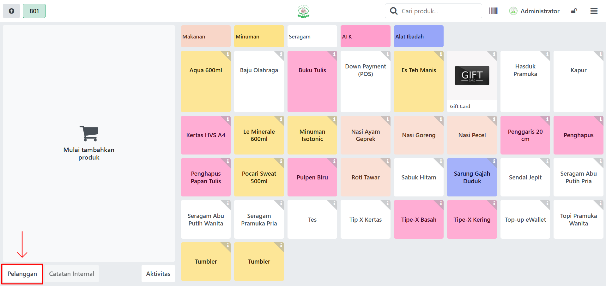<figcaption></figcaption></figure>

9.  Akan tampil daftar pelanggan (santri/orang tua). Anda dapat memilih pelanggan dengan dua cara:

    * **Scan kartu santri fisik** menggunakan barcode/QR scanner.
    * **Pilih manual** dari daftar pelanggan yang tersedia.

    <figure>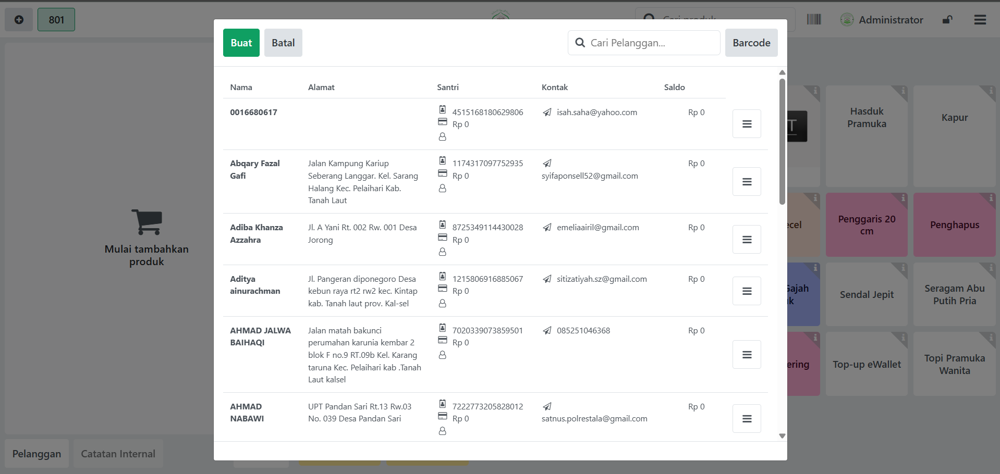<figcaption></figcaption></figure>

10. Selanjutnya, pilih produk yang akan dibeli pelanggan dengan mengklik produk pada daftar POS. Produk akan otomatis masuk ke keranjang belanja. Jika sudah selesai memilih produk, klik tombol **"Pembayaran"**.

    <figure>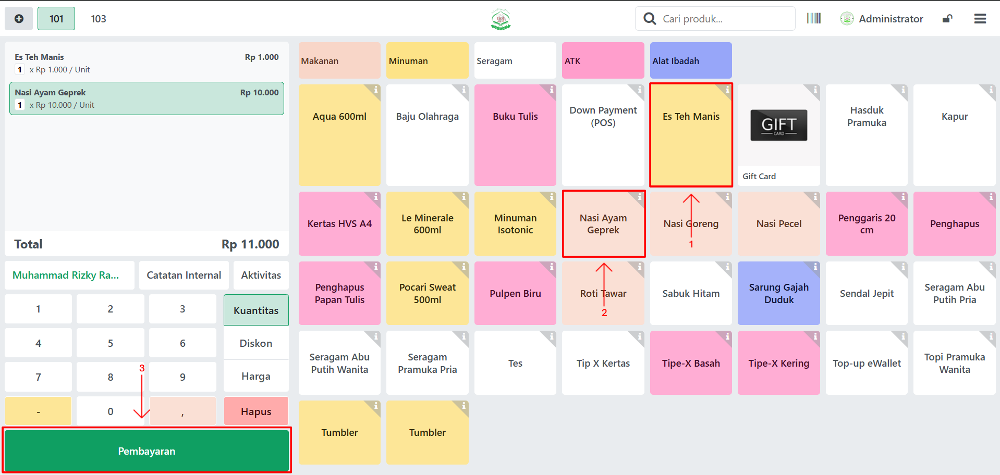<figcaption></figcaption></figure>

11. Pada tampilan pembayaran POS, pilih **metode pembayaran** (misalnya: **Dompet Santri**). Jika ingin transaksi penjualan langsung tercatat sebagai faktur, aktifkan opsi **Faktur**. Klik tombol **"Validasi"** untuk melanjutkan proses pembayaran.

    <figure>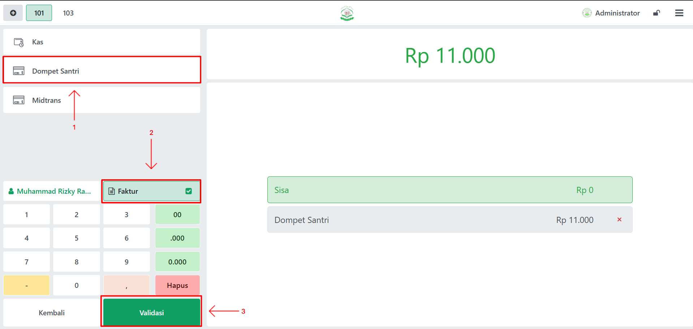<figcaption></figcaption></figure>

12. Sistem akan menampilkan pop up konfirmasi PIN. Lalu masukkan PIN **Dompet Santri** milik pelanggan.

    <figure>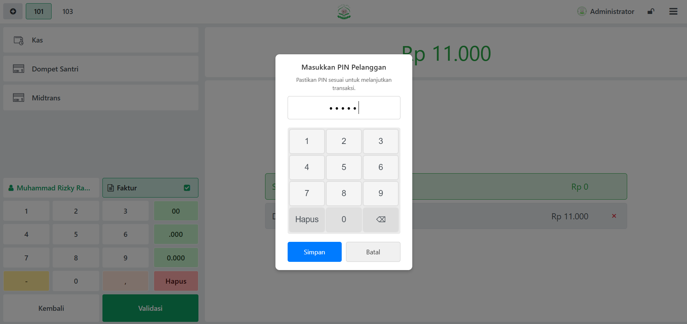<figcaption></figcaption></figure>

13. Jika PIN benar, sistem akan memproses transaksi dan menampilkan **struk pembelian** sebagai bukti transaksi.

    <figure>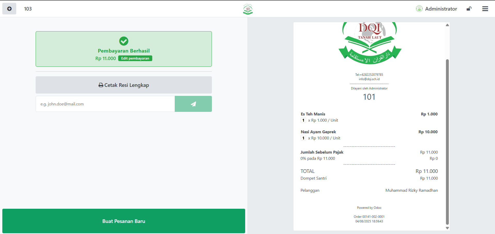<figcaption></figcaption></figure>

14. Untuk keluar dari sesi POS, klik tombol menu **(tiga garis horizontal)** di pojok kanan atas, lalu pilih opsi **Tutup Kasir**.

    <figure>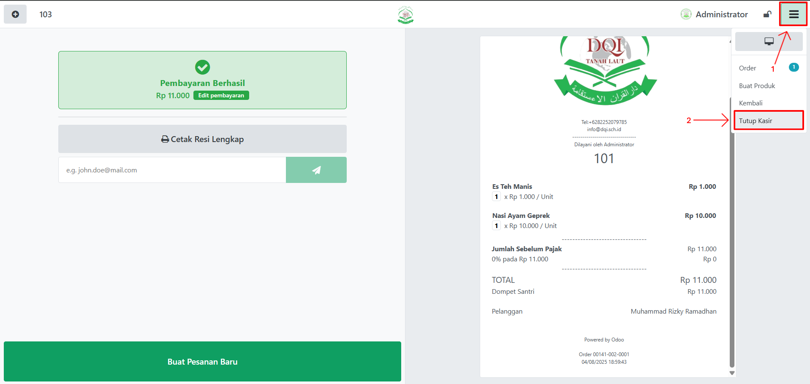<figcaption></figcaption></figure>

15. Akan muncul pop up **Tutup Kasir**. Periksa kolom **Dompet Santri Hitung** (biasanya otomatis terisi sesuai transaksi). Jika sudah sesuai, klik tombol **"Tutup Kasir"** untuk menyelesaikan sesi POS.

    <figure><figcaption></figcaption></figure>

16. Sesi POS akan ditutup, dan transaksi penjualan tercatat otomatis di sistem.

