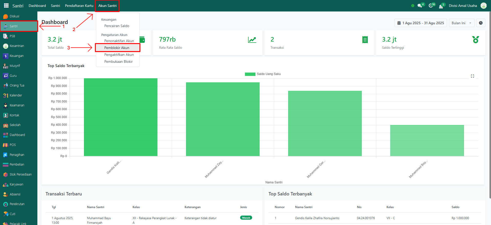
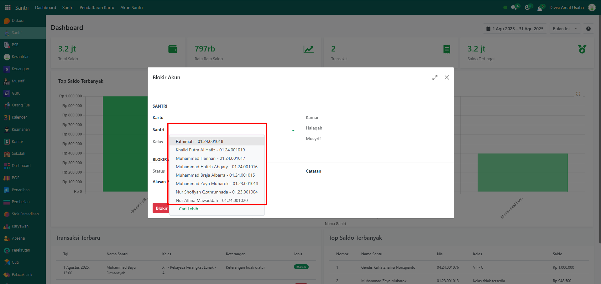
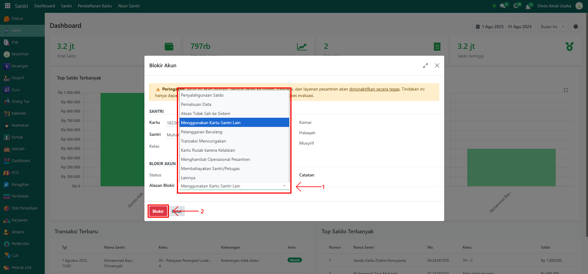
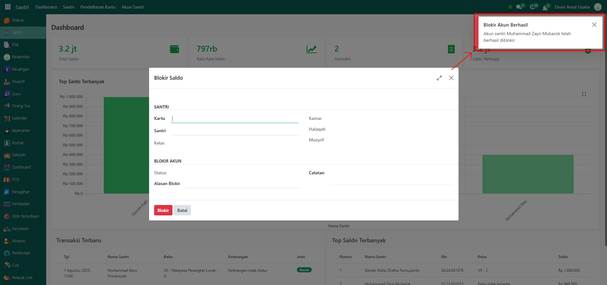
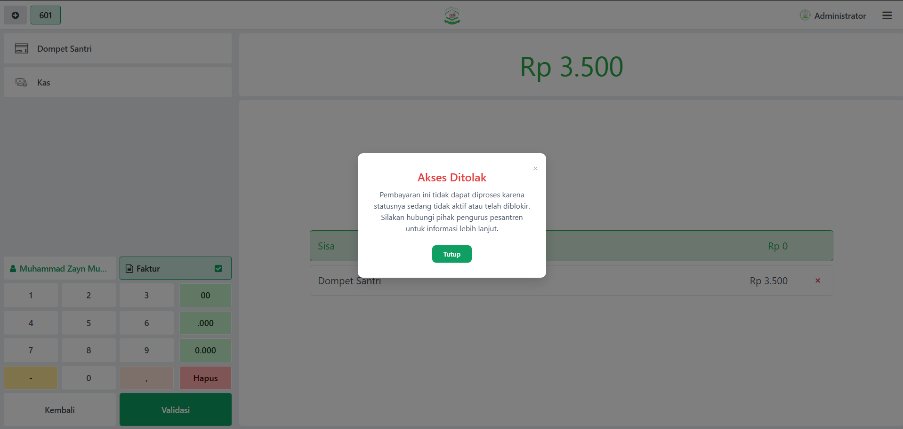

# Pemblokiran Akun

Video \[]

## Pemblokiran Akun Santri

**Pemblokiran Akun Santri** adalah fitur yang digunakan untuk menghentikan sementara akses transaksi santri pada sistem Odoo Pesantren. Fitur ini biasanya dipakai ketika santri melakukan pelanggaran tertentu, seperti penyalahgunaan kartu santri, atau berdasarkan kebijakan pesantren. Berbeda dengan **Penonaktifan Akun** yang bersifat permanen, pemblokiran akun dapat dibuka kembali jika santri dinyatakan layak menggunakan akunnya kembali.

### Memblokir Akun Santri

Berikut adalah langkah-langkah untuk memblokir akun santri pada Odoo Pesantren.

1. Login menggunakan akun administrator. Jika Anda belum memahami cara login sebagai admin, silakan lihat panduan [**Login Admin** di sini](../../../panduan-login/login-admin.md).
2.  Buka modul **Santri**, lalu klik menu **Akun Santri** dan pilih submenu **Pemblokiran Akun**.

    <figure><figcaption></figcaption></figure>

3. Pastikan santri sudah memiliki **kartu santri** yang aktif agar bisa dilakukan pemblokiran.
4.  Pada tampilan form pop up **Pemblokiran Akun**, pilih nama santri pada bagian **Santri**.

    <figure><figcaption></figcaption></figure>

5.  Pilih **Alasan Pemblokiran Akun** (misalnya: Menggunakan Kartu Santri Orang Lain). Jika sudah, klik tombol **"Blokir"** untuk memproses pemblokiran akun santri.

    <figure><figcaption></figcaption></figure>

6.  Setelah berhasil, sistem akan menampilkan notifikasi bahwa **akun santri berhasil diblokir**.

    <figure><figcaption></figcaption></figure>

7. Setelah akun diblokir, status akun santri akan berubah menjadi **Diblokir**, sehingga santri tidak bisa menggunakan akunnya untuk transaksi sampai akun dibuka kembali.
8.  Contoh transaksi dengan akun santri yang diblokir.

    <figure><figcaption></figcaption></figure>
