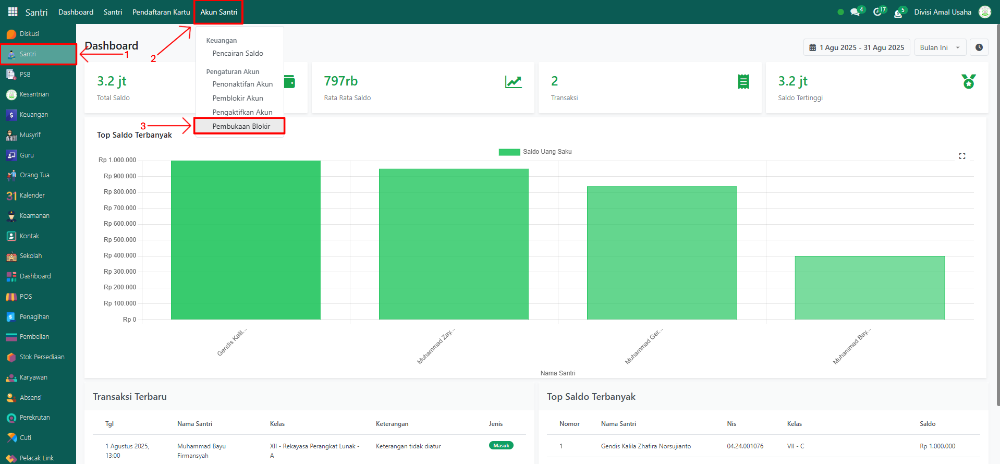
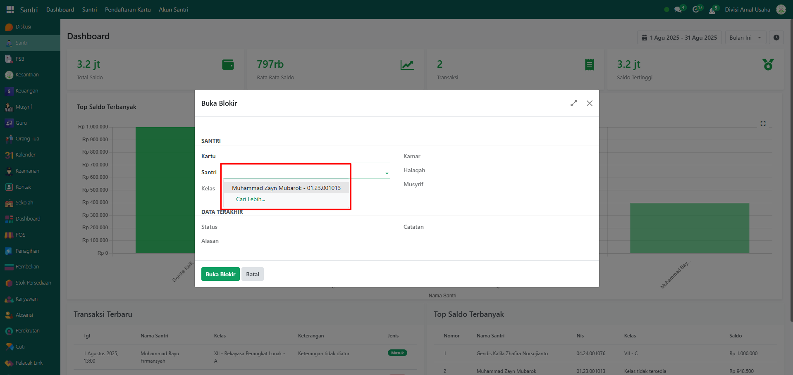
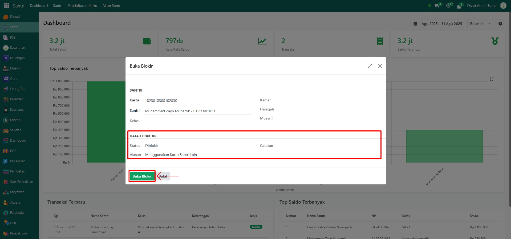
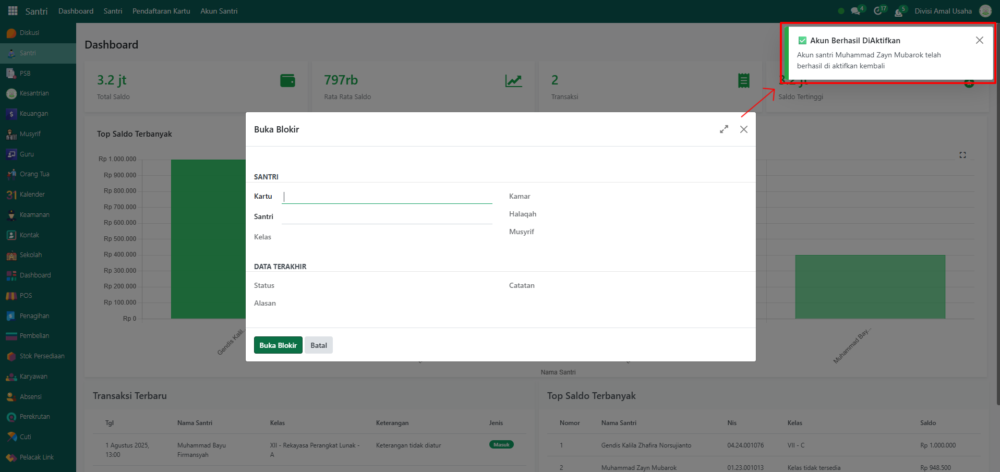

# Pembukaan Akun



## Pembukaan Akun

**Pembukaan Akun** digunakan ketika akun santri yang sebelumnya diblokir karena pelanggaran atau alasan tertentu ingin dipulihkan kembali. Dengan fitur ini, akun santri dapat kembali digunakan untuk berbagai transaksi seperti pengisian saldo, pencairan, pembayaran, maupun aktivitas yang ada di pesantren.

### Membuka Akun Santri

Berikut adalah langkah-langkah untuk membuka akun santri yang diblokir pada Odoo Pesantren.

1. Login menggunakan akun administrator. Jika Anda belum memahami cara login sebagai admin, silakan lihat panduan [**Login Admin** di sini](../../../panduan-login/login-admin.md).
2.  Buka modul **Santri**, lalu klik menu **Akun Santri** kemudian pilih submenu **Pembukaan Akun**.

    <figure><figcaption></figcaption></figure>

3.  Pada tampilan form pop up **Pembukaan Akun**, pilih nama santri pada bagian **Santri** yang akunnya diblokir.

    <figure><figcaption></figcaption></figure>

4.  Sistem akan menampilkan informasi status kartu beserta alasan pemblokiran sebelumnya. Lalu klik tombol **"Buka Blokir"** untuk memproses pembukaan akun santri.

    <figure><figcaption></figcaption></figure>

5.  Setelah berhasil, sistem akan menampilkan notifikasi bahwa **pembukaan akun berhasil** dan dapat kembali digunakan untuk transaksi.

    <figure><figcaption></figcaption></figure>
