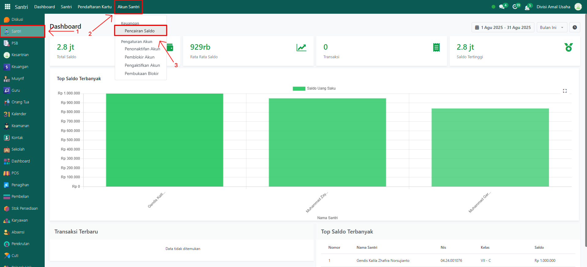
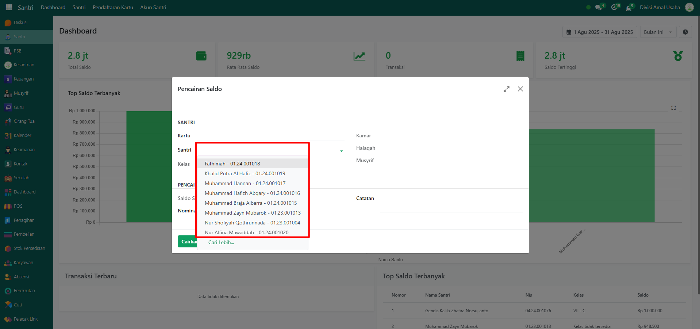
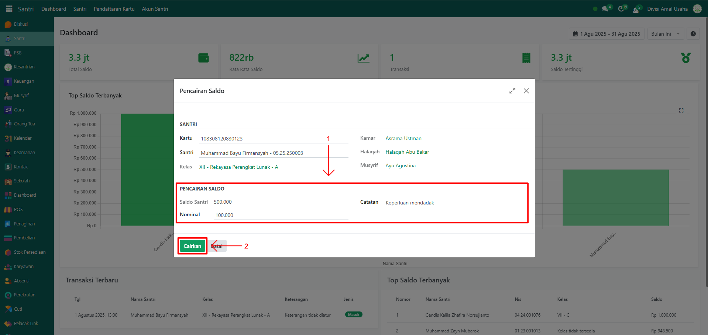
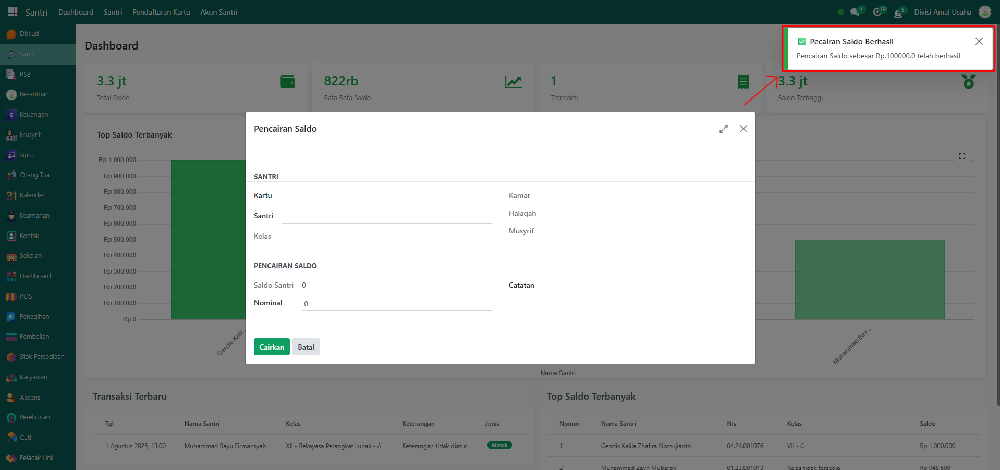

# Pencairan Saldo



## Pencairan Saldo

**Pencairan Saldo** adalah fitur pada Odoo Pesantren yang digunakan untuk menarik saldo dari akun virtual santri yang sebelumnya telah diisi oleh orang tua atau pihak pesantren. Proses pencairan ini umumnya dilakukan apabila santri membutuhkan uang tunai untuk keperluan tertentu di luar sistem transaksi non-tunai pesantren.

### Melakukan Pencairan Saldo Santri

Berikut langkah-langkah untuk mencairkan saldo santri pada Odoo Pesantren.

1. Login menggunakan akun administrator. Jika Anda belum memahami cara login sebagai admin, silakan lihat panduan [**Login Admin** di sini](../../../panduan-login/login-admin.md).
2.  Buka modul **Santri**, lalu klik menu **Akun Santri** kemudian pilih submenu **Pencairan Saldo**.

    <figure><figcaption></figcaption></figure>

3.  Pada halaman form pop up pencairan saldo, pilih nama santri pada field **Santri**.

    <figure><figcaption></figcaption></figure>

4. Pastikan santri yang bersangkutan sudah memiliki **kartu santri** dan **saldo**.
   * Jika santri belum memiliki kartu santri, lakukan pendaftaran kartu santri terlebih dahulu [disini](../pendaftaran-kartu-dan-va.md#langkah-langkah-mendaftarkan-kartu-santri).
   * Jika santri belum memiliki saldo, silakan minta pengisian uang saku dari orang tua melalui [musyrif disini](../../modul-musyrif/mutasi-saldo.md) atau [administrator disini](../../modul-keuangan/uang-saku.md).
5.  Isi nominal saldo yang ingin dicairkan pada field **Nominal**, serta catatan tambahan bila diperlukan. Jika sudah, klik tombol **"Cairkan"** untuk memproses pencairan saldo.

    <figure><figcaption></figcaption></figure>

6.  Setelah berhasil, sistem akan menampilkan notifikasi bahwa **pencairan saldo santri** berhasil.

    <figure><figcaption></figcaption></figure>

7. Transaksi pencairan saldo akan tercatat secara otomatis di riwayat akun santri sehingga dapat dipantau kembali kapan saja.
