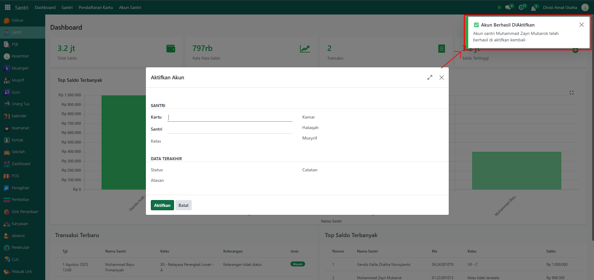

# Pengaktifan Akun



## Pengaktifan Akun Santri

**Pengaktifan Akun** digunakan ketika akun santri yang sebelumnya dinonaktifkan ingin dipulihkan agar bisa kembali digunakan untuk transaksi keuangan, seperti pengisian saldo, pencairan, maupun pembayaran.

### Mengaktifkan Akun Santri

Berikut adalah langkah-langkah untuk mengaktifkan akun santri pada Odoo Pesantren.

1. Login menggunakan akun administrator. Jika Anda belum memahami cara login sebagai admin, silakan lihat panduan [**Login Admin** di sini](../../../panduan-login/login-admin.md).
2.  Buka modul **Santri**, lalu klik menu **Akun Santri** kemudian pilih submenu **Pengaktifan Akun**.

    <figure><figcaption></figcaption></figure>

3.  Pada tampilan form pop up **Pengaktifan Akun**, pilih nama santri pada bagian **Santri** yang sebelumnya akunnya dinonaktifkan.

    <figure><figcaption></figcaption></figure>

4.  Sistem akan menampilkan informasi status kartu beserta alasan penonaktifan sebelumnya. Lalu klik tombol **"Aktifkan"** untuk memproses pengaktifan kembali akun santri.

    <figure><figcaption></figcaption></figure>

5.  Setelah berhasil, sistem akan menampilkan notifikasi bahwa **akun santri berhasil diaktifkan** dan dapat kembali digunakan untuk transaksi.

    <figure><figcaption></figcaption></figure>
