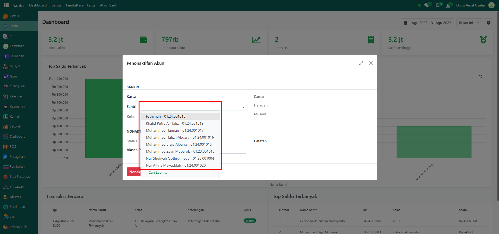

# Penonaktifan Akun



## Penonaktifan Akun Santri

**Penonaktifan Akun Santri** adalah proses untuk menonaktifkan akun transaksi santri pada sistem Odoo Pesantren. Fitur ini biasanya digunakan ketika santri sudah tidak aktif, pindah sekolah, lulus, atau ada kebijakan tertentu dari pihak pesantren. Setelah akun dinonaktifkan, santri tidak bisa lagi melakukan transaksi menggunakan kartu santri maupun akun virtual.

### Menonaktifkan Akun Santri

Berikut adalah langkah-langkah untuk menonaktifkan akun santri pada Odoo Pesantren.

1. Login menggunakan akun administrator. Jika Anda belum memahami cara login sebagai admin, silakan lihat panduan [**Login Admin** di sini](../../../panduan-login/login-admin.md).
2.  Buka modul **Santri**, lalu klik menu **Akun Santri** kemudian pilih submenu **Penonaktifan Akun**.

    <figure><figcaption></figcaption></figure>

3.  Pada tampilan form pop up **Penonaktifan Akun**, pilih nama santri pada bagian **Santri**.

    <figure><figcaption></figcaption></figure>

4. Pastikan santri yang dipilih memiliki **kartu santri** yang statusnya aktif sebelum dilakukan penonaktifan.
5.  Pilih **Alasan Penonaktifan Akun** sesuai kondisi (misalnya: pelanggaran, pindah pesantren, atau lainnya) serta catatan tambahan penonaktifan. Jika sudah, klik tombol **"Nonaktifkan"** untuk memproses penonaktifan akun santri.

    <figure><figcaption></figcaption></figure>

6.  Setelah berhasil, sistem akan menampilkan notifikasi bahwa **akun santri berhasil dinonaktifkan**.

    <figure><figcaption></figcaption></figure>

7. Status akun santri akan berubah menjadi **Nonaktif**, dan santri tidak bisa lagi melakukan transaksi.
8.  Contoh transaksi dengan akun santri yang dinonaktifkan.

    <figure><figcaption></figcaption></figure>

