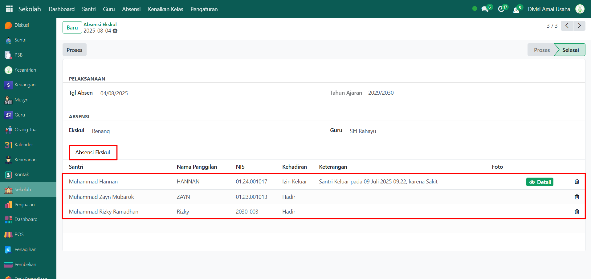

# Cek Absensi Ekskul



## Absensi Ekskul

**Absensi Ekskul** pada modul **Sekolah** merupakan kumpulan catatan kehadiran santri dalam kegiatan ekstrakurikuler (ekskul).

### Melihat Daftar Absensi Ekskul

Berikut adalah langkah-langkah untuk melihat daftar absensi ekskul pada Odoo Pesantren sebagai **administrator**.

1. Login menggunakan akun administrator. Jika Anda belum memahami cara login sebagai admin, silakan lihat panduan [**Login Admin** di sini](../../../panduan-login/login-admin.md).
2.  Buka modul **Sekolah**, lalu klik menu **Absensi** kemudian pilih submenu **Absensi Ekskul**.

    <figure><figcaption></figcaption></figure>

3.  Pada halaman **Absensi Ekskul**, akan ditampilkan daftar seluruh absensi dari setiap kegiatan ekskul dalam filter kelompok yaitu pertanggal. Informasi utama yang ditampilkan meliputi: **nama ekskul, guru pembina, tanggal absen, tahun ajaran, serta status absensi**.

    <figure><figcaption></figcaption></figure>

4. Untuk melihat detail dari absensi, klik salah satu data absensi yang ada pada daftar.
5.  Akan tampil halaman form absensi yang berisi informasi detail dari absensi tersebut. Pada **Tab Absensi Ekskul**, Anda dapat melihat daftar santri yang mengikuti kegiatan ekskul beserta status kehadirannya.

    <figure><figcaption></figcaption></figure>

6. Dengan langkah ini, administrator dapat memantau riwayat absensi ekskul secara lengkap, baik secara keseluruhan maupun detail tiap kegiatan.
