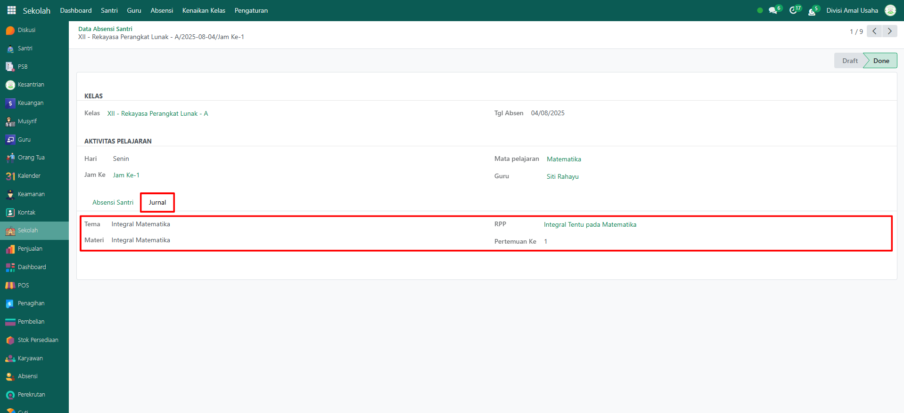

# Cek Absensi Santri



## Absensi Santri

**Absensi Santri** pada modul **Sekolah** merupakan kumpulan catatan absensi berdasarkan kelas, mata pelajaran, guru, dan status absensi santri.

### Melihat Daftar Absensi Santri

Berikut adalah langkah-langkah untuk melihat daftar absensi santri pada Odoo Pesantren sebagai **administrator**.

1. Login menggunakan akun administrator. Jika Anda belum memahami cara login sebagai admin, silakan lihat panduan [**Login Admin** di sini](../../../panduan-login/login-admin.md).
2.  Buka modul **Sekolah**, lalu klik menu **Absensi** kemudian pilih submenu **Absensi Santri**.

    <figure><figcaption></figcaption></figure>

3.  Pada halaman **Absensi Santri**, akan ditampilkan daftar seluruh absensi dari setiap kelas. Setiap data absensi memiliki informasi seperti **tanggal absen, nama kelas, mata pelajaran, guru, jam pelajaran, serta status absensi.**

    <figure><figcaption></figcaption></figure>

4. Untuk melihat detail dari suatu absensi, klik salah satu data absensi yang ada di daftar.&#x20;
5.  Akan tampil halaman form absensi yang berisi informasi detail dari absensi. Pada **Tab Absensi Santri**, Anda dapat melihat daftar santri yang terdaftar dalam kelas tersebut beserta status kehadirannya.

    <figure><figcaption></figcaption></figure>

6.  Pada **Tab Jurnal**, Anda dapat melihat informasi tambahan seperti tema, materi pembelajaran, RPP yang digunakan, serta pertemuan ke berapa absensi tersebut dilakukan.

    <figure><figcaption></figcaption></figure>

7. Dengan langkah ini, Anda dapat memantau dan memastikan data absensi santri tercatat dengan benar sesuai dengan kelas dan jadwal pelajaran yang berlangsung.
